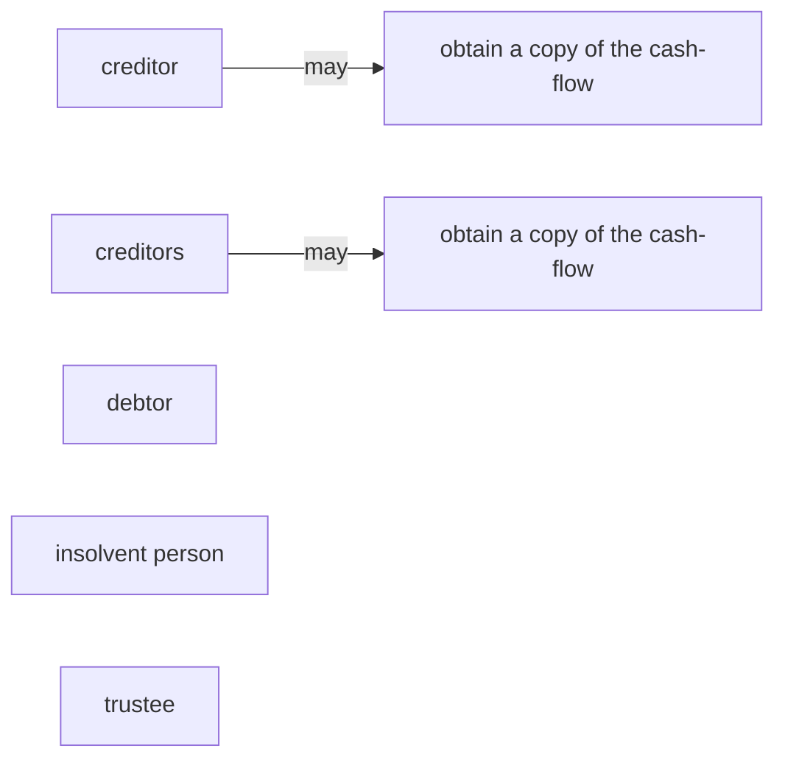

# Division I NOI Process - Duty Chain

```mermaid
graph LR


    A1[creditor]
    P2[obtain a copy of the cash-flow]
    A1 --"may"--> P2

    A3[creditors]
    P4[obtain a copy of the cash-flow]
    A3 --"may"--> P4

    A5[debtor]


    A6[insolvent person]


    A7[trustee]


```
