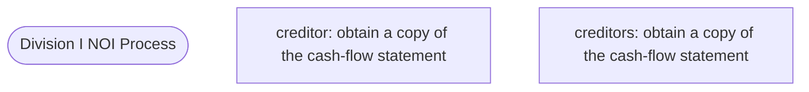

# Division I NOI Process

```mermaid
flowchart TD
    START([Division I NOI Process])

    P1["creditor: obtain a copy of the cash-flow statement"]

    P2["creditors: obtain a copy of the cash-flow statement"]

```
