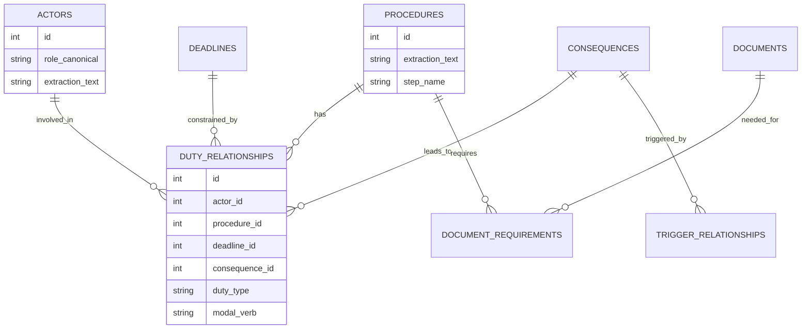

# Knowledge Base Schema

```mermaid
erDiagram

    ACTORS ||--o{ DUTY_RELATIONSHIPS : involved_in
    PROCEDURES ||--o{ DUTY_RELATIONSHIPS : has
    DEADLINES ||--o{ DUTY_RELATIONSHIPS : constrained_by
    CONSEQUENCES ||--o{ DUTY_RELATIONSHIPS : leads_to
    PROCEDURES ||--o{ DOCUMENT_REQUIREMENTS : requires
    DOCUMENTS ||--o{ DOCUMENT_REQUIREMENTS : needed_for
    CONSEQUENCES ||--o{ TRIGGER_RELATIONSHIPS : triggered_by

    ACTORS {
        int id
        string role_canonical
        string extraction_text
    }

    PROCEDURES {
        int id
        string extraction_text
        string step_name
    }

    DUTY_RELATIONSHIPS {
        int id
        int actor_id
        int procedure_id
        int deadline_id
        int consequence_id
        string duty_type
        string modal_verb
    }

```
