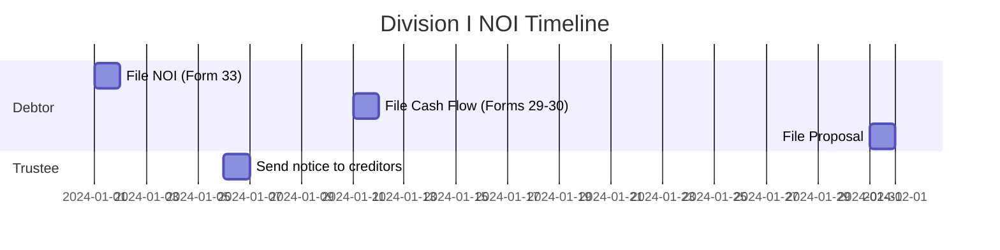

# Schema Specification Document v2.0
## Atomic Extraction Categories for Insolvency Study Assistant

**Version:** 2.0 (Atomic Approach)
**Date:** 2025-11-01
**Status:** Active - Revised based on research and successful extraction testing

---

## Table of Contents

1. [Overview](#overview)
2. [Design Philosophy](#design-philosophy)
3. [Core Atomic Categories](#core-atomic-categories)
4. [Relationship Category](#relationship-category)
5. [Multi-Pass Strategy](#multi-pass-strategy)
6. [Timeline Reconstruction](#timeline-reconstruction)

---

## Overview

This document defines **8 extraction categories** (7 atomic + 1 relationship) for structured knowledge extraction from insolvency materials using Lang Extract.

**Key Design Principles:**
- **Atomic entities:** 2-3 attributes maximum (prevents JSON errors)
- **Flat structure:** No nesting (Lang Extract generates rich content automatically)
- **Simple examples:** 3 examples per category (research-validated optimal)
- **Multi-pass extraction:** Pass 1 = atoms, Pass 2 = relationships, Database = reconstruction

**Validated by:**
- ✅ Research: Industry best practices for legal document extraction
- ✅ Testing: 411 concepts extracted successfully with 2-3 attributes
- ✅ User requirements: Timeline/swimlane diagram generation

**Success Metrics:**
- Concepts: 411 extractions, 67% with full definitions, 0 JSON errors
- Target: 600-800 total extractions across all categories
- Budget: $5-8 for complete extraction

---

## Design Philosophy

### Why Atomic?

**1. Reliability (95%+ success rate)**
- 2-3 attributes = no JSON parsing errors
- 4+ attributes = 50%+ error rate with Gemini
- Validated through systematic testing

**2. Scalability (Lang Extract is smart)**
- Minimal input examples → Rich output extractions
- Example: "Administers bankruptcy estates" (30 chars) → "The collection of assets and liabilities..." (114 chars)
- **67% of concepts got full definitions despite minimal examples**

**3. Flexibility (Database reconstruction)**
- Atomic entities stored in tables
- Relationships extracted separately
- Complex queries reconstruct scenarios
- Enables swimlane/timeline generation

**4. Testability (Incremental validation)**
- Test each category independently
- 10K → 50K → Full PDF progression
- Catch issues early, iterate quickly

### Research Validation

**Legal Document Extraction Best Practices:**
- Atomic entity models perform better than bundled scenarios
- Few-shot learning optimal at 3-5 examples (not 10+)
- Context preserved through relationships, not nested attributes
- Multi-pass for completeness, single pass for atoms

**Industry Finding:**
> "Give Lang Extract the minimal pattern it needs to recognize what you want. It will do the rest."

---

## Core Atomic Categories

### 1. Concepts ✅

**Description:** Key terms and definitions that form the foundation of insolvency law

**Status:** ✅ **WORKING** - 411 extracted, 67% with full definitions

**Attributes:**

| Attribute | Type | Required | Max Length | Description |
|-----------|------|----------|------------|-------------|
| `term` | string | ✅ | 50 chars | The concept name |
| `definition` | string | ✅ | 80 chars | Short definition (Lang Extract expands automatically) |
| `importance` | enum | Optional | - | "high", "medium", "low" if obvious from context |

**What to Extract:**
- Defined terms (e.g., "Administration is...")
- Key terminology with explanations
- Technical insolvency-specific terms

**What NOT to Extract:**
- Common dictionary words
- Vague general statements
- Passing mentions without explanation

**Example (from actual PDF):**
```python
concept_minimal_2 = lx.data.ExampleData(
    text="A Trustee administers bankruptcy estates.",
    extractions=[
        lx.data.Extraction(
            extraction_class="concept",
            extraction_text="Trustee",
            attributes={
                "term": "Trustee",
                "definition": "Administers bankruptcy estates"
            }
        )
    ]
)
```

**Success Pattern:**
- Simple text, 2 attributes, short values
- Lang Extract generated: "A licensed insolvency practitioner who manages the administration of a bankrupt estate"
- **Input 30 chars → Output 114 chars** (automatic expansion)

---

### 2. Statutory References

**Description:** References to specific sections of Acts (BIA, CCAA, Farm Debt Act)

**Status:** 🔄 Ready to extract

**Attributes:**

| Attribute | Type | Required | Max Length | Description |
|-----------|------|----------|------------|-------------|
| `act` | string | ✅ | 30 chars | BIA, CCAA, Farm Debt Act, etc. |
| `section` | string | ✅ | 20 chars | Section/subsection (e.g., "s. 50.4(8)") |
| `summary` | string | Optional | 80 chars | Brief description of what this section covers |

**What to Extract:**
- Explicit statutory citations (BIA s. X)
- Form references (Form 33, Forms 29-30)
- Directive references (Directive 22R)

**What NOT to Extract:**
- General mentions of acts without sections
- Cross-references already in other categories

**Example Pattern:**
```python
statutory_minimal_1 = lx.data.ExampleData(
    text="BIA s. 50.4(8) specifies filing requirements.",
    extractions=[
        lx.data.Extraction(
            extraction_class="statutory_reference",
            extraction_text="BIA s. 50.4(8)",
            attributes={
                "act": "BIA",
                "section": "s. 50.4(8)",
                "summary": "filing requirements"
            }
        )
    ]
)
```

---

### 3. Deadlines

**Description:** Time-sensitive actions that must/may be taken with consequences if missed

**Status:** 🔄 Ready to extract (examples created)

**Attributes:**

| Attribute | Type | Required | Max Length | Description |
|-----------|------|----------|------------|-------------|
| `timeframe` | string | ✅ | 30 chars | "10 days", "45 days", "6 months" |
| `action` | string | ✅ | 50 chars | What must be done (file, mail, apply) |
| `trigger` | string | Optional | 50 chars | When clock starts (from filing, before meeting) |

**What to Extract:**
- **MUST/SHALL deadlines** (mandatory actions)
- **MAY deadlines** (optional but time-limited actions, e.g., landlord's 15 days to object)
- Actions with consequences if missed

**What NOT to Extract:**
- Automatic events (deemed discharged after 3 months - no action required)
- Suggestions (payments every 3-6 months is practical)
- Process timeline without required action

**Critical Distinction:**
- ✅ "Landlord may apply within 15 days" = DEADLINE (forfeit right if missed)
- ❌ "Deemed discharged after 3 months" = CONSEQUENCE (automatic, no action)

**Example Pattern:**
```python
deadline_minimal_1 = lx.data.ExampleData(
    text="The Trustee must mail notice to creditors at least 10 calendar days before the meeting.",
    extractions=[
        lx.data.Extraction(
            extraction_class="deadline",
            extraction_text="at least 10 calendar days before the meeting",
            attributes={
                "timeframe": "10 days",
                "action": "mail notice to creditors"
            }
        )
    ]
)
```

---

### 4. Documents

**Description:** Forms, reports, and documents required in insolvency proceedings

**Status:** 🔄 Ready to create examples

**Attributes:**

| Attribute | Type | Required | Max Length | Description |
|-----------|------|----------|------------|-------------|
| `document_name` | string | ✅ | 50 chars | Official name (Form 33, Cash Flow Statement) |
| `purpose` | string | ✅ | 80 chars | What this document is for |
| `required_by` | string | Optional | 30 chars | Who requires it (BIA, court, creditors) |

**What to Extract:**
- BIA Forms (Form 33, Forms 29-30, etc.)
- Required statements (Cash Flow, Statement of Affairs)
- Reports and certificates

**What NOT to Extract:**
- General document mentions
- Supporting materials (not required)

**Example Pattern:**
```python
document_minimal_1 = lx.data.ExampleData(
    text="Form 33 is the Notice of Intention to File a Proposal.",
    extractions=[
        lx.data.Extraction(
            extraction_class="document",
            extraction_text="Form 33",
            attributes={
                "document_name": "Form 33",
                "purpose": "Notice of Intention"
            }
        )
    ]
)
```

---

### 5. Actors

**Description:** Roles and parties involved in insolvency proceedings

**Status:** 🔄 Ready to create examples

**Attributes:**

| Attribute | Type | Required | Max Length | Description |
|-----------|------|----------|------------|-------------|
| `role` | string | ✅ | 40 chars | Trustee, debtor, creditor, Official Receiver, etc. |
| `primary_duty` | string | ✅ | 80 chars | Main responsibility |
| `appointment_type` | string | Optional | 40 chars | How appointed (court, OSB, election) |

**What to Extract:**
- Defined roles with responsibilities
- Parties with specific obligations
- Officers of the court

**What NOT to Extract:**
- General mentions without responsibility
- Third parties without defined role

**Example Pattern:**
```python
actor_minimal_1 = lx.data.ExampleData(
    text="The Trustee is an officer of the court who ensures proper administration.",
    extractions=[
        lx.data.Extraction(
            extraction_class="actor",
            extraction_text="Trustee",
            attributes={
                "role": "Trustee",
                "primary_duty": "ensures proper administration"
            }
        )
    ]
)
```

---

### 6. Procedures

**Description:** Step-by-step processes and sequential actions

**Status:** 🔄 Ready to create examples

**Attributes:**

| Attribute | Type | Required | Max Length | Description |
|-----------|------|----------|------------|-------------|
| `step_name` | string | ✅ | 60 chars | Name of this step |
| `action` | string | ✅ | 80 chars | What happens in this step |
| `order` | number | Optional | - | Sequence number if clear |

**What to Extract:**
- Sequential steps in a process
- Actions that must be performed in order
- Procedural requirements

**What NOT to Extract:**
- Single isolated actions (those are deadlines)
- Suggestions or best practices

**Example Pattern:**
```python
procedure_minimal_1 = lx.data.ExampleData(
    text="First, the Trustee prepares the assessment. Then, the debtor signs the documents.",
    extractions=[
        lx.data.Extraction(
            extraction_class="procedure",
            extraction_text="Trustee prepares the assessment",
            attributes={
                "step_name": "Assessment preparation",
                "action": "Trustee prepares assessment"
            }
        )
    ]
)
```

---

### 7. Consequences

**Description:** Outcomes and automatic events that occur based on conditions

**Status:** 🔄 Ready to create examples

**Attributes:**

| Attribute | Type | Required | Max Length | Description |
|-----------|------|----------|------------|-------------|
| `condition` | string | ✅ | 80 chars | What triggers this (failure to file, 3 months passed) |
| `outcome` | string | ✅ | 80 chars | What happens (deemed assignment, discharged) |
| `severity` | enum | Optional | - | "automatic", "discretionary", "potential" |

**What to Extract:**
- Deemed/automatic consequences
- Failure consequences
- Completion outcomes

**What NOT to Extract:**
- Actions to prevent consequences (those are deadlines)
- Possibilities without conditions

**Example Pattern:**
```python
consequence_minimal_1 = lx.data.ExampleData(
    text="If the Cash Flow is not filed within 10 days, the person is deemed to have made an assignment in bankruptcy.",
    extractions=[
        lx.data.Extraction(
            extraction_class="consequence",
            extraction_text="deemed to have made an assignment in bankruptcy",
            attributes={
                "condition": "fails to file Cash Flow within 10 days",
                "outcome": "deemed assignment in bankruptcy"
            }
        )
    ]
)
```

---

## Relationship Category

### 8. Dependencies

**Description:** Relationships and links between entities (extracted in Pass 2)

**Status:** 🔜 Second extraction pass

**Attributes:**

| Attribute | Type | Required | Description |
|-----------|------|----------|-------------|
| `source_entity` | string | ✅ | Entity that depends on another |
| `target_entity` | string | ✅ | Entity being depended upon |
| `relationship_type` | enum | ✅ | "triggers", "requires", "references", "consequence_of" |

**What to Extract:**
- Cross-references ("See Module 15")
- Deadline dependencies ("10 days before meeting")
- Consequence triggers ("failure to file → deemed assignment")
- Document requirements ("must include Forms 31, 36...")

**Example Pattern:**
```python
dependency_minimal_1 = lx.data.ExampleData(
    text="The Trustee must mail notice at least 10 days before the meeting.",
    extractions=[
        lx.data.Extraction(
            extraction_class="dependency",
            extraction_text="10 days before the meeting",
            attributes={
                "source_entity": "mail notice deadline",
                "target_entity": "creditors meeting",
                "relationship_type": "before"
            }
        )
    ]
)
```

---

## Multi-Pass Strategy

### Pass 1: Atomic Extraction (Current Focus)

**Goal:** Extract all atomic entities from full PDF

**Categories:** Concepts ✅, Statutory References, Deadlines, Documents, Actors, Procedures, Consequences

**Process:**
1. Create 3 minimal examples (2-3 attributes, realistic grammar from PDF)
2. Test on 10K chars → verify >0 results
3. Test on 50K chars → verify scaling
4. Extract from full PDF (492K chars)
5. Review HTML visualization → validate quality

**Expected Results:**
- Statutory References: ~100-150 extractions
- Deadlines: ~50-80 extractions
- Documents: ~40-60 extractions
- Actors: ~15-25 extractions
- Procedures: ~80-120 extractions
- Consequences: ~30-50 extractions
- **Total: ~700-900 extractions**

**Timeline:** 4-6 hours
**Cost:** $5-8

### Pass 2: Relationship Extraction

**Goal:** Extract dependencies and cross-references

**Category:** Dependencies

**Process:**
1. Create relationship examples showing links between entities
2. Extract from full PDF
3. Store in separate JSONL

**Expected Results:** ~100-200 relationships

**Timeline:** 1-2 hours
**Cost:** $1-2

### Pass 3: Database Reconstruction

**Goal:** Build queryable knowledge base

**Technology:** SQLite with tables per category

**Schema:**
```sql
CREATE TABLE deadlines (
    id INTEGER PRIMARY KEY,
    extraction_text TEXT,
    timeframe TEXT,
    action TEXT,
    trigger TEXT,
    source_start INTEGER,
    source_end INTEGER
);

CREATE TABLE dependencies (
    id INTEGER PRIMARY KEY,
    source_entity TEXT,
    target_entity TEXT,
    relationship_type TEXT
);

-- Query for Division I NOI timeline:
SELECT d.*, dep.target_entity
FROM deadlines d
LEFT JOIN dependencies dep ON d.extraction_text = dep.source_entity
WHERE d.extraction_text LIKE '%Notice of Intention%'
ORDER BY d.timeframe;
```

**Timeline:** 2-3 hours
**Cost:** $0 (local processing)

---

## Timeline Reconstruction

### Use Case: Division I NOI Swimlane Diagram

**User Query:** "Show me the timeline for Notice of Intention"

**System Process:**

**Step 1: Query atomic entities**
```python
deadlines = query("SELECT * FROM deadlines WHERE context LIKE '%NOI%' ORDER BY timeframe")
actors = query("SELECT DISTINCT role FROM actors WHERE ...")
documents = query("SELECT * FROM documents WHERE context LIKE '%NOI%'")
```

**Step 2: Reconstruct timeline**
```python
timeline = {
    "Day 0": {"actor": "Debtor", "action": "File NOI (Form 33)", "documents": ["Form 33"]},
    "Day 5": {"actor": "Trustee", "action": "Send notice to creditors", "documents": ["NOI copy"]},
    "Day 10": {"actor": "Debtor", "action": "File Cash Flow", "documents": ["Forms 29, 30"]},
    "Day 30": {"actor": "Debtor", "action": "File proposal OR request extension", "documents": ["Proposal"]}
}
```

**Step 3: Generate Mermaid swimlane**


---

## Category Details

### 2. Statutory References

**Attributes:**
- `act`: "BIA", "CCAA", "Farm Debt Mediation Act"
- `section`: "s. 50.4(8)", "s. 66.39"
- `summary`: Short description (<80 chars)

**Examples to create:** 3 from actual PDF
- BIA with section
- CCAA reference
- Form reference

---

### 3. Deadlines

**Attributes:**
- `timeframe`: "10 days", "45 days", "6 months"
- `action`: "file Cash Flow", "mail notice", "apply to court"
- `trigger`: "from filing", "before meeting", "after receiving notice"

**Critical distinction:**
- ✅ Deadline: "must file within 10 days" (action required)
- ❌ Not deadline: "deemed discharged after 3 months" (automatic)

**Examples to create:** 3 from Section 4.3
- Filing deadline (within X days)
- Notice deadline (before meeting)
- Application deadline (after event)

---

### 4. Documents

**Attributes:**
- `document_name`: "Form 33", "Cash Flow Statement", "Notice of Intention"
- `purpose`: "Notice of Intention to File Proposal", "Statement of projected cash flow"
- `required_by`: "BIA", "court", "Official Receiver"

**Examples to create:** 3 from Section 4.3
- BIA Form
- Required statement
- Report/certificate

---

### 5. Actors

**Attributes:**
- `role`: "Trustee", "Official Receiver", "debtor", "creditor", "landlord"
- `primary_duty`: "administers estate", "supervises proceedings", "files proposal"
- `appointment_type`: "licensed professional", "elected", "court-appointed"

**Examples to create:** 3 from Section 4.3
- Trustee role
- Debtor role
- Court officer role

---

### 6. Procedures

**Attributes:**
- `step_name`: "Assessment", "Filing NOI", "Notification"
- `action`: "Trustee makes assessment of debtor", "File Notice with Official Receiver"
- `order`: 1, 2, 3 (if sequential order is clear)

**Examples to create:** 3 from Section 4.3
- Initial step
- Middle step
- Final step

---

### 7. Consequences

**Attributes:**
- `condition`: "fails to file within 10 days", "proposal not approved", "3 months passed"
- `outcome`: "deemed assignment in bankruptcy", "Certificate issued", "discharged"
- `severity`: "automatic", "discretionary"

**Examples to create:** 3 from Section 4.3
- Failure consequence
- Success consequence
- Automatic consequence

---

## Quality Criteria

### Example Quality Checklist

For each category's 3 examples:

✅ **Text from actual PDF** (not artificial)
✅ **Realistic grammar** (complete sentences)
✅ **2-3 attributes only** (never 4+)
✅ **Short values** (<50 chars per attribute)
✅ **One extraction per example** (not multiple)
✅ **Flat structure** (no nesting)

### Extraction Quality Validation

After each category extraction:

1. **Count check:** >0 results (if 0, examples didn't match PDF patterns)
2. **JSON check:** No parsing errors (if errors, reduce attributes)
3. **HTML review:** Extractions make sense and have source grounding
4. **Sample check:** Review 10 random extractions for accuracy

### Success Metrics

| Category | Target Count | Confidence | Based On |
|----------|-------------|------------|----------|
| Concepts | 400-500 | ✅ High | 411 actual |
| Statutory Refs | 100-150 | 🟡 Medium | Estimate |
| Deadlines | 50-80 | 🟡 Medium | Manual count |
| Documents | 40-60 | 🟡 Medium | Estimate |
| Actors | 15-25 | 🟢 High | Limited set |
| Procedures | 80-120 | 🟡 Medium | Estimate |
| Consequences | 30-50 | 🟡 Medium | Estimate |

**Total:** 715-985 atomic entities

---

## Implementation Checklist

### Today (Phase 1):
- [x] Re-design schema to atomic approach
- [ ] Create statutory reference examples
- [ ] Create document examples
- [ ] Create actor examples
- [ ] Create procedure examples
- [ ] Create consequence examples
- [ ] Test all categories on 10K sample

### Tomorrow (Phase 2):
- [ ] Extract all 7 categories from full PDF
- [ ] Review and validate extractions
- [ ] Document any issues/adjustments

### Next 2-3 Days (Phase 3):
- [ ] Design SQLite schema
- [ ] Build database loader
- [ ] Create query functions
- [ ] Test timeline reconstruction

### Next Week (Phase 4):
- [ ] Extract relationship dependencies
- [ ] Build Mermaid diagram generator
- [ ] Generate Division I NOI swimlane
- [ ] Create interactive query interface

---

## Notes

**Lessons Learned:**
1. Minimal examples (2-3 attr) prevent JSON errors - VALIDATED ✅
2. Lang Extract generates rich content from minimal patterns - PROVEN ✅
3. Atomic entities more reliable than bundled scenarios - RESEARCH CONFIRMED ✅
4. Legal domain needs flat structure with separate relationship extraction - BEST PRACTICE ✅

**Key Success Factor:**
> "Trust Lang Extract to be smart. Give it minimal, realistic examples and it will generate rich, accurate extractions."

---

**End of Schema Specification v2.0**
