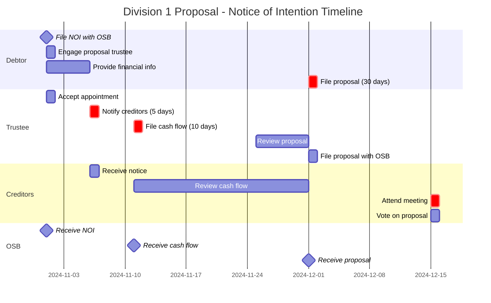

# Visualization Design Document
## Mermaid Diagram Generation for Insolvency Study Assistant

**Version:** 1.0
**Date:** 2025-10-31
**Status:** Approved
**Purpose:** Define visualization system for generating swimlane diagrams, flowcharts, and mindmaps

---

## 1. Overview

### Purpose
Provide visual learning tools to help understand complex insolvency processes, timelines, and relationships through automatically generated diagrams.

### Visual Learning Requirements
As a visual learner, diagrams help:
- Understand multi-actor timelines (who does what, when)
- See decision trees (options and outcomes)
- Map concept relationships (how ideas connect)
- Grasp dependencies (what must happen before what)

### Diagram Types Supported

1. **Swimlane Diagrams** (Gantt charts) - Timeline + multi-actor coordination
2. **Flowcharts** - Decision trees and procedural flows
3. **Mindmaps** - Concept relationships and hierarchies

---

## 2. Use Case Example

### Scenario: Division 1 Proposal - Notice of Intention to File

**User Query:**
"Show me the timeline for Division 1 NOI with debtor, trustee, and creditor roles"

**System Response:**



**Plus text answers:**
- **Required documents:** NOI Form 42, Cash Flow Statement, Proposal
- **Key deadline:** 30 days from NOI to file proposal (BIA s. 50.4(8))
- **Calculation:** Calendar days (can be extended by court)
- **Source:** Study guide p. 67, BIA s. 50.4

---

## 3. Architecture

### 3.1 Component Structure

```
visualization/
├── __init__.py
├── diagram_generator.py      # Main generator
├── mermaid_builder.py        # Mermaid syntax builder
├── templates/                # Scenario templates
│   ├── swimlane_templates.py
│   ├── flowchart_templates.py
│   └── mindmap_templates.py
├── scenario_definitions.py   # Pre-defined scenarios
└── renderers.py              # Output formatting
```

### 3.2 Data Flow

```
User Query
  ↓
Scenario Selector (user chooses: NOI, bankruptcy, etc.)
  ↓
Knowledge Query (extract relevant deadlines, roles, documents)
  ↓
Template Loader (load swimlane/flowchart/mindmap template)
  ↓
Data Populator (fill template with extracted knowledge)
  ↓
Mermaid Generator (create Mermaid syntax)
  ↓
Renderer (output as .md file or rendered image)
```

---

## 4. Enhanced Schema for Visualization

### 4.1 Timeline Sequences (NEW Category)

```python
"timeline_sequences": {
    "description": "Complete event sequences for scenarios",
    "attributes": [
        "scenario_name",           # "Division 1 NOI", "Bankruptcy filing"
        "scenario_type",           # "Proposal", "Bankruptcy", "Receivership"
        "sequence_steps": [        # List of steps in order
            {
                "step_number": int,
                "event_description": str,
                "timing": str,         # "Day 0", "Within 5 days", etc.
                "responsible_actor": str,  # "Debtor", "Trustee", etc.
                "required_documents": list[str],
                "deadline_reference": str,  # Links to deadlines category
                "is_milestone": bool,
                "is_critical": bool,
                "dependencies": list[str]  # "Requires step X"
            }
        ],
        "total_duration": str,     # "45 days", "6 months"
        "statutory_basis": list[str],
        "common_variations": list[str]
    ]
}
```

**Example Extraction:**
```python
{
    "scenario_name": "Division 1 Proposal - Notice of Intention",
    "scenario_type": "Proposal",
    "sequence_steps": [
        {
            "step_number": 1,
            "event_description": "Debtor files Notice of Intention with OSB",
            "timing": "Day 0",
            "responsible_actor": "Debtor",
            "required_documents": ["Form 42 - Notice of Intention"],
            "is_milestone": true,
            "is_critical": true,
            "dependencies": []
        },
        {
            "step_number": 2,
            "event_description": "Trustee notifies known creditors",
            "timing": "Within 5 days of NOI filing",
            "responsible_actor": "Trustee",
            "required_documents": ["Notice to creditors"],
            "deadline_reference": "BIA s. 50.4(1)",
            "is_critical": true,
            "dependencies": ["Step 1 - NOI filed"]
        }
        // ... more steps
    ],
    "total_duration": "30 days from NOI to proposal filing",
    "statutory_basis": ["BIA s. 50.4", "BIA s. 62"]
}
```

### 4.2 Decision Points (NEW Category)

```python
"decision_points": {
    "description": "Decision trees and conditional branches",
    "attributes": [
        "decision_name",           # "Choosing insolvency option"
        "question",                # "Is debtor a corporation or individual?"
        "condition",               # What determines the path
        "options": [               # Possible choices
            {
                "option_name": str,
                "conditions": list[str],  # When this applies
                "outcomes": list[str],
                "leads_to": str,         # Next decision or procedure
                "statutory_basis": str
            }
        ],
        "context": str,
        "typical_path": str,       # Most common choice
        "factors_to_consider": list[str]
    ]
}
```

---

## 5. Visualization Templates

### 5.1 Swimlane Template Structure

```python
# Pre-defined template for NOI scenario
NOI_SWIMLANE_TEMPLATE = {
    "scenario": "division-1-noi",
    "title": "Division 1 Proposal - Notice of Intention Timeline",
    "actors": ["Debtor", "Trustee", "Creditors", "OSB"],
    "milestones": [
        {"event": "File NOI", "actor": "Debtor", "timing": "Day 0"},
        {"event": "Notify creditors", "actor": "Trustee", "timing": "Day 5"},
        {"event": "File cash flow", "actor": "Trustee", "timing": "Day 10"},
        {"event": "File proposal", "actor": "Debtor", "timing": "Day 30"}
    ],
    "critical_deadlines": [
        {"event": "Notify creditors", "deadline": "5 days"},
        {"event": "Cash flow statement", "deadline": "10 days"},
        {"event": "File proposal", "deadline": "30 days"}
    ],
    "query_filters": {
        "categories": ["deadlines", "procedures", "document_requirements"],
        "topics": ["notice of intention", "division 1", "proposal"]
    }
}
```

### 5.2 Available Scenario Templates

**Pre-defined scenarios to build:**

1. **Division 1 Proposal - NOI** (your example)
2. **Personal Bankruptcy Filing**
3. **Consumer Proposal**
4. **Receivership Appointment**
5. **CCAA Proceedings** (if time permits)
6. **First Meeting of Creditors**

**User can customize:**
- Which actors to show
- Time range to display
- Level of detail
- Starting date (for actual deadlines)

---

## 6. Implementation Details

### 6.1 MermaidBuilder Class

```python
class MermaidBuilder:
    """Generate Mermaid diagram syntax."""

    def build_swimlane(self,
                      scenario: TimelineSequence,
                      actors: List[str],
                      start_date: Optional[date] = None) -> str:
        """Generate Mermaid Gantt chart for swimlane."""

    def build_flowchart(self,
                       decision_tree: DecisionPoint,
                       style: str = "TD") -> str:
        """Generate Mermaid flowchart (TD=top-down, LR=left-right)."""

    def build_mindmap(self,
                     root_concept: str,
                     relationships: List[Relationship],
                     depth: int = 2) -> str:
        """Generate Mermaid mindmap."""
```

### 6.2 Semi-Automatic Generation

```python
class VisualizationEngine:
    """Semi-automatic diagram generation."""

    def generate_scenario_diagram(self,
                                  scenario_type: str,  # User selects
                                  actors: List[str],   # User selects
                                  start_date: Optional[date] = None) -> str:
        """
        Generate swimlane diagram for scenario.

        Steps:
        1. Load scenario template
        2. Query knowledge base for relevant data
        3. Populate template with extracted knowledge
        4. Generate Mermaid syntax
        5. Return diagram code
        """

    def generate_decision_flowchart(self,
                                   topic: str,      # User selects
                                   start_condition: str) -> str:
        """Generate flowchart from decision points."""

    def generate_concept_mindmap(self,
                                root_concept: str,  # User selects
                                depth: int = 2) -> str:
        """Generate mindmap from concept relationships."""
```

---

## 7. Cost & Time Estimates

### Phase 6.5: Visualization Engine

**Time:** 6 days
- Day 1: MermaidBuilder implementation
- Day 2: Swimlane templates (3-4 scenarios)
- Day 3: Flowchart templates
- Day 4: Mindmap generator
- Day 5: Integration with knowledge base
- Day 6: Testing and refinement

**Cost:** $0 (no API calls - just formatting)

**Total Project Impact:**
- Original: 57-58 days
- With visualization: 63-64 days (still within 6-8 weeks!)

---

## 8. Success Criteria

✅ User can query: "Show Division 1 NOI timeline"
✅ System generates swimlane diagram in Mermaid format
✅ Diagram shows all actors, deadlines, documents, dependencies
✅ User can customize which actors to show
✅ Flowcharts show decision trees accurately
✅ Mindmaps show concept relationships
✅ All diagrams based on extracted knowledge (not hardcoded)
✅ Can render as markdown or image

---

## Next Steps

1. Update Architecture doc with visualization components
2. Update Implementation Plan with Phase 6.5
3. Enhance Schema Specification with new categories
4. Proceed to Phase 3 with enhanced schema
5. Build system over next 6-8 weeks

This plan is **attainable and aligned with your needs!**