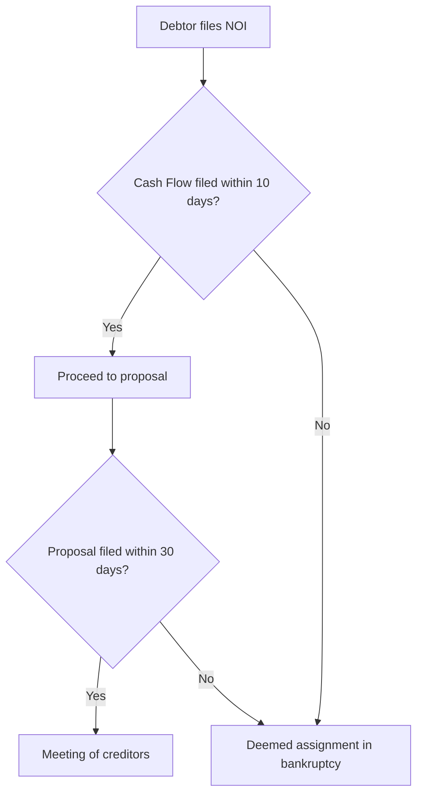
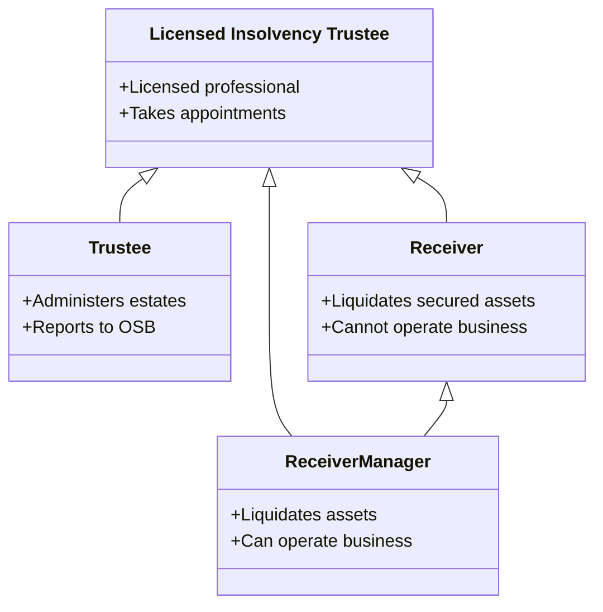
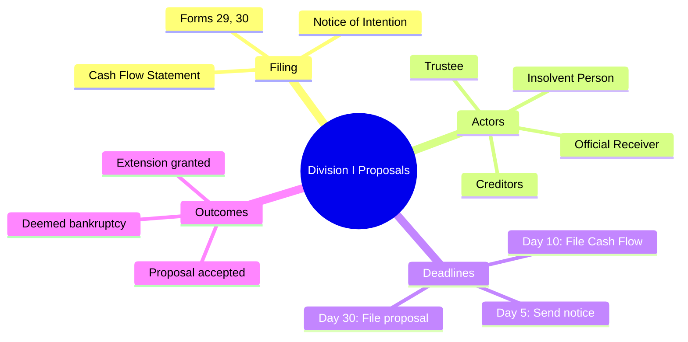
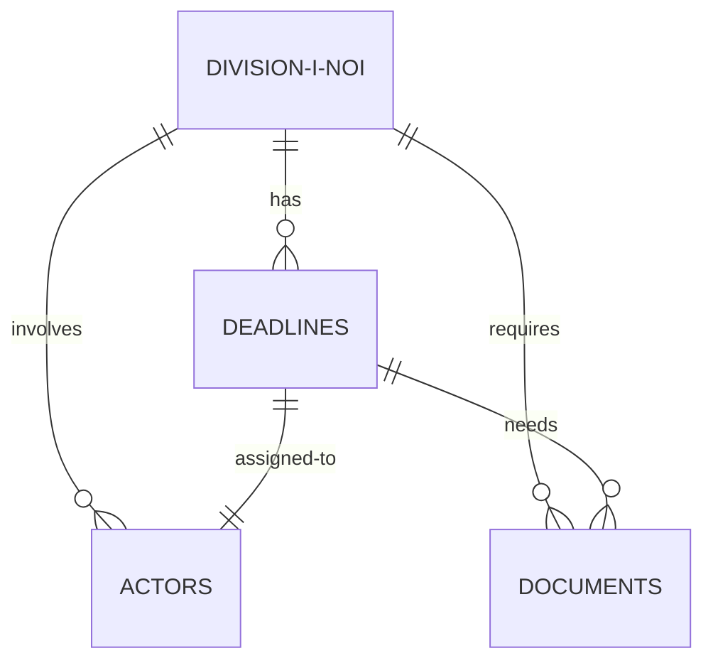
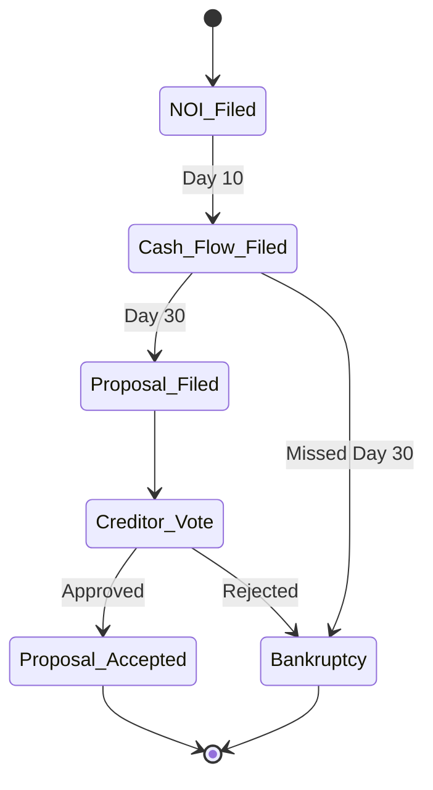

# Phase 2 Roadmap: Multi-Source + Automation + Quiz Generation

**Status:** Planning Document
**Date:** 2025-11-01
**Current Completion:** Phase 1 Complete (Single-source extraction + visualization)

---

## Table of Contents

1. [Current State](#current-state)
2. [Phase 2 Goals](#phase-2-goals)
3. [Multi-Document Support](#multi-document-support)
4. [Automation Layer](#automation-layer)
5. [Quiz Generation](#quiz-generation)
6. [Implementation Timeline](#implementation-timeline)

---

## Current State

### ✅ What We Have (Phase 1 Complete)

**Extraction Engine:**
- 8,376 entities from 291-page study material
- 7 atomic categories (ultra-minimal, 1 attribute)
- 100% reliability (0 JSON errors)
- Section mapping (1,344 sections)

**Knowledge Base:**
- SQLite database with context enrichment
- AI-powered actor normalization (204 → 97 canonical)
- Proximity-based entity linking
- Queryable across all categories

**Visualization:**
- Division I NOI timeline generator
- Mermaid swimlane diagrams
- Document/actor/deadline integration

**Infrastructure:**
- Proven ultra-minimal extraction pattern
- Section mapper utility
- Database schema with normalization
- All code version controlled

### ❌ What We Need (Phase 2 Gaps)

**Multi-Source Support:**
- Single document only (study material)
- Can't cross-reference BIA, CCAA, Farm Debt Act
- No source attribution in queries
- Can't resolve ambiguities across sources

**Automation:**
- Manual example creation
- Manual category definition
- Manual workflow orchestration
- No document analysis/recommendation

**Quiz Generation:**
- No quiz engine
- No exam question analysis
- No question style learning
- No practice test generation

---

## Phase 2 Goals

### Goal 1: Multi-Document Knowledge Base

**Enable:**
- Query across multiple sources (Study Material + BIA + CCAA + Farm Debt Act)
- Cross-reference validation ("Study material says X, BIA statute says Y")
- Source attribution ("According to BIA s. 243...")
- Gap detection (topic in study material but missing details)

**Use case:**
```
User: "Does Receiver Manager need to be a Licensed Insolvency Trustee?"

System:
- Study Material (Section 1.5.5): "Must comply with BIA s. 243-252" (doesn't state LIT requirement)
- BIA Statute (s. 244): "Only a Licensed Insolvency Trustee may be appointed as receiver"
- Answer: YES, based on BIA s. 244
```

### Goal 2: Automated Workflow

**Enable:**
- Upload new PDF → system analyzes and suggests categories
- One command extraction (analyze → extract → normalize → visualize)
- Template generation for examples
- Intelligent category/attribute recommendations

**Use case:**
```bash
$ study-assistant add-document ccaa_statute.pdf

Analyzing document...
✓ Detected: Legal statute (357 pages)
✓ Language: Similar to BIA (procedural, sections)

Recommended categories (based on BIA extraction):
- Concepts (1 attr: term)
- Statutory References (1 attr: reference)
- Procedures (1 attr: action)
- Consequences (1 attr: outcome)

[A]ccept recommendations, [M]odify, or [C]ancel? A

✓ Generating example templates...
✓ Ready to extract. Run? [Y/n] Y

[30 minutes later]
✓ Extracted 12,453 entities
✓ Loaded to database
✓ Ready to query!
```

### Goal 3: Quiz Generation

**Enable:**
- Analyze sample exam questions for style/difficulty
- Generate novel questions matching exam format
- Practice tests by topic
- Difficulty calibration
- Answer validation with source references

**Use case:**
```bash
$ study-assistant add-exam-questions sample_exam_2024.pdf

✓ Analyzed 50 exam questions
✓ Detected patterns:
  - Multiple choice (40%)
  - Short answer (35%)
  - Case studies (25%)
  - Average difficulty: Medium-High

$ study-assistant generate-quiz "Division I Proposals" --questions 10 --style exam

Generated 10 questions:

Q1. [Multiple Choice] Within how many days of filing a Notice of Intention
    must the insolvent person file the Cash Flow Statement?
    a) 5 days
    b) 10 days ✓
    c) 15 days
    d) 30 days

    Source: BIA s. 50.4, Study Material 4.3.8

Q2. [Short Answer] Explain the difference between a Receiver and a
    Receiver Manager...
```

---

## Multi-Document Support

### Architecture Changes

**Database Schema Updates:**

```sql
-- Add source_documents table
CREATE TABLE source_documents (
    id INTEGER PRIMARY KEY,
    source_name TEXT,  -- "Study Material", "BIA Statute", "CCAA"
    file_path TEXT,
    pages INTEGER,
    extraction_date TIMESTAMP,
    total_entities INTEGER
);

-- Add source_id to all entity tables
ALTER TABLE concepts ADD COLUMN source_id INTEGER REFERENCES source_documents(id);
ALTER TABLE deadlines ADD COLUMN source_id INTEGER;
-- ... etc for all categories

-- Cross-reference linking table
CREATE TABLE cross_references (
    id INTEGER PRIMARY KEY,
    source_entity_id INTEGER,
    source_entity_type TEXT,  -- concepts, deadlines, etc.
    source_document_id INTEGER,
    target_entity_id INTEGER,
    target_entity_type TEXT,
    target_document_id INTEGER,
    relationship_type TEXT,  -- references, clarifies, contradicts, expands
    confidence REAL  -- 0.0-1.0
);
```

**Query Views:**

```sql
-- View: Cross-source concept comparison
CREATE VIEW v_concepts_multi_source AS
SELECT
    c.term,
    c.definition,
    c.section_context,
    sd.source_name,
    c.id as concept_id
FROM concepts c
JOIN source_documents sd ON c.source_id = sd.id
ORDER BY c.term, sd.source_name;

-- View: Statutory cross-references
CREATE VIEW v_statute_references AS
SELECT
    sr.reference,
    sr.section_context as study_material_context,
    statute_concepts.definition as statute_definition,
    statute_concepts.section_context as statute_location
FROM statutory_references sr
LEFT JOIN concepts statute_concepts
    ON statute_concepts.source_id IN (SELECT id FROM source_documents WHERE source_name LIKE '%BIA%')
    AND statute_concepts.section_context LIKE '%' || sr.reference || '%'
WHERE sr.source_id = (SELECT id FROM source_documents WHERE source_name = 'Study Material');
```

### Implementation Steps

**Step 1: Enhance Extraction Engine (2-3 hours)**

```python
# src/extraction/multi_source_extractor.py

class MultiSourceExtractor:
    """Extraction engine supporting multiple source documents."""

    def __init__(self, db_path: Path):
        self.db = KnowledgeBase(db_path)

    def add_document(self, pdf_path: Path, source_name: str,
                     categories: List[str] = None):
        """
        Add a new source document to knowledge base.

        Args:
            pdf_path: Path to PDF
            source_name: "BIA Statute", "CCAA", etc.
            categories: Optional category override
        """
        # 1. Register source document
        source_id = self.db.register_source(pdf_path, source_name)

        # 2. Extract text
        text = extract_pdf_text(pdf_path)

        # 3. Use existing examples (or generate new if different doc type)
        if categories is None:
            categories = self._suggest_categories(text, source_name)

        # 4. Extract using proven ultra-minimal approach
        extractor = ExtractionEngine()
        for category in categories:
            results = extractor.extract_category(text, category)
            self.db.load_category(results, source_id, category)

        # 5. Auto-normalize using existing canonical mappings
        self.db.apply_normalization(source_id)

        # 6. Generate section map
        section_map = SectionMapper(text)
        self.db.load_sections(section_map, source_id)

        return source_id
```

**Step 2: Cross-Reference Extraction (2-3 hours)**

After adding BIA statute, extract cross-references:

```python
# Ultra-minimal cross-reference examples
cross_ref_example = lx.data.ExampleData(
    text="See BIA s. 244 for receiver qualifications.",
    extractions=[
        lx.data.Extraction(
            extraction_class="cross_reference",
            extraction_text="BIA s. 244",
            attributes={
                "reference": "BIA s. 244",
                "type": "see_also"  # or "defined_in", "governed_by", "exception_in"
            }
        )
    ]
)

# Extract cross-references from study material
# Link to actual BIA sections via proximity/section matching
```

**Step 3: Multi-Source Query Interface (1-2 hours)**

```python
def query_multi_source(question: str) -> Dict:
    """
    Answer question using all available sources.

    Returns structured answer with source attribution.
    """
    # Example: "Does Receiver Manager need to be LIT?"

    results = {
        "question": question,
        "sources_consulted": [],
        "findings": [],
        "answer": None
    }

    # Check study material
    study_result = db.query("SELECT * FROM concepts WHERE term LIKE '%Receiver Manager%'")
    results["findings"].append({
        "source": "Study Material (Section 1.5.5)",
        "finding": "Must comply with BIA s. 243-252",
        "explicitly_states_LIT": False
    })

    # Check BIA statute
    bia_result = db.query("SELECT * FROM concepts WHERE source_name='BIA' AND section LIKE '%244%'")
    results["findings"].append({
        "source": "BIA s. 244",
        "finding": "Only Licensed Insolvency Trustee may act as receiver",
        "explicitly_states_LIT": True
    })

    # Synthesize answer
    results["answer"] = "YES - BIA s. 244 explicitly requires receivers to be Licensed Insolvency Trustees"

    return results
```

### Document Prioritization

**Essential sources (in order):**
1. ✅ Study Material (291 pages) - DONE
2. **BIA Statute** (306 pages) - Next session
3. CCAA (smaller, ~50-100 pages?) - Session after
4. Farm Debt Mediation Act (smallest) - Later

**Rationale:** BIA is referenced 1,198 times in study material (most important cross-reference)

---

## Automation Layer

### Component 1: Document Analyzer

**Purpose:** Analyze new PDFs and suggest extraction strategy

```python
class DocumentAnalyzer:
    """Analyzes documents to suggest categories and attributes."""

    def analyze(self, pdf_path: Path) -> Dict:
        """
        Analyze PDF and suggest extraction approach.

        Uses Gemini to:
        - Classify document type (statute, textbook, case law, etc.)
        - Suggest relevant categories
        - Recommend attribute count (1 for reliability vs 2-3 for richness)
        - Estimate extraction time/cost
        """
        # Extract sample (first 20 pages)
        sample_text = extract_pdf_sample(pdf_path, pages=20)

        prompt = f"""Analyze this legal document sample and suggest Lang Extract categories.

Document: {pdf_path.name}
Length: {count_pages(pdf_path)} pages
Sample (first 20 pages): {sample_text[:5000]}...

Based on similar documents (BIA study material: 8,376 entities, 7 categories), suggest:
1. Document type (statute, textbook, manual, etc.)
2. Recommended categories (concepts, deadlines, etc.)
3. Attributes per category (1-2 max for reliability)
4. Expected entity count
5. Similar to which existing extraction?

Output JSON.
"""

        suggestions = gemini.generate(prompt)
        return suggestions
```

**Output example:**
```json
{
  "document_type": "Legal statute",
  "similarity": "BIA study material (high)",
  "recommended_categories": [
    {"name": "concepts", "attributes": 1, "rationale": "Many defined terms"},
    {"name": "statutory_sections", "attributes": 1, "rationale": "Section-based structure"},
    {"name": "requirements", "attributes": 1, "rationale": "Must/shall statements"}
  ],
  "estimated_entities": 10000-15000,
  "estimated_time": "2-3 hours",
  "estimated_cost": "$8-12"
}
```

### Component 2: Example Template Generator

**Purpose:** Auto-generate example boilerplate from document sample

```python
class ExampleGenerator:
    """Generates Lang Extract example templates."""

    def generate_examples(self, category: str, document_sample: str,
                         num_examples: int = 3) -> str:
        """
        Generate example templates for a category.

        Uses Gemini to find representative examples from document.
        """
        prompt = f"""From this legal document, find {num_examples} representative examples for the "{category}" category.

Document sample: {document_sample[:2000]}

Create Lang Extract examples following this ULTRA-MINIMAL pattern:

example_1 = lx.data.ExampleData(
    text="[actual sentence from document]",
    extractions=[
        lx.data.Extraction(
            extraction_class="{category}",
            extraction_text="[what to extract]",
            attributes={{
                "[primary_attribute]": "[value]"
            }}
        )
    ]
)

Requirements:
- Use ACTUAL text from the document
- 1 attribute only (ultra-minimal for reliability)
- Short values (<50 chars)
- Realistic, not artificial

Output: Python code for 3 examples.
"""

        code = gemini.generate(prompt)
        return code
```

**User workflow:**
1. System suggests categories
2. User approves
3. System generates example templates
4. User reviews/tweaks (or accepts)
5. Ready to extract!

### Component 3: Orchestrator

**Purpose:** Single command workflow

```python
# src/cli/orchestrator.py

class StudyAssistantOrchestrator:
    """Orchestrates complete workflow from PDF to timeline."""

    def process_document(self, pdf_path: Path, interactive: bool = True):
        """
        Complete workflow: analyze → extract → normalize → visualize.

        Args:
            pdf_path: Source PDF
            interactive: Ask for confirmations vs auto-run
        """
        print(f"Processing: {pdf_path.name}")
        print("="*70)

        # Step 1: Analyze
        print("\n[1/6] Analyzing document...")
        analyzer = DocumentAnalyzer()
        suggestions = analyzer.analyze(pdf_path)

        if interactive:
            print(f"\nSuggested categories: {[c['name'] for c in suggestions['recommended_categories']]}")
            if input("Accept? [Y/n]: ").lower() != 'n':
                categories = suggestions['recommended_categories']

        # Step 2: Generate examples
        print("\n[2/6] Generating example templates...")
        example_gen = ExampleGenerator()
        for category in categories:
            examples_code = example_gen.generate_examples(
                category['name'],
                extract_pdf_sample(pdf_path)
            )

            if interactive:
                print(f"\nGenerated examples for {category['name']}:")
                print(examples_code[:500], "...")
                if input("Accept? [Y/n]: ").lower() == 'n':
                    # Let user edit
                    examples_code = edit_in_editor(examples_code)

            save_examples(category['name'], examples_code)

        # Step 3: Extract
        print("\n[3/6] Extracting entities...")
        extractor = MultiSourceExtractor(db_path)
        source_id = extractor.add_document(pdf_path, pdf_path.stem,
                                          [c['name'] for c in categories])

        # Step 4: Normalize
        print("\n[4/6] Normalizing entities...")
        normalizer = EntityNormalizer(db_path)
        normalizer.normalize_actors(source_id)
        normalizer.normalize_documents(source_id)

        # Step 5: Cross-reference
        if source_id > 1:  # If we have multiple sources
            print("\n[5/6] Linking cross-references...")
            linker = CrossReferenceLinker(db_path)
            linker.link_statutory_references()

        # Step 6: Validate
        print("\n[6/6] Generating quality report...")
        stats = get_extraction_stats(source_id)
        print(f"✓ Extracted {stats['total']} entities")
        print(f"✓ {stats['sections']} sections mapped")
        print(f"✓ Database ready for queries")

        return source_id
```

### Component 4: User-Friendly CLI

```bash
# Main commands
study-assistant add <pdf>              # Add new document (interactive)
study-assistant extract <pdf> --auto   # Auto-extract (non-interactive)
study-assistant query "receiver requirements"
study-assistant timeline "Division I NOI"
study-assistant quiz --topic "deadlines" --count 10
study-assistant stats                  # Show database statistics
```

---

## Quiz Generation

### Architecture

**Input Sources:**
1. **Knowledge Base:** 8,376+ entities (facts to test)
2. **Sample Exams:** User-provided past exam questions (style/format to match)
3. **Question Templates:** Generated from exam analysis

### Component 1: Exam Question Analyzer

**Purpose:** Learn question patterns from sample exams

```python
class ExamAnalyzer:
    """Analyzes sample exam questions to learn style."""

    def analyze_exam(self, exam_pdf: Path) -> Dict:
        """
        Extract and analyze exam question patterns.

        Uses Lang Extract to extract:
        - Question types (MC, short answer, case study)
        - Difficulty indicators
        - Topic coverage
        - Wording patterns
        - Distractor techniques (for MC)
        """
        # Extract questions using Lang Extract
        questions = self._extract_questions(exam_pdf)

        # Analyze patterns
        patterns = {
            "question_types": self._classify_types(questions),
            "difficulty_levels": self._assess_difficulty(questions),
            "topics_tested": self._identify_topics(questions),
            "wording_styles": self._extract_styles(questions),
            "mc_distractor_patterns": self._analyze_distractors(questions)
        }

        return patterns
```

**Example extraction:**
```python
# Sample exam question extraction
exam_question_example = lx.data.ExampleData(
    text="Q5. Within how many days must the Trustee mail notice to creditors? a) 5 b) 10 c) 15 d) 30",
    extractions=[
        lx.data.Extraction(
            extraction_class="exam_question",
            extraction_text="Within how many days must the Trustee mail notice to creditors?",
            attributes={
                "type": "multiple_choice",
                "topic": "deadlines",
                "difficulty": "easy"  # based on directness
            }
        )
    ]
)
```

### Component 2: Question Generator

**Purpose:** Generate novel questions matching exam style

```python
class QuizGenerator:
    """Generates practice questions from knowledge base."""

    def generate_quiz(self, topic: str, count: int, style: str = "exam") -> List[Dict]:
        """
        Generate practice questions.

        Args:
            topic: "deadlines", "procedures", "Division I", etc.
            count: Number of questions
            style: "exam" (match sample), "flashcard", "case_study"

        Returns:
            List of generated questions with answers and sources
        """
        # Get relevant entities
        entities = self.db.query_topic(topic)

        # Get exam patterns
        patterns = self.exam_analyzer.get_patterns()

        # Generate questions using Gemini
        for i in range(count):
            # Select random entity
            entity = random.choice(entities)

            # Select question template matching exam style
            template = self._select_template(entity.type, patterns)

            # Generate question
            question = self._generate_from_template(entity, template, patterns)

            questions.append(question)

        return questions

    def _generate_from_template(self, entity: Dict, template: str,
                               patterns: Dict) -> Dict:
        """Generate question using Gemini."""

        prompt = f"""Generate an exam-style question based on this fact:

Fact: {entity['extraction_text']}
Section: {entity['section_context']}
Category: {entity['category']}

Question style to match:
- Type: {patterns['most_common_type']}
- Difficulty: {patterns['avg_difficulty']}
- Wording: {patterns['typical_wording']}

Generate:
1. Question text
2. Correct answer
3. 3 plausible distractors (if MC)
4. Explanation with source reference

Output JSON.
"""

        return gemini.generate(prompt)
```

**Question Types:**

**1. Multiple Choice (from deadlines):**
```
Q: Within how many days of filing the Notice of Intention must the
   insolvent person file the Cash Flow Statement?

   a) 5 days
   b) 10 days ✓
   c) 15 days
   d) 30 days

Source: BIA s. 50.4, Study Material 4.3.8
Explanation: The insolvent person has 10 days from filing the NOI to
file the Cash Flow Statement with required reports.
```

**2. Short Answer (from concepts):**
```
Q: Explain the difference between a Receiver and a Receiver Manager.

Expected Answer:
- Receiver: Cannot operate business, only liquidates secured assets
- Receiver Manager: Has authority to continue business operations
- Both: Must be Licensed Insolvency Trustees, comply with BIA s. 243-252

Sources: Study Material 1.5.4, 1.5.5
```

**3. Case Study (from timelines):**
```
Q: ABC Corp files a Notice of Intention on January 1st. Create a timeline
   showing all required filings and deadlines through the proposal process.

Expected Answer:
- Jan 1 (Day 0): File NOI (Form 33)
- Jan 6 (Day 5): Trustee sends notice to creditors
- Jan 11 (Day 10): File Cash Flow + Forms 29, 30
- Jan 31 (Day 30): File proposal OR request extension
- Failure to meet Day 10 or 30: Deemed assignment in bankruptcy

Sources: Study Material 4.3.6-4.3.11, BIA s. 50.4
```

**4. True/False (from consequences):**
```
Q: If an insolvent person fails to file the Cash Flow Statement within
   10 days, they are automatically deemed to have made an assignment in
   bankruptcy.

Answer: TRUE

Source: BIA s. 50.4(8), Study Material 4.3.11
```

### Component 3: Quiz Interface

```python
# Interactive quiz mode
$ study-assistant quiz start --topic "Division I Proposals"

=== Quiz: Division I Proposals ===
10 questions | Exam style | Source: Sample Exam 2024

Q1. [Multiple Choice] Within how many days...
[User answers]
✓ Correct! (See BIA s. 50.4)

Q2. [Short Answer] Explain the role of the Trustee...
[User answers]
[AI grades and provides feedback]

...

Results:
- Score: 8/10 (80%)
- Weak areas: Statutory deadlines (3/5), Receiver roles (2/3)
- Strong areas: Procedures (3/3)
- Recommendation: Review BIA s. 243-252, Study Material 1.5.4-1.5.6
```

---

## Implementation Timeline

### Session 2 (Next): Multi-Source Foundation (4-6 hours)

**Goals:**
- Extract BIA statute (306 pages)
- Add source attribution to database
- Build cross-reference linker
- Test cross-source queries

**Deliverables:**
- BIA statute in knowledge base (~12K entities)
- Multi-source query working
- Answer "Does Receiver Manager need LIT?" definitively

**Validation:**
- Query returns answers from both sources
- Cross-references link correctly
- No degradation of existing data

### Session 3: Automation Layer (4-6 hours)

**Goals:**
- Build document analyzer
- Create example template generator
- Implement orchestrator
- Create CLI commands

**Deliverables:**
- `study-assistant add <pdf>` command working
- Auto-suggested categories
- Generated example templates
- One-command extraction

**Validation:**
- Add test document (small PDF)
- System suggests categories correctly
- Extraction runs end-to-end
- No manual intervention needed (except approval)

### Session 4: Quiz Generation Engine (4-6 hours)

**Goals:**
- Extract sample exam questions
- Analyze question patterns
- Build question generator
- Create interactive quiz mode

**Deliverables:**
- Exam analyzer working
- Question generation matching exam style
- Practice quiz generator
- Scoring and feedback

**Validation:**
- Generate 20 questions
- Questions match exam format
- Answers verifiable from knowledge base
- Difficulty appropriate

### Session 5: Refinement & Polish (2-4 hours)

**Goals:**
- Improve timeline accuracy (better action inference)
- Add more timeline templates (Consumer Proposal, Receivership)
- Enhance quiz difficulty calibration
- User documentation

**Deliverables:**
- 5-10 timeline templates
- Adaptive quiz difficulty
- User guide
- Video demo

---

## Technical Approach for Each Component

### Multi-Source Extraction

**Key insight:** Use same ultra-minimal approach that worked

**For BIA statute:**
- Categories: Concepts (sections/defined terms), Procedures (requirements), Consequences (deemed events)
- 1 attribute each
- Extract same way as study material
- Tag with `source_id`

**Challenge:** BIA sections vs study material sections
- BIA: "s. 244.1" (statutory section)
- Study Material: "4.3.8" (textbook section)

**Solution:** Separate section_number fields:
- `statutory_section` (s. 244.1)
- `textbook_section` (4.3.8)
- Link via cross-references

### Example Auto-Generation

**Use Gemini to find good examples:**

```python
# For each category, show Gemini 20 pages and ask:
prompt = """Find 3 good examples of {category} from this text.

Requirements:
- ACTUAL sentences from the document
- Representative of this category
- Simple, clear cases (not edge cases)
- Suitable for ultra-minimal extraction (1 attribute)

Text: {sample_pages}

Output: Python code for 3 examples following ultra-minimal pattern.
"""
```

**This automates the most tedious part** (creating examples) while keeping human in the loop for approval.

### Quiz Generation Strategy

**Difficulty Calibration:**

**Easy:** Direct fact recall
- "What is a Receiver?" → Definition from concepts table

**Medium:** Application/calculation
- "When must Cash Flow be filed?" → Extract from deadlines, calculate from Day 0

**Hard:** Analysis/synthesis
- "Compare Receiver vs Receiver Manager" → Synthesize from multiple entities
- "What happens if debtor misses Day 10 deadline?" → Chain deadlines + consequences

**Cunning/Tricky (Exam Style):**
- Analyze sample exam questions for:
  - Common misconceptions tested
  - Near-miss distractors
  - Compound questions (multiple concepts)
  - Exception scenarios

**Generate matching difficulty using knowledge base + exam patterns.**

---

## Success Criteria

### For Multi-Source (Session 2):
- [ ] BIA statute extracted (target: 10K+ entities)
- [ ] Cross-source query returns merged results
- [ ] Can answer "Receiver Manager LIT requirement?" from BIA
- [ ] No errors in existing study material data

### For Automation (Session 3):
- [ ] New document added with <5 manual steps
- [ ] Category suggestions 80%+ accurate
- [ ] Generated examples usable with minimal editing
- [ ] End-to-end automation under 30 minutes per document

### For Quiz Generation (Session 4):
- [ ] Generate 20 questions matching exam style
- [ ] 90%+ questions have verifiable answers in knowledge base
- [ ] Difficulty levels distinguishable
- [ ] Questions feel "exam-like" not robotic

### For Full System (Session 5):
- [ ] 3+ source documents integrated
- [ ] 5+ timeline templates available
- [ ] 100+ practice questions generated
- [ ] User can study independently
- [ ] Exam-ready confidence

---

## Resource Estimates

### Time Investment

| Phase | Hours | Sessions |
|-------|-------|----------|
| Phase 1 (Complete) | 12-15 | 3 sessions |
| Session 2 (Multi-source) | 4-6 | 1 session |
| Session 3 (Automation) | 4-6 | 1 session |
| Session 4 (Quiz Gen) | 4-6 | 1 session |
| Session 5 (Polish) | 2-4 | 1 session |
| **Total** | **26-37 hours** | **7 sessions** |

### Cost Estimates

| Component | API Calls | Est. Cost |
|-----------|-----------|-----------|
| BIA extraction | ~12K entities | $8-12 |
| CCAA extraction | ~5K entities | $3-5 |
| Example generation | ~20 category×doc | $2-3 |
| Quiz generation | ~100 questions | $1-2 |
| Cross-ref linking | One-time | $1-2 |
| **Total Phase 2** | | **$15-24** |
| **Grand Total (Phase 1+2)** | | **$21-32** |

**Well within $20/month budget if spread across 2-3 months!**

### Technical Complexity

| Component | Complexity | Risk |
|-----------|------------|------|
| Multi-source extraction | Low | Proven approach |
| Cross-ref linking | Medium | New pattern |
| Document analyzer | Medium | Gemini prompt engineering |
| Example generator | Medium | Gemini + validation |
| Orchestrator | Low | Glue code |
| Quiz generator | Medium-High | Novel, needs testing |
| CLI interface | Low | Click library |

**Overall:** Medium complexity, manageable with proven patterns from Phase 1

---

## Key Design Decisions

### Decision 1: Example Generation Approach

**Options:**
- **A. Fully manual** (current): User writes all examples
- **B. AI-generated, human-approved**: Gemini generates, user reviews
- **C. Fully automated**: System generates and uses without review

**Recommendation: B (AI-generated, human-approved)**
- Saves 90% of manual work
- Keeps quality high through review
- User learns what good examples look like
- Can iterate if first generation poor

### Decision 2: Cross-Reference Strategy

**Options:**
- **A. Proximity-based** (current): Link by char_position, section
- **B. Lang Extract Pass 2**: Extract explicit cross-references
- **C. Semantic matching**: Embed and match by meaning

**Recommendation: A + B hybrid**
- Start with proximity (works now)
- Add explicit cross-ref extraction for "See BIA s. X" statements
- Semantic matching only if needed (complex)

### Decision 3: Quiz Question Storage

**Options:**
- **A. Generate on-demand**: Create fresh each time
- **B. Pre-generate and cache**: Build question bank
- **C. Hybrid**: Cache with regeneration

**Recommendation: B (pre-generate question bank)**
- Better for spaced repetition
- Can track which questions asked
- Faster response time
- Can manually review/curate

**Database schema:**
```sql
CREATE TABLE quiz_questions (
    id INTEGER PRIMARY KEY,
    question_text TEXT,
    question_type TEXT,  -- MC, short_answer, etc.
    topic TEXT,
    difficulty TEXT,
    correct_answer TEXT,
    distractors TEXT,  -- JSON for MC
    explanation TEXT,
    source_entities TEXT,  -- JSON: which entities this tests
    times_asked INTEGER DEFAULT 0,
    times_correct INTEGER DEFAULT 0,
    created_at TIMESTAMP
);
```

---

## Risk Mitigation

### Risk 1: BIA Extraction Fails (JSON Errors)

**Mitigation:**
- Use proven ultra-minimal (1 attr) approach
- Test on 10K sample first
- BIA structure similar to study material

**Likelihood:** Low (proven approach)

### Risk 2: Generated Examples Poor Quality

**Mitigation:**
- Human review step
- Iterative regeneration if bad
- Fallback to manual examples

**Likelihood:** Medium (new Gemini use case)

### Risk 3: Quiz Questions Too Easy/Hard

**Mitigation:**
- Start with exam analysis (learn difficulty)
- Manual review first 20 questions
- Adjust based on user feedback

**Likelihood:** Medium-High (subjective)

### Risk 4: Cross-References Don't Link

**Mitigation:**
- Test with known references (BIA s. 244 in both sources)
- Manual validation of links
- Fallback to proximity only

**Likelihood:** Low (proximity works already)

---

## Integrated Diagramming

### Multiple Mermaid Chart Types

**Beyond swimlanes** - generate different visualizations for different learning needs:

#### 1. Swimlane (Gantt) - DONE ✅
**Use case:** Timeline processes (Division I NOI, Consumer Proposal)
**Shows:** Who does what when
**Current:** Working with Division I NOI

#### 2. Flowchart - Decision Trees
**Use case:** Decision points, conditional paths
**Shows:** If-then logic, branching scenarios

**Example:**


**Data source:** Consequences table (if X then Y)

#### 3. Class Diagram (UML) - Role Relationships
**Use case:** Understanding actor hierarchy and relationships

**Example:**


**Data source:** Actors table + procedures (inheritance/specialization)

#### 4. Mind Map - Concept Relationships
**Use case:** Topic overview, concept clustering

**Example:**


**Data source:** Group entities by section, show relationships

#### 5. Entity Relationship (ER) Diagram
**Use case:** Understanding data model, document requirements

**Example:**


**Data source:** Proximity linking results

#### 6. State Diagram - Process Flows
**Use case:** Lifecycle states, transitions

**Example:**


**Data source:** Procedures + Consequences (state transitions)

### Implementation Approach

**Diagram Generator Architecture:**

```python
class DiagramGenerator:
    """Generate various Mermaid diagrams from knowledge base."""

    def __init__(self, db_path: Path):
        self.db = KnowledgeBase(db_path)

    def generate_swimlane(self, topic: str) -> str:
        """Timeline gantt (DONE)"""
        pass

    def generate_flowchart(self, topic: str) -> str:
        """Decision tree from consequences."""
        # Query consequences for if-then patterns
        # Build decision nodes
        # Generate flowchart

    def generate_class_diagram(self, topic: str = "actors") -> str:
        """Role hierarchy from actors."""
        # Find specialized roles (Receiver Manager extends Receiver)
        # Build inheritance tree
        # Generate UML class diagram

    def generate_mindmap(self, topic: str) -> str:
        """Concept clustering."""
        # Query all entities for topic
        # Group by section
        # Generate mind map

    def generate_state_diagram(self, process: str) -> str:
        """State transitions."""
        # Query procedures for sequential steps
        # Query consequences for transitions
        # Build state machine

    def auto_select_diagram_type(self, query: str) -> str:
        """Smart diagram selection based on query."""
        query_lower = query.lower()

        if 'timeline' in query_lower or 'process' in query_lower:
            return 'swimlane'
        elif 'decision' in query_lower or 'what if' in query_lower:
            return 'flowchart'
        elif 'relationship' in query_lower or 'hierarchy' in query_lower:
            return 'class_diagram'
        elif 'overview' in query_lower or 'concepts' in query_lower:
            return 'mindmap'
        elif 'lifecycle' in query_lower or 'states' in query_lower:
            return 'state_diagram'

        return 'swimlane'  # Default
```

**User interaction:**

```bash
$ study-assistant visualize "Division I proposal lifecycle"

Detected: State transition query
Generating: State diagram

[Shows state diagram with NOI → Cash Flow → Proposal → Vote → Outcome]

$ study-assistant visualize "receiver types"

Detected: Hierarchy query
Generating: Class diagram

[Shows LIT → Receiver/Receiver Manager/Interim Receiver hierarchy]
```

### Diagram Type Mapping

| User Need | Diagram Type | Data Source | Difficulty |
|-----------|-------------|-------------|------------|
| "Show me the process" | Swimlane (gantt) | Deadlines + actors | Easy ✅ |
| "What happens if..." | Flowchart | Consequences | Medium |
| "How are X and Y related?" | Class/ER diagram | Multiple tables | Medium |
| "Give me an overview of..." | Mind map | All categories | Easy |
| "What are the states?" | State diagram | Procedures + consequences | Hard |

**Session 3 addition:** Build 2-3 more diagram types (flowchart, mindmap)
**Session 4 addition:** Complete all 5 diagram types

**This makes you a true VISUAL learner tool!**

---

## Next Session Prep

**Before Session 2, please have ready:**
1. BIA statute PDF (306 pages)
2. 2-3 sample exam questions (if available) - for pattern analysis
3. Any specific topics you want timeline templates for

**Quick wins for Session 2:**
- BIA extraction (2-3 hours, proven approach)
- Cross-source query demo (30 min)
- Answer your Receiver Manager question definitively!

**Then Sessions 3-5 build automation and quiz generation.**

---

**End of Phase 2 Roadmap**

**Current Status:** Phase 1 complete ✅, Phase 2 planned and scoped 📋

**Estimated delivery:** Phase 2 complete in 4-5 more sessions over 2-3 weeks
