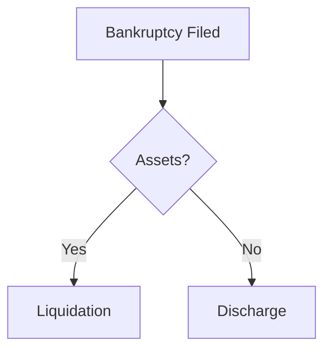
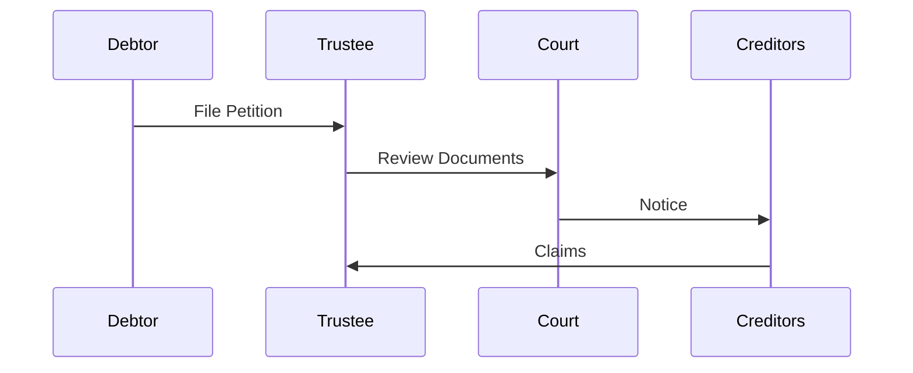
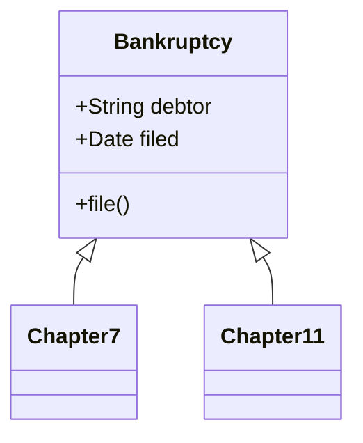
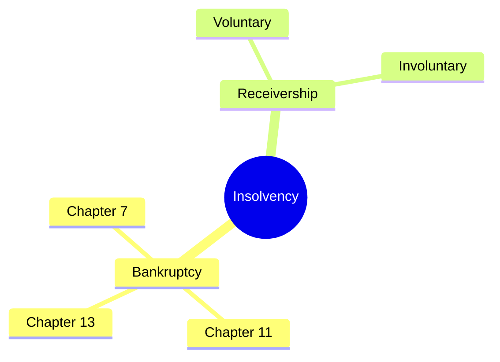

# AI Study Assistant Tech Stack Research Report
**Date:** November 3, 2025
**Project:** Integrated AI Study Assistant with Live Diagram Rendering
**Research Focus:** Optimal tech stack for 10-15 hour development timeline

---

## Executive Summary

This research evaluates tech stacks for building an integrated AI study assistant that queries SQLite databases, generates diagrams through AI, and renders them live in a unified web interface. Based on comprehensive analysis, **Streamlit + streamlit-mermaid + Claude/Gemini API** emerges as the optimal solution for rapid development (8-12 hours), with Flask+React as a more powerful but complex alternative (20-30 hours).

---

## Requirements Summary

1. **Single-page web UI** with prompt input box
2. **SQLite database integration** (insolvency_knowledge.db)
3. **AI integration** (Claude/Gemini) for query processing and diagram code generation
4. **Live diagram rendering** in the same interface (no downloads)
5. **Multiple diagram types**: flowchart, sequence, mindmap, UML, class diagrams, ER diagrams, Gantt
6. **All-in-one interface**: prompt + diagram display + database results

---

## Part 1: Diagram Rendering Libraries Analysis

### Mermaid.js (Recommended)
**Capabilities:**
- Flowcharts (including subgraph-based swimlanes)
- Sequence diagrams
- Class diagrams
- State diagrams
- Entity Relationship diagrams
- Gantt charts
- Pie charts
- Git graphs
- Mindmaps
- User Journey diagrams

**Limitations:**
- No native swimlane/cross-functional diagrams (workaround: use subgraphs)
- No native Venn diagrams
- Limited customization compared to D3.js

**Why Mermaid.js is Best for This Project:**
- Text-based syntax (AI can easily generate valid code)
- In-browser rendering (no server-side image generation)
- Widely documented (AI models trained on it)
- Simple integration with all frameworks
- Automatic layout (no manual positioning needed)

### D3.js (Not Recommended for This Project)
**Pros:** Unlimited customization, powerful visualizations
**Cons:** Requires extensive JavaScript coding, AI cannot easily generate D3 code, steep learning curve
**Verdict:** Overkill for study diagrams; use for data dashboards only

### vis.js (Not Recommended)
**Pros:** Good for network graphs
**Cons:** Limited diagram types, less AI-friendly than Mermaid
**Verdict:** Use only if network/graph visualization is primary need

### Plotly (Not Recommended)
**Pros:** Excellent for charts/graphs
**Cons:** Not designed for flowcharts/UML/process diagrams
**Verdict:** Use for statistical visualizations, not process diagrams

---

## Part 2: Web Framework Comparison

### Option 1: Streamlit + streamlit-mermaid (RECOMMENDED)

**Tech Stack:**
- Frontend: Streamlit (Python)
- Diagram Rendering: streamlit-mermaid component
- Database: sqlite3 (built-in Python)
- AI: anthropic or google-generativeai Python SDK

**Pros:**
✅ Fastest development (8-12 hours total)
✅ Pure Python (no JavaScript required)
✅ Built-in state management
✅ `streamlit-mermaid` component works perfectly for live rendering
✅ Proven integration: see [AI Diagram Generator tutorial](https://discuss.streamlit.io/t/create-an-ai-diagram-generator-with-google-gemini-mermaid-and-streamlit/116956)
✅ Auto-reload during development
✅ Simple deployment (Streamlit Cloud, Docker)
✅ Example project exists: [Easy-Diagram-AI](https://github.com/osama96gh/Easy-Diagram-AI) uses Flask+React+Mermaid with Claude

**Cons:**
❌ Less customization than custom React
❌ Re-runs entire script on interaction (optimization needed for large apps)
❌ All apps look similar visually
❌ Limited control over layout/styling

**Integration Architecture:**
```
User Prompt (st.text_input)
    ↓
Claude/Gemini API (generate SQL + diagram code)
    ↓
SQLite Query (sqlite3)
    ↓
Results Display (st.dataframe)
    ↓
Diagram Code Generation (LLM)
    ↓
Live Rendering (streamlit_mermaid.st_mermaid)
```

**Code Example:**
```python
import streamlit as st
import streamlit_mermaid as stmd
from anthropic import Anthropic
import sqlite3

# Initialize AI client
client = Anthropic(api_key=st.secrets["CLAUDE_API_KEY"])

st.title("Insolvency Study Assistant")

# Prompt input
user_prompt = st.text_area("Ask a question or request a diagram:")

if st.button("Generate"):
    # Query database
    conn = sqlite3.connect("insolvency_knowledge.db")
    # ... execute queries based on AI-generated SQL

    # Generate diagram code via AI
    response = client.messages.create(
        model="claude-sonnet-4.5-20250929",
        messages=[{
            "role": "user",
            "content": f"Generate Mermaid diagram code for: {user_prompt}"
        }]
    )

    mermaid_code = response.content[0].text

    # Render diagram LIVE
    stmd.st_mermaid(mermaid_code)
```

**Development Time Estimate:** 8-12 hours
- Setup: 1 hour
- Database integration: 2 hours
- AI integration: 2-3 hours
- Diagram rendering: 1-2 hours
- UI polish: 2-3 hours
- Testing: 2 hours

---

### Option 2: Gradio + HTML Component

**Tech Stack:**
- Frontend: Gradio (Python)
- Diagram Rendering: gr.HTML with embedded Mermaid.js
- Database: sqlite3
- AI: anthropic/google SDK

**Pros:**
✅ Simple Python-only development
✅ Good for ML model interfaces
✅ Fast prototyping (similar to Streamlit)
✅ Hugging Face integration

**Cons:**
❌ **JavaScript in gr.HTML is historically stripped** (major limitation)
❌ Workarounds required (.load() with _js parameter)
❌ Recent PR (#10442) improving JS support, but still experimental
❌ Less mature than Streamlit for data apps
❌ Smaller community/fewer examples

**JavaScript Rendering Workaround:**
```python
import gradio as gr

html_with_mermaid = """
<script src="https://cdn.jsdelivr.net/npm/mermaid/dist/mermaid.min.js"></script>
<div class="mermaid">
graph TD
    A[Start] --> B[Process]
</div>
"""

with gr.Blocks() as demo:
    output = gr.HTML(html_with_mermaid)
    demo.load(_js="mermaid.initialize({startOnLoad:true})")
```

**Development Time Estimate:** 10-14 hours (extra time for JS workarounds)

**Verdict:** Use only if you need Gradio-specific features (model demos, Hugging Face). Otherwise, Streamlit is more reliable.

---

### Option 3: Chainlit + Custom JSX Elements

**Tech Stack:**
- Frontend: Chainlit (Python + JSX)
- Diagram Rendering: Custom JSX components (React-based)
- Database: sqlite3
- AI: anthropic/google SDK

**Pros:**
✅ Built specifically for AI chat interfaces
✅ Custom JSX elements for advanced UI
✅ Bi-directional Python ↔ JavaScript communication
✅ Good for conversational AI apps
✅ [Example: AI + Charts](https://medium.com/data-science-collective/from-prompt-to-chart-build-an-ai-powered-data-assistant-with-python-and-chainlit-ab1d37a58f64)

**Cons:**
❌ Requires learning React/JSX
❌ More complex setup than Streamlit
❌ Custom components must be written as .jsx files
❌ Less documentation than Streamlit
❌ Overkill for non-chat interfaces

**Custom Element Example:**
```jsx
// public/elements/MermaidDiagram.jsx
export default function MermaidDiagram() {
    useEffect(() => {
        mermaid.initialize({ startOnLoad: true });
        mermaid.contentLoaded();
    }, [props.code]);

    return (
        <div className="mermaid">
            {props.code}
        </div>
    );
}
```

```python
# app.py
import chainlit as cl

@cl.on_message
async def on_message(msg: cl.Message):
    # Generate diagram code via AI
    diagram_code = generate_diagram(msg.content)

    # Render custom element
    element = cl.CustomElement(
        name="MermaidDiagram",
        props={"code": diagram_code}
    )
    await cl.Message(content="Here's your diagram:", elements=[element]).send()
```

**Development Time Estimate:** 12-16 hours (learning curve + JSX)

**Verdict:** Use if building a chatbot-style interface with advanced UI needs. For simple study assistant, Streamlit is faster.

---

### Option 4: Flask + React + Mermaid.js

**Tech Stack:**
- Backend: Flask (Python)
- Frontend: React (JavaScript/TypeScript)
- Diagram Rendering: react-mermaid or mermaid.js
- Database: SQLite with SQLAlchemy
- AI: anthropic/google SDK

**Pros:**
✅ Full control over UI/UX
✅ Production-ready architecture
✅ Scalable (can add features indefinitely)
✅ Separate frontend/backend (easier testing)
✅ [Example project exists: Easy-Diagram-AI](https://github.com/osama96gh/Easy-Diagram-AI)
✅ Best for long-term maintenance

**Cons:**
❌ **Longest development time (20-30 hours)**
❌ Requires JavaScript/React knowledge
❌ More complex deployment
❌ Need to manage CORS, API endpoints, state management
❌ Overkill for 10-15 hour timeline

**Architecture:**
```
React Frontend (localhost:3000)
    ↓ HTTP POST /api/query
Flask Backend (localhost:5000)
    ↓ Query SQLite
    ↓ Call Claude API
    ↓ Return JSON
Frontend renders Mermaid diagram
```

**Backend (Flask):**
```python
# app.py
from flask import Flask, request, jsonify
from anthropic import Anthropic
import sqlite3

app = Flask(__name__)

@app.route('/api/query', methods=['POST'])
def process_query():
    user_prompt = request.json['prompt']

    # Query database
    conn = sqlite3.connect('insolvency_knowledge.db')
    # ... execute queries

    # Generate diagram
    client = Anthropic(api_key=os.getenv('CLAUDE_API_KEY'))
    response = client.messages.create(...)

    return jsonify({
        'data': query_results,
        'diagram_code': mermaid_code
    })
```

**Frontend (React):**
```jsx
import React, { useState } from 'react';
import mermaid from 'mermaid';

function DiagramApp() {
    const [diagramCode, setDiagramCode] = useState('');

    const handleSubmit = async (prompt) => {
        const response = await fetch('http://localhost:5000/api/query', {
            method: 'POST',
            headers: { 'Content-Type': 'application/json' },
            body: JSON.stringify({ prompt })
        });
        const data = await response.json();
        setDiagramCode(data.diagram_code);
    };

    useEffect(() => {
        mermaid.initialize({ startOnLoad: true });
        mermaid.contentLoaded();
    }, [diagramCode]);

    return (
        <div>
            <input type="text" onSubmit={handleSubmit} />
            <div className="mermaid">{diagramCode}</div>
        </div>
    );
}
```

**Development Time Estimate:** 20-30 hours
- Backend setup: 3 hours
- Frontend setup: 3 hours
- API integration: 4 hours
- Database integration: 3 hours
- AI integration: 3 hours
- Diagram rendering: 2 hours
- CORS/deployment: 2 hours
- Testing/polish: 4-6 hours

**Verdict:** Use for production apps with long-term maintenance plans. NOT suitable for 10-15 hour timeline.

---

### Option 5: Reflex (Formerly Pynecone)

**Tech Stack:**
- Framework: Reflex (Pure Python)
- Diagram Rendering: Custom component or HTML
- Database: sqlite3
- AI: anthropic/google SDK

**Pros:**
✅ Pure Python (like Streamlit)
✅ More flexible than Streamlit (full CSS control)
✅ Better state management than Streamlit (WebSocket-based)
✅ Scales better than Streamlit

**Cons:**
❌ Newer framework (less mature)
❌ Smaller community than Streamlit
❌ Fewer examples for diagram rendering
❌ Learning curve for Reflex-specific patterns
❌ Limited documentation on Mermaid integration

**Development Time Estimate:** 12-16 hours (similar to Chainlit)

**Verdict:** Interesting middle ground, but Streamlit has more examples and community support for this use case.

---

## Part 3: Three Recommended Options

### 🥇 OPTION 1: Streamlit + streamlit-mermaid (BEST FOR 10-15 HOURS)

**Why Choose This:**
- Proven integration (multiple working examples exist)
- Fastest development time (8-12 hours)
- Pure Python (no JavaScript needed)
- `streamlit-mermaid` package handles all rendering complexity
- Easy deployment

**Best For:**
- Quick prototypes
- Internal tools
- Study/research applications
- Solo developers
- Python-only teams

**Limitations:**
- Less visual customization
- Re-runs entire script on interaction
- Not ideal for high-traffic production apps

**Development Timeline (10 hours):**
1. Hour 1: Setup Streamlit, install dependencies
2. Hours 2-3: Connect to SQLite database, create query functions
3. Hours 4-5: Integrate Claude/Gemini API, design prompts
4. Hours 6-7: Implement diagram generation logic
5. Hour 8: Install streamlit-mermaid, test rendering
6. Hours 9-10: UI polish, error handling, testing

**Code Structure:**
```
project/
├── app.py                 # Main Streamlit app
├── database.py            # SQLite query functions
├── ai_handler.py          # Claude/Gemini integration
├── diagram_generator.py   # Mermaid code generation
├── requirements.txt       # Dependencies
└── insolvency_knowledge.db
```

---

### 🥈 OPTION 2: Gradio + HTML (SIMPLER, SOME LIMITATIONS)

**Why Choose This:**
- Simpler than Streamlit for ML interfaces
- Good if you already use Hugging Face ecosystem
- Can embed HTML+JavaScript (with workarounds)

**Best For:**
- ML model demos
- Hugging Face-centric workflows
- Simple interfaces without complex state

**Limitations:**
- JavaScript rendering requires workarounds
- Less mature for data apps than Streamlit
- Fewer diagram-specific examples

**Development Timeline (12 hours):**
1. Hours 1-2: Setup Gradio, database connection
2. Hours 3-4: AI integration
3. Hours 5-7: Implement JavaScript workarounds for Mermaid
4. Hours 8-9: Testing different rendering approaches
5. Hours 10-12: UI polish, error handling

**When to Choose Over Streamlit:**
- You need tight Hugging Face integration
- You prefer Gradio's simpler API
- Your team already uses Gradio

---

### 🥉 OPTION 3: Flask + React + Mermaid (PRODUCTION-READY, 20-30 HOURS)

**Why Choose This:**
- Full control over architecture
- Production-ready and scalable
- Separation of concerns (API + Frontend)
- Professional codebase structure

**Best For:**
- Production applications
- Multi-developer teams
- Long-term maintenance projects
- Apps requiring complex UI/UX

**Limitations:**
- 2-3x longer development time
- Requires JavaScript/React expertise
- More complex deployment

**Development Timeline (24 hours):**
1. Hours 1-3: Backend API setup, database integration
2. Hours 4-6: React frontend scaffolding
3. Hours 7-9: API endpoints for queries + AI
4. Hours 10-12: Mermaid integration in React
5. Hours 13-15: State management, error handling
6. Hours 16-18: CORS, authentication (if needed)
7. Hours 19-21: Testing, debugging
8. Hours 22-24: Deployment, documentation

**When to Choose Over Streamlit:**
- Building a production SaaS product
- Need multi-user authentication
- Require complex UI interactions
- Budget allows 20-30 hours

---

## Part 4: AI Integration Patterns

### Recommended Prompt Engineering Flow

**Step 1: User Input**
```
User: "Show me the process flow for bankruptcy proceedings"
```

**Step 2: AI Processes Request**
```python
system_prompt = """
You are an insolvency study assistant. Given a user query:
1. Determine if database query is needed
2. Generate SQLite query if needed
3. Generate appropriate Mermaid diagram code
4. Ensure diagram matches the data retrieved

Available diagram types:
- flowchart (graph TD/LR)
- sequence diagram (sequenceDiagram)
- class diagram (classDiagram)
- ER diagram (erDiagram)
- mindmap (mindmap)
- gantt (gantt)

Return JSON with: {sql_query, diagram_type, mermaid_code}
"""
```

**Step 3: Database Query**
```python
# AI generates SQL
sql = "SELECT step_name, step_order FROM bankruptcy_steps ORDER BY step_order"
results = execute_query(sql)
```

**Step 4: Diagram Generation**
```python
# AI generates Mermaid code based on results
mermaid_code = """
graph TD
    A[File Bankruptcy Petition] --> B[Trustee Assignment]
    B --> C[First Meeting of Creditors]
    C --> D[Asset Liquidation]
    D --> E[Distribution to Creditors]
"""
```

**Step 5: Live Rendering**
```python
# Streamlit
stmd.st_mermaid(mermaid_code)

# Gradio
gr.HTML(f'<div class="mermaid">{mermaid_code}</div>')

# React
<Mermaid chart={mermaidCode} />
```

### AI Model Recommendations

**Claude Sonnet 4.5** (Recommended)
- Excellent at SQL generation
- Strong at structured output (JSON)
- Good at Mermaid syntax
- Cost-effective for this use case

**Gemini 2.0 Flash** (Alternative)
- Faster responses
- Good at code generation
- Lower cost than Claude
- Proven in Streamlit examples

### Example Prompt Template

```python
prompt_template = """
Based on this user request: {user_query}

Database schema:
{schema_info}

Tasks:
1. If data query needed, generate SQLite SQL
2. Determine best diagram type for visualization
3. Generate Mermaid diagram code

Return JSON:
{
  "needs_database": true/false,
  "sql_query": "SELECT ...",
  "diagram_type": "flowchart|sequence|class|er|mindmap",
  "mermaid_code": "graph TD\\n...",
  "explanation": "Brief description"
}
"""
```

---

## Part 5: Comparison Matrix

| Feature | Streamlit | Gradio | Chainlit | Flask+React | Reflex |
|---------|-----------|---------|----------|-------------|--------|
| **Dev Time** | 8-12h | 10-14h | 12-16h | 20-30h | 12-16h |
| **Python Only** | ✅ Yes | ✅ Yes | ⚠️ Mostly | ❌ No | ✅ Yes |
| **Mermaid Support** | ✅ Native | ⚠️ Workaround | ✅ Custom | ✅ React lib | ⚠️ Custom |
| **Learning Curve** | Low | Low | Medium | High | Medium |
| **Customization** | Medium | Low | High | Very High | High |
| **Production Ready** | Medium | Low | Medium | High | Medium |
| **Community Size** | Large | Medium | Small | Large | Small |
| **Documentation** | Excellent | Good | Good | Excellent | Fair |
| **Deployment** | Easy | Easy | Medium | Complex | Medium |
| **State Management** | Built-in | Built-in | Built-in | Manual | Built-in |
| **Real-time Updates** | Polling | Polling | WebSocket | WebSocket | WebSocket |
| **Best For** | Prototypes | ML demos | Chatbots | Production | Complex apps |

---

## Part 6: Implementation Recommendations

### For 10-15 Hour Timeline: Use Streamlit + streamlit-mermaid

**Setup (30 minutes):**
```bash
pip install streamlit streamlit-mermaid anthropic sqlite3
mkdir insolvency-assistant
cd insolvency-assistant
```

**Minimal Working Example (app.py):**
```python
import streamlit as st
import streamlit_mermaid as stmd
from anthropic import Anthropic
import sqlite3
import json

# Configuration
st.set_page_config(page_title="Insolvency Study Assistant", layout="wide")

# Initialize
client = Anthropic(api_key=st.secrets["CLAUDE_API_KEY"])
db_path = "insolvency_knowledge.db"

st.title("🎓 Insolvency Study Assistant")
st.markdown("Ask questions and get visual diagrams")

# Input
user_query = st.text_area("What would you like to learn?", height=100)

if st.button("Generate", type="primary"):
    with st.spinner("Thinking..."):
        # Step 1: Get AI response
        response = client.messages.create(
            model="claude-sonnet-4.5-20250929",
            max_tokens=2000,
            system="""You are an insolvency law study assistant.
            Generate Mermaid diagram code to visualize concepts.
            Return JSON: {diagram_type, mermaid_code, explanation}""",
            messages=[{"role": "user", "content": user_query}]
        )

        # Parse response
        result = json.loads(response.content[0].text)

        # Step 2: Query database if needed
        if result.get("needs_database"):
            conn = sqlite3.connect(db_path)
            cursor = conn.cursor()
            cursor.execute(result["sql_query"])
            data = cursor.fetchall()
            st.dataframe(data)

        # Step 3: Display explanation
        st.markdown(f"**{result['explanation']}**")

        # Step 4: Render diagram LIVE
        st.subheader(f"{result['diagram_type'].title()} Diagram")
        stmd.st_mermaid(result['mermaid_code'], height=500)
```

**Run:**
```bash
streamlit run app.py
```

### Key Optimizations

**1. Caching for Database**
```python
@st.cache_resource
def get_database_connection():
    return sqlite3.connect("insolvency_knowledge.db")
```

**2. Session State for History**
```python
if 'history' not in st.session_state:
    st.session_state.history = []

# Store queries
st.session_state.history.append({
    'query': user_query,
    'diagram': mermaid_code
})
```

**3. Error Handling**
```python
try:
    stmd.st_mermaid(mermaid_code)
except Exception as e:
    st.error(f"Diagram rendering failed: {e}")
    st.code(mermaid_code, language="mermaid")
```

---

## Part 7: Future Expansion Paths

### Easy Additions (0-2 hours each)
- Export diagrams as PNG/SVG (Mermaid.live API)
- Save/load previous queries (SQLite storage)
- Multi-language support
- Dark/light theme toggle
- Diagram zoom/pan controls

### Medium Additions (2-5 hours each)
- Multi-step diagram generation (wizard)
- Diagram editing interface
- Database schema visualizer
- Export to PDF report
- Share diagrams via URL

### Advanced Additions (5-10 hours each)
- User authentication
- Collaborative editing
- Real-time multi-user support
- Advanced diagram customization
- Integration with external APIs

### Scalability Considerations

**When to Migrate from Streamlit:**
- User base >1000 concurrent users
- Need for complex authentication
- Require sub-second response times
- Need advanced UI/UX customization

**Migration Path:**
Streamlit → Flask+React (keep same AI/database logic, rebuild frontend)

---

## Part 8: Cost Estimates

### Development Costs (10-15 hours @ $50-150/hour)
- Streamlit option: $400-1,800
- Flask+React option: $1,000-4,500

### API Costs (Monthly, assuming 1000 queries)
- Claude Sonnet 4.5: ~$15-30
- Gemini 2.0 Flash: ~$5-15
- SQLite: $0 (local)

### Hosting Costs (Monthly)
- Streamlit Cloud: $0 (free tier) or $20/month
- Heroku/Railway: $5-25/month
- AWS/GCP: $10-50/month

---

## Final Recommendation

### For Your 10-15 Hour Timeline: **Streamlit + streamlit-mermaid + Claude API**

**Why:**
1. ✅ Proven to work (multiple examples exist)
2. ✅ Fastest development (can finish in 8-12 hours)
3. ✅ Pure Python (no JavaScript learning required)
4. ✅ Built-in database support (sqlite3)
5. ✅ Native Mermaid rendering (streamlit-mermaid)
6. ✅ Easy deployment (Streamlit Cloud)
7. ✅ All requirements met:
   - ✓ Text prompt input
   - ✓ SQLite database queries
   - ✓ AI integration (Claude/Gemini)
   - ✓ Live diagram rendering (not downloads)
   - ✓ Multiple diagram types (Mermaid supports all)
   - ✓ Single-page interface

**Implementation Steps:**
1. Install Streamlit + streamlit-mermaid (30 min)
2. Connect to SQLite database (1-2 hours)
3. Integrate Claude API (2-3 hours)
4. Build prompt → query → diagram pipeline (2-3 hours)
5. Implement UI with stmd.st_mermaid() (1-2 hours)
6. Test and polish (2-3 hours)

**Total: 9-13 hours** ✅ Within your timeline

---

## Appendix: Code Examples & Resources

### Complete Streamlit Example
See: [Easy-Diagram-AI GitHub](https://github.com/osama96gh/Easy-Diagram-AI)
- Flask backend + React frontend + Mermaid + Claude
- Shows production architecture if you scale beyond Streamlit

### Mermaid Diagram Type Examples

**Flowchart:**


**Sequence Diagram:**


**Class Diagram:**


**Mindmap:**


### Key Dependencies

**requirements.txt:**
```
streamlit==1.39.0
streamlit-mermaid==0.3.0
anthropic==0.39.0
sqlite3  # built-in
pandas==2.1.4
python-dotenv==1.0.0
```

### Environment Setup

**.env:**
```
CLAUDE_API_KEY=sk-ant-xxxxx
DATABASE_PATH=./insolvency_knowledge.db
```

**secrets.toml (for Streamlit Cloud):**
```toml
[secrets]
CLAUDE_API_KEY = "sk-ant-xxxxx"
```

---

## Conclusion

For your specific requirements (10-15 hour timeline, integrated AI + visualization, SQLite database), **Streamlit + streamlit-mermaid is the clear winner**. It provides the fastest path to a working application while meeting all technical requirements. The ecosystem is mature, documentation is excellent, and multiple working examples exist.

If you later need more customization or scale, you can migrate to Flask+React while reusing your AI and database logic.

**Start with Streamlit. Ship in 10 hours. Scale later if needed.**

---

**Resources:**
- [Streamlit Documentation](https://docs.streamlit.io/)
- [streamlit-mermaid Package](https://pypi.org/project/streamlit-mermaid/)
- [Mermaid.js Documentation](https://mermaid.js.org/)
- [Claude API Documentation](https://docs.anthropic.com/)
- [AI Diagram Generator Tutorial](https://discuss.streamlit.io/t/create-an-ai-diagram-generator-with-google-gemini-mermaid-and-streamlit/116956)
- [Easy-Diagram-AI Reference](https://github.com/osama96gh/Easy-Diagram-AI)
