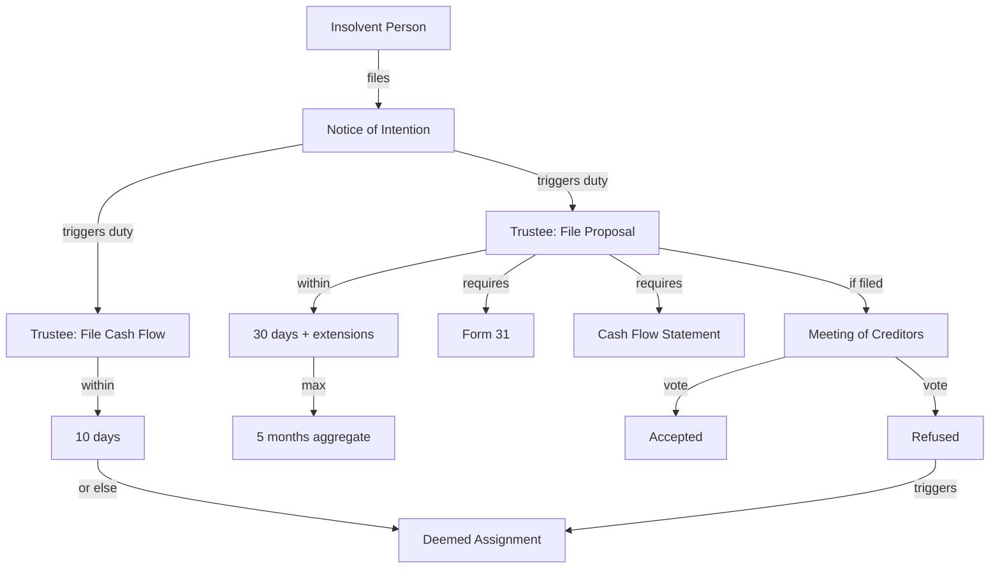
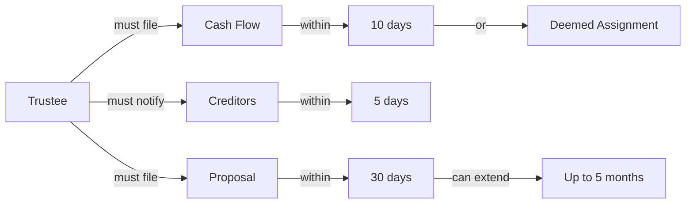

# Session 3 Plan: Relationship Extraction & Knowledge Graphs

**Goal:** Enhance knowledge base with explicit relationships between entities and create visual knowledge graphs for complex process understanding.

**Estimated Time:** 4-6 hours
**Prerequisites:** Session 2 complete (multi-source database with entities)

---

## Part 1: Relationship Extraction (2-3 hours)

### Step 1: Enhance Database Schema (30 minutes)

**Create 3 new relationship tables:**

```sql
-- 1. Duty Relationships (Actor → Action → Deadline → Consequence)
CREATE TABLE duty_relationships (
    id INTEGER PRIMARY KEY AUTOINCREMENT,
    actor_id INTEGER,
    procedure_id INTEGER,
    deadline_id INTEGER,
    consequence_id INTEGER,
    bia_section TEXT,
    duty_type TEXT,              -- 'mandatory', 'discretionary', 'prohibited'
    modal_verb TEXT,             -- 'shall', 'may', 'shall not'
    relationship_text TEXT,      -- Full sentence showing relationship
    source_id INTEGER,
    created_at TIMESTAMP DEFAULT CURRENT_TIMESTAMP,
    FOREIGN KEY (actor_id) REFERENCES actors(id),
    FOREIGN KEY (procedure_id) REFERENCES procedures(id),
    FOREIGN KEY (deadline_id) REFERENCES deadlines(id),
    FOREIGN KEY (consequence_id) REFERENCES consequences(id),
    FOREIGN KEY (source_id) REFERENCES source_documents(id)
);

-- 2. Document Requirements (Procedure → Document)
CREATE TABLE document_requirements (
    id INTEGER PRIMARY KEY AUTOINCREMENT,
    procedure_id INTEGER,
    document_id INTEGER,
    is_mandatory BOOLEAN DEFAULT TRUE,
    filing_context TEXT,         -- When/why document is needed
    bia_section TEXT,
    source_id INTEGER,
    FOREIGN KEY (procedure_id) REFERENCES procedures(id),
    FOREIGN KEY (document_id) REFERENCES documents(id)
);

-- 3. Trigger Relationships (Condition → Consequence)
CREATE TABLE trigger_relationships (
    id INTEGER PRIMARY KEY AUTOINCREMENT,
    trigger_entity_id INTEGER,
    trigger_entity_type TEXT,    -- 'procedure', 'deadline', 'event'
    consequence_id INTEGER,
    trigger_condition TEXT,      -- What condition triggers the consequence
    bia_section TEXT,
    source_id INTEGER,
    FOREIGN KEY (consequence_id) REFERENCES consequences(id)
);

-- Indexes for performance
CREATE INDEX idx_duty_actor ON duty_relationships(actor_id);
CREATE INDEX idx_duty_procedure ON duty_relationships(procedure_id);
CREATE INDEX idx_duty_deadline ON duty_relationships(deadline_id);
CREATE INDEX idx_doc_req_procedure ON document_requirements(procedure_id);
CREATE INDEX idx_trigger_consequence ON trigger_relationships(consequence_id);

-- Views for easy querying
CREATE VIEW v_complete_duties AS
SELECT
    a.role_canonical as actor,
    p.extraction_text as procedure,
    d.timeframe as deadline,
    c.outcome as consequence,
    dr.modal_verb,
    dr.bia_section,
    sd.source_name
FROM duty_relationships dr
LEFT JOIN actors a ON dr.actor_id = a.id
LEFT JOIN procedures p ON dr.procedure_id = p.id
LEFT JOIN deadlines d ON dr.deadline_id = d.id
LEFT JOIN consequences c ON dr.consequence_id = c.id
LEFT JOIN source_documents sd ON dr.source_id = sd.id;
```

**File:** `src/database/relationship_schema.sql`

---

### Step 2: Build Relationship Extractor (1.5-2 hours)

**Approach:** AI-powered relationship detection from existing entity data

**File:** `src/extraction/relationship_extractor.py`

```python
"""
Relationship Extractor - Connect entities into meaningful relationships.

Uses Gemini to analyze entities within the same BIA section and identify
explicit relationships (duties, requirements, triggers).
"""

import google.generativeai as genai
from pathlib import Path
import sqlite3
import json


class RelationshipExtractor:
    """Extract relationships from existing entity data."""

    def __init__(self, db_path: Path, api_key: str):
        self.db = sqlite3.connect(db_path)
        genai.configure(api_key=api_key)
        self.model = genai.GenerativeModel('gemini-2.5-flash')

    def extract_duties_from_section(self, section_number: str):
        """
        Extract duty relationships from a BIA section.

        For a given section, get all entities and ask AI to identify duties.
        """
        # Get section text
        cursor = self.db.execute(
            'SELECT full_text FROM bia_sections WHERE section_number = ?',
            (section_number,)
        )
        section_text = cursor.fetchone()[0]

        # Get entities from this section (via proximity)
        entities = self._get_entities_in_section(section_number)

        # AI prompt to extract relationships
        prompt = f"""
        Analyze this BIA section and identify duty relationships.

        Section {section_number}:
        {section_text[:2000]}

        Entities found in this section:
        - Actors: {entities['actors']}
        - Procedures: {entities['procedures']}
        - Deadlines: {entities['deadlines']}
        - Consequences: {entities['consequences']}

        For each duty relationship, identify:
        1. Who (actor) has the duty
        2. What (procedure) they must do
        3. When (deadline) it must be done
        4. What happens (consequence) if not done
        5. Modal verb (shall, may, shall not)

        Return JSON array of duty relationships.
        """

        response = self.model.generate_content(prompt)
        relationships = json.loads(response.text)

        return relationships

    def _get_entities_in_section(self, section_number: str):
        """Get all entities that appear in a section."""
        # Use proximity - entities within section boundaries
        cursor = self.db.execute('''
            SELECT char_start, char_end FROM bia_sections
            WHERE section_number = ?
        ''', (section_number,))

        result = cursor.fetchone()
        if not result:
            return {}

        char_start, char_end = result

        # Get entities within this character range
        entities = {
            'actors': self._get_entities_in_range('actors', char_start, char_end),
            'procedures': self._get_entities_in_range('procedures', char_start, char_end),
            'deadlines': self._get_entities_in_range('deadlines', char_start, char_end),
            'consequences': self._get_entities_in_range('consequences', char_start, char_end)
        }

        return entities

    def process_all_sections(self):
        """Process all BIA sections and extract relationships."""
        # Focus on high-value sections first
        priority_sections = [
            '50.4',  # NOI and extensions
            '158',   # Bankrupt duties
            '13.3',  # Trustee qualifications
            '25',    # Estate funds
            '26',    # Books and records
            '59',    # Proposal approval
            '69',    # Stay of proceedings
        ]

        all_relationships = []

        for section_num in priority_sections:
            print(f'Processing section {section_num}...')
            relationships = self.extract_duties_from_section(section_num)
            all_relationships.extend(relationships)

            # Store in database
            self._store_relationships(relationships, section_num)

        return all_relationships
```

**Usage:**
```bash
python src/extraction/relationship_extractor.py --sections priority
python src/extraction/relationship_extractor.py --sections all  # For complete extraction
```

---

### Step 3: Test Relationship Queries (30 minutes)

**Test queries enabled by relationships:**

```sql
-- Q1: What are all trustee duties with deadlines?
SELECT actor, procedure, deadline, consequence
FROM v_complete_duties
WHERE actor = 'Trustee'
  AND deadline IS NOT NULL;

-- Q2: What triggers deemed assignment?
SELECT trigger_condition, consequence, bia_section
FROM trigger_relationships tr
JOIN consequences c ON tr.consequence_id = c.id
WHERE c.outcome LIKE '%deemed assignment%';

-- Q3: What documents are required for proposals?
SELECT p.extraction_text as procedure, d.document_name as required_doc
FROM document_requirements dr
JOIN procedures p ON dr.procedure_id = p.id
JOIN documents d ON dr.document_id = d.id
WHERE p.extraction_text LIKE '%proposal%'
  AND dr.is_mandatory = TRUE;

-- Q4: Chain query - Follow complete duty chain
SELECT
    actor,
    procedure,
    deadline,
    consequence,
    modal_verb
FROM v_complete_duties
WHERE bia_section = '50.4'
ORDER BY deadline;
```

---

## Part 2: Knowledge Graph Visualization (2-3 hours)

### Step 1: Design Graph Types (30 minutes)

**File:** `src/visualization/graph_types.py`

```python
from enum import Enum

class GraphType(Enum):
    PROCESS_FLOW = "process_flow"      # Linear process with all entities
    DUTY_CHAIN = "duty_chain"          # Actor → Duty → Deadline → Consequence
    ENTITY_RELATIONSHIP = "erd"        # Schema/relationship diagram
    TIMELINE_GANTT = "timeline"        # Existing timeline (keep)

class GraphConfig:
    """Configuration for graph generation."""
    def __init__(self, graph_type: GraphType, title: str, section_filter: str = None):
        self.graph_type = graph_type
        self.title = title
        self.section_filter = section_filter  # e.g., "4.3.%" for Division I
```

---

### Step 2: Build Graph Generators (1.5-2 hours)

**File 1:** `src/visualization/process_flow_generator.py`

```python
"""
Process Flow Graph Generator

Creates Mermaid flowchart showing complete process:
- Actors performing actions
- Documents being filed
- Deadlines being met
- Consequences if conditions not met
"""

class ProcessFlowGenerator:
    """Generate process flow diagrams from relationships."""

    def generate_division_i_noi_graph(self):
        """
        Generate Division I Notice of Intention complete process flow.

        Output: Mermaid flowchart showing:
        - Insolvent person files NOI
        - Trustee obligations (cash flow, monitoring)
        - Deadline sequences (10 days, 30 days, extensions)
        - Consequences (deemed assignment if fail)
        - Proposal filing and approval
        """

        # Get all relationships for Division I sections (50-66)
        relationships = self._get_relationships_for_sections('50%')

        # Build flowchart
        mermaid = "graph TD\n"

        # Start node
        mermaid += "    START[Insolvent Person in Financial Difficulty]\n"

        # Add each step with relationships
        for rel in relationships:
            mermaid += self._create_flow_node(rel)

        return mermaid

    def _create_flow_node(self, relationship):
        """Create Mermaid node from relationship."""
        # Format: Actor -->|action + deadline| NextStep
        # If consequence exists, add decision diamond
```

**File 2:** `src/visualization/duty_chain_generator.py`

```python
"""
Duty Chain Graph Generator

Creates graph showing actor duties with connected deadlines and consequences.
Useful for understanding: "What must X do, by when, or else what?"
"""

class DutyChainGenerator:
    """Generate duty chain diagrams."""

    def generate_trustee_duties_graph(self):
        """
        All trustee duties with deadlines and consequences.

        Output: Mermaid graph showing:
        Trustee → must file cash flow → within 10 days → or deemed assignment
        Trustee → must notify creditors → within 5 days → or opposition allowed
        etc.
        """

        query = """
        SELECT actor, procedure, deadline, consequence, bia_section
        FROM v_complete_duties
        WHERE actor = 'Trustee'
        ORDER BY bia_section
        """

        # Build chain graph
        mermaid = "graph LR\n"
        mermaid += "    T[Trustee]\n"

        for duty in duties:
            mermaid += self._create_duty_chain(duty)

        return mermaid
```

**File 3:** `src/visualization/knowledge_graph_generator.py`

```python
"""
Master graph generator - coordinates all graph types.
"""

class KnowledgeGraphGenerator:
    """Main interface for generating all graph types."""

    def __init__(self, db_path: Path):
        self.db_path = db_path
        self.process_flow_gen = ProcessFlowGenerator(db_path)
        self.duty_chain_gen = DutyChainGenerator(db_path)

    def generate_all_graphs(self, output_dir: Path):
        """Generate all knowledge graphs."""
        graphs = {
            'division_i_noi_process': self.process_flow_gen.generate_division_i_noi_graph(),
            'trustee_duties_chain': self.duty_chain_gen.generate_trustee_duties_graph(),
            'debtor_duties_chain': self.duty_chain_gen.generate_debtor_duties_graph(),
            'discharge_process': self.process_flow_gen.generate_discharge_process_graph(),
        }

        for name, mermaid in graphs.items():
            output_file = output_dir / f'{name}.md'
            self._save_graph(mermaid, output_file, title=name)

        return graphs
```

---

### Step 3: Generate Sample Graphs (30 minutes)

**Run the generators:**

```bash
# Generate all knowledge graphs
python src/visualization/knowledge_graph_generator.py \
  --output data/output/knowledge_graphs/

# Outputs:
# - division_i_noi_process.md
# - trustee_duties_chain.md
# - debtor_duties_chain.md
# - discharge_process.md
```

---

## Detailed Implementation Steps

### Session 3 - Hour 1: Database Schema

1. Add relationship tables to `src/database/relationship_schema.sql`
2. Run schema migration on `database/insolvency_knowledge.db`
3. Create relationship views for easy querying
4. Test schema with dummy data

**Success Criteria:**
- ✅ 3 new tables created
- ✅ Foreign key constraints working
- ✅ Views return expected structure

---

### Session 3 - Hour 2-3: Relationship Extraction

1. Build `RelationshipExtractor` class
2. Create Gemini prompts for relationship identification
3. Process priority BIA sections (50.4, 158, 13.3, 25, 26, 59, 69)
4. Store relationships in database
5. Validate with queries

**Success Criteria:**
- ✅ 50+ duty relationships extracted
- ✅ 30+ document requirements identified
- ✅ 20+ trigger relationships captured
- ✅ Can query: "What are trustee duties with deadlines?"

---

### Session 3 - Hour 4-5: Knowledge Graph Generation

1. Create graph generator classes
2. Implement Mermaid diagram generation
3. Generate Division I NOI process flow
4. Generate trustee duty chain
5. Test graphs render correctly

**Success Criteria:**
- ✅ 4+ visual graphs generated
- ✅ Mermaid syntax validates
- ✅ Graphs render in GitHub/Obsidian
- ✅ Complete process flows visible

---

### Session 3 - Hour 6: Testing & Validation

1. Test relationship queries answer exam questions better
2. Validate graph accuracy against BIA sections
3. Create usage documentation
4. Commit and push to GitHub

**Success Criteria:**
- ✅ Graphs accurately represent BIA provisions
- ✅ Relationship queries return expected results
- ✅ Documentation complete

---

## Expected Outputs

### 1. Enhanced Query Capabilities

**Complex questions now answerable:**

```
Q: "What must the trustee do within 10 days and what happens if they don't?"

Query:
SELECT actor, procedure, deadline, consequence
FROM v_complete_duties
WHERE actor = 'Trustee'
  AND deadline LIKE '%10 days%';

Result:
Trustee | file cash flow statement | within 10 days | deemed assignment
Trustee | notify creditors of NOI  | within 5 days  | opposition allowed
```

### 2. Visual Knowledge Graphs

**Division I NOI Complete Process:**


**Trustee Duties Chain:**


### 3. New Query Patterns

**Exam Question Enhancement:**

**Before (Entity queries):**
```sql
-- Limited: Just finds deadlines
SELECT timeframe FROM deadlines WHERE timeframe LIKE '%10 days%';
```

**After (Relationship queries):**
```sql
-- Complete: Shows full context
SELECT * FROM v_complete_duties WHERE deadline LIKE '%10 days%';
-- Returns: who, what, when, consequence
```

---

## File Structure After Session 3

```
insolvency-knowledge/
├── database/
│   ├── insolvency_knowledge.db         # Enhanced with relationships
│   └── schema_v3_relationships.sql     # New schema
│
├── src/
│   ├── extraction/
│   │   └── relationship_extractor.py   # NEW
│   ├── visualization/
│   │   ├── process_flow_generator.py   # NEW
│   │   ├── duty_chain_generator.py     # NEW
│   │   └── knowledge_graph_generator.py # NEW
│   └── database/
│       └── relationship_schema.sql     # NEW
│
├── data/output/
│   └── knowledge_graphs/               # NEW
│       ├── division_i_noi_process.md
│       ├── trustee_duties_chain.md
│       ├── debtor_duties_chain.md
│       └── discharge_process.md
│
└── docs/guides/
    └── Using_Knowledge_Graphs.md       # NEW
```

---

## Success Metrics

**Quantitative:**
- 100+ duty relationships extracted
- 50+ document requirements identified
- 30+ trigger relationships captured
- 5+ visual knowledge graphs generated

**Qualitative:**
- Complex multi-entity questions answerable
- Visual study aids for process understanding
- Enhanced cross-reference capabilities
- Improved exam preparation efficiency

---

## Prerequisites for Session 3

Before starting Session 3, ensure you have:
- ✅ Session 2 database (`database/insolvency_knowledge.db`)
- ✅ Gemini API key (for relationship extraction)
- ✅ BIA entities extracted (actors, procedures, deadlines, consequences)
- ✅ Clean directory structure

---

## Commands to Run in Session 3

```bash
# Step 1: Add relationship schema
sqlite3 database/insolvency_knowledge.db < src/database/relationship_schema.sql

# Step 2: Extract relationships
python src/extraction/relationship_extractor.py --sections priority

# Step 3: Generate graphs
python src/visualization/knowledge_graph_generator.py --output data/output/knowledge_graphs/

# Step 4: Test relationship queries
python tools/query/test_relationship_queries.py

# Step 5: Commit
git add -A
git commit -m "Add relationship extraction and knowledge graph visualization"
git push
```

---

## Total Deliverables

**Database Enhancements:**
- 3 new relationship tables
- 100+ relationships extracted
- Enhanced query views

**Visualizations:**
- 5+ Mermaid knowledge graphs
- Process flows for Division I NOI, discharge, etc.
- Duty chains for trustees and debtors

**Tools:**
- Relationship extractor
- Multiple graph generators
- Relationship query examples

**Documentation:**
- Usage guides
- Graph examples
- Relationship query patterns

---

**Session 3 will transform your knowledge base from entity collection to relationship network - enabling complex reasoning and visual process understanding!**

Ready to execute when you start Session 3. 🚀
