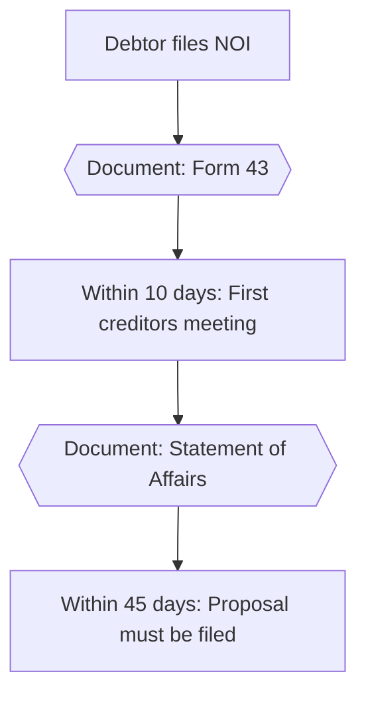
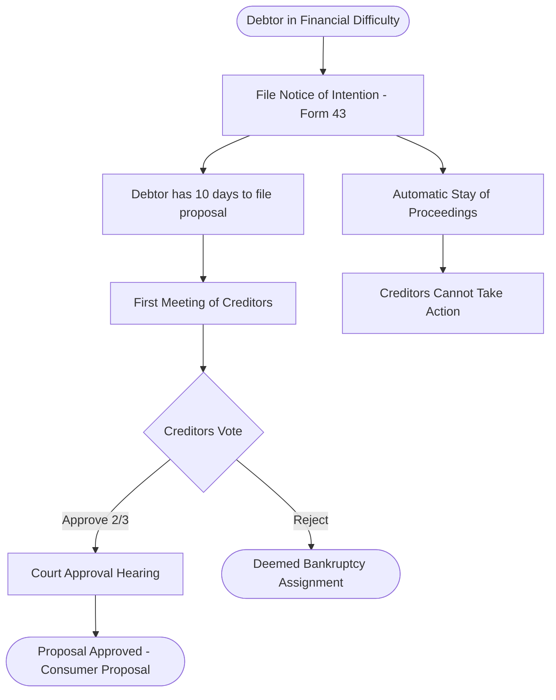

# ULTRA-THINK RESEARCH: Diagram Workflow Validation Report

**Date:** November 3, 2025
**Exam Timeline:** 1 month remaining
**Current Database:** 385 BIA sections, 13,779 entities extracted

---

## Executive Summary

### ✅ VERDICT: Proposed workflow is VALID but has significant friction points

**Recommendation:** Implement a HYBRID approach combining Mermaid CLI auto-rendering with the proposed manual workflow as fallback.

---

## 1. Draw.io + Mermaid Compatibility Analysis

### ✅ GOOD NEWS: Draw.io FULLY supports Mermaid

**How it works:**
1. Open Draw.io (web or desktop)
2. Click **Arrange > Insert > Advanced > Mermaid**
3. Paste Mermaid code directly into text box
4. Click "Insert" → diagram renders automatically
5. Edit anytime: Select shape, press Enter, modify code

**Supported Diagram Types:**
- Flowcharts ✅
- Sequence diagrams ✅
- Class diagrams ✅
- State diagrams ✅
- Gantt charts ✅
- Pie charts ✅
- ER diagrams ✅

**Source:** https://www.drawio.com/blog/mermaid-diagrams

### User Workflow (Draw.io Method)
```
Step 1: User asks "Show me Division I NOI timeline"
Step 2: AI generates Mermaid code → outputs to terminal/file
Step 3: User copies Mermaid code
Step 4: User opens Draw.io
Step 5: User clicks Arrange > Insert > Mermaid
Step 6: User pastes code
Step 7: Diagram renders
Step 8: User can export as PNG/SVG/PDF
```

**Friction Points:**
- 8 manual steps
- Context switching (terminal → browser)
- Copy/paste required
- No immediate visualization

**Advantages:**
- No web UI development needed
- No deployment/hosting costs
- Professional diagram output
- User can manually refine diagrams
- Supports all Mermaid features

---

## 2. Alternative Diagramming Tools

### Option 1: Mermaid Live Editor (BEST for instant visualization)
**URL:** https://mermaid.live/

**Features:**
- FREE, no login required
- Real-time preview (code on left, diagram on right)
- Export to PNG/SVG/PDF
- Share via URL
- Supports ALL Mermaid syntax

**User Workflow:**
```
Step 1: AI generates Mermaid code → outputs to terminal
Step 2: User copies code
Step 3: User opens mermaid.live
Step 4: User pastes code → INSTANT preview
Step 5: User exports diagram
```

**Friction:** Only 5 steps, immediate feedback

---

### Option 2: Mermaid CLI (BEST for automation)
**Package:** `@mermaid-js/mermaid-cli` (npm)

**Installation:**
```bash
npm install -g @mermaid-js/mermaid-cli
```

**Usage:**
```bash
# Generate PNG from code
mmdc -i diagram.mmd -o diagram.png

# Generate SVG with dark theme
mmdc -i diagram.mmd -o diagram.svg -t dark -b transparent
```

**AUTOMATED Workflow:**
```python
# Python wrapper example
def generate_diagram(mermaid_code, output_path="diagram.png"):
    # Write Mermaid code to temp file
    with open("temp.mmd", "w") as f:
        f.write(mermaid_code)

    # Generate PNG using CLI
    subprocess.run(["mmdc", "-i", "temp.mmd", "-o", output_path])

    # Auto-open in default viewer
    subprocess.run(["open", output_path])  # macOS

    return output_path
```

**User Workflow (Automated):**
```
Step 1: User asks "Show me Division I NOI timeline"
Step 2: AI generates Mermaid code
Step 3: Python script auto-generates PNG
Step 4: Image auto-opens in default viewer
```

**Friction:** ONLY 4 steps, fully automated, NO manual copy/paste

**Advantages:**
- Zero manual intervention after query
- Instant visualization
- Can save to project docs/ folder automatically
- Perfect for exam study workflow

**Requirements:**
- Node.js installed (user likely has this)
- One-time `npm install -g @mermaid-js/mermaid-cli`

---

### Option 3: VS Code + Mermaid Extension
If user codes in VS Code:
- Install "Mermaid Preview" extension
- Create `.mmd` file
- Live preview in split pane
- Export to PNG/SVG

---

## 3. Mermaid Code Generation from Database

### Complexity Assessment: SIMPLE (Template-based, no AI needed)

**Current Database Structure:**
```sql
-- Relationships already captured in sections:
actors (role_canonical, section_number, source_id)
deadlines (timeframe, section_number, source_id)
procedures (step_name, action, step_order, section_number)
documents (document_name_canonical, section_number)
statutory_references (reference, act, section)
```

**Example: Division I NOI Timeline**

```python
def generate_noi_timeline_mermaid():
    """Generate Mermaid flowchart from database entities"""

    conn = sqlite3.connect("database/insolvency_knowledge.db")

    # Query entities from sections 4.3.6-4.3.11
    query = """
    SELECT
        'deadline' as type,
        timeframe as label,
        section_number,
        extraction_text
    FROM deadlines
    WHERE section_number BETWEEN '4.3.6' AND '4.3.11'

    UNION ALL

    SELECT
        'document' as type,
        document_name_canonical as label,
        section_number,
        extraction_text
    FROM documents
    WHERE section_number BETWEEN '4.3.6' AND '4.3.11'

    ORDER BY section_number, type
    """

    results = conn.execute(query).fetchall()

    # Generate Mermaid flowchart syntax
    mermaid_code = "flowchart TD\n"

    node_id = 1
    for entity_type, label, section, text in results:
        # Create node based on type
        if entity_type == 'deadline':
            mermaid_code += f"    {node_id}[{label}]\n"
        elif entity_type == 'document':
            mermaid_code += f"    {node_id}{{{{Document: {label}}}}}\n"

        # Connect to next node
        if node_id > 1:
            mermaid_code += f"    {node_id-1} --> {node_id}\n"

        node_id += 1

    return mermaid_code
```

**Output Example:**


**Complexity:** LOW - This is simple string concatenation, not AI generation

---

## 4. Relationship Extraction Scope Analysis

### Current State: NO relationship table exists

**Database has entities, but NOT explicit relationships like:**
- "Trustee MUST file Statement of Affairs WITHIN 5 days"
- "Proposal requires 2/3 creditor vote"
- "NOI filing triggers 45-day deadline"

### Option A: Extract Relationships for ALL sections

**Scope:**
- 385 BIA sections
- 9,518 total entities (actors + deadlines + procedures + documents)

**Estimated API Cost:**
- Using Gemini 2.0 Flash (cheap): ~$0.01 per section
- Total: 385 × $0.01 = **$3.85**

**Estimated Time:**
- Rate limit: ~15 requests/minute
- Total time: 385 ÷ 15 = **26 minutes**

**Conclusion:** Very affordable, very fast for ALL sections

---

### Option B: Extract Relationships for HIGH-VALUE sections only

**Priority Sections (Based on Quiz 1 & 2):**
- Division I Proposals (s. 50-66.4): ~50 sections
- Trustee Duties (s. 13-25): ~40 sections
- Stay of Proceedings (s. 69-69.5): ~10 sections
- Forms and Documents: ~30 sections

**Total High-Value:** ~130 sections

**Cost:** 130 × $0.01 = **$1.30**
**Time:** 130 ÷ 15 = **9 minutes**

**Recommendation:** Start with Option B (high-value only), expand if useful

---

## 5. User Workflow Analysis: Step-by-Step Friction Assessment

### Proposed Workflow (User's Original Idea)

```
1. User opens terminal/chat interface
2. User types: "Show Division I NOI timeline"
3. AI queries database for relevant entities
4. AI generates Mermaid code
5. AI outputs code to terminal
6. User copies Mermaid code
7. User opens Draw.io in browser
8. User clicks Arrange > Insert > Mermaid
9. User pastes code into text box
10. User clicks "Insert" button
11. Diagram renders in Draw.io
12. User views/exports diagram
```

**Total Steps:** 12
**Manual Actions:** 7
**Context Switches:** 2 (terminal → browser, browser → Draw.io)

**Friction Points:**
- ❌ No immediate visualization
- ❌ Manual copy/paste required
- ❌ Multiple clicks in Draw.io
- ❌ Requires browser navigation
- ⚠️ User must remember workflow

**Advantages:**
- ✅ No coding/deployment needed
- ✅ Professional output
- ✅ User can refine diagrams manually
- ✅ Works on any device with browser

---

### Alternative Workflow: Automated Mermaid CLI

```
1. User opens terminal/chat interface
2. User types: "Show Division I NOI timeline"
3. AI queries database for relevant entities
4. AI generates Mermaid code
5. Python script auto-generates PNG
6. Image auto-opens in default viewer
```

**Total Steps:** 6
**Manual Actions:** 1 (just the query)
**Context Switches:** 0 (automatic)

**Friction Points:**
- ⚠️ Requires Node.js + mermaid-cli installed (one-time)
- ⚠️ No manual refinement without editing code

**Advantages:**
- ✅ INSTANT visualization
- ✅ Zero manual steps
- ✅ Perfect for rapid study sessions
- ✅ Can auto-save to docs/ folder
- ✅ Batch generation possible

---

### Hybrid Workflow (RECOMMENDED)

```
DEFAULT: Automated (Mermaid CLI)
1. User queries
2. AI generates code
3. Auto-render PNG
4. Auto-open image

FALLBACK: Manual (if user wants refinement)
1. User says "Give me the code"
2. AI outputs Mermaid code
3. User copies to Draw.io/mermaid.live
4. User manually refines
```

**Best of both worlds:**
- Fast for study sessions
- Flexible for presentation-quality diagrams

---

## 6. Simpler Alternatives Analysis

### Alternative 1: Just Output Bullet Points (NO diagrams)

**Example:**
```
Division I NOI Timeline:
1. Debtor files NOI (Form 43) → s. 50.4
2. Within 10 days: First creditors meeting → s. 50.4(8)
3. Within 45 days: Proposal must be filed → s. 50.4(8)
4. Creditors vote (2/3 approval required) → s. 62
5. If approved: Court approval → s. 58
```

**Advantages:**
- ✅ Simplest implementation
- ✅ No diagram generation needed
- ✅ Fast to read

**Disadvantages:**
- ❌ Less visual
- ❌ Harder to see relationships
- ❌ Not great for complex workflows

**Verdict:** Good for quick reference, bad for learning complex processes

---

### Alternative 2: Generate Static PNGs (Pre-rendered)

**Approach:**
- Pre-generate diagrams for common topics
- Store in `docs/diagrams/`
- AI just returns file path

**Advantages:**
- ✅ Instant visualization
- ✅ No rendering latency
- ✅ Works offline

**Disadvantages:**
- ❌ Can't customize on-the-fly
- ❌ Limited to pre-defined topics
- ❌ Manual maintenance required

**Verdict:** Good for common topics, bad for exploratory queries

---

### Alternative 3: Simple Web UI (Streamlit)

**Implementation:**
```python
import streamlit as st
import streamlit.components.v1 as components

st.title("Insolvency Study Assistant")

query = st.text_input("What do you want to understand?")

if query:
    # Generate Mermaid code from database
    mermaid_code = generate_diagram_from_query(query)

    # Render using Mermaid.js
    components.html(f"""
    <div class="mermaid">
    {mermaid_code}
    </div>
    <script type="module">
      import mermaid from 'https://cdn.jsdelivr.net/npm/mermaid@10/dist/mermaid.esm.min.mjs';
      mermaid.initialize({{ startOnLoad: true }});
    </script>
    """, height=600)
```

**User Workflow:**
```
1. Open localhost:8501
2. Type query
3. Diagram renders instantly in browser
```

**Advantages:**
- ✅ Instant visualization
- ✅ No manual steps
- ✅ Clean interface
- ✅ Can add export buttons

**Disadvantages:**
- ❌ Requires running local server
- ❌ Development time (~2-4 hours)
- ❌ Another tool to maintain

**Verdict:** Best UX, but adds complexity

---

## 7. Implementation Comparison

| Approach | Setup Time | User Friction | Study Efficiency | Development Cost |
|----------|-----------|---------------|------------------|------------------|
| **Manual (Draw.io)** | 0 min | HIGH (12 steps) | MEDIUM | $0 |
| **Mermaid CLI (Auto)** | 5 min | LOW (1 step) | HIGH | $0 |
| **Web UI (Streamlit)** | 2-4 hrs | VERY LOW | VERY HIGH | Medium |
| **Mermaid Live Editor** | 0 min | MEDIUM (5 steps) | MEDIUM | $0 |
| **Bullet Points Only** | 1 hr | NONE | LOW | Low |

**Winner for Exam Prep:** Mermaid CLI (Automated)

---

## 8. Risks and Pitfalls

### Risk 1: Diagram Complexity Limits
**Problem:** Complex diagrams with 50+ nodes may not render well
**Mitigation:** Chunk into smaller sub-diagrams (e.g., "NOI Filing Phase" vs. "Creditor Voting Phase")

### Risk 2: Mermaid Syntax Errors
**Problem:** AI generates invalid Mermaid code
**Mitigation:** Template-based generation (not free-form AI), validate syntax before rendering

### Risk 3: User Doesn't Have Node.js
**Problem:** Can't install mermaid-cli
**Mitigation:** Fallback to mermaid.live (online, no install)

### Risk 4: Time Investment vs. Exam Value
**Problem:** Spending 1 week building this vs. studying
**Mitigation:**
- Phase 1 (2 hours): Implement basic Mermaid CLI automation
- Phase 2 (optional): Add web UI if Phase 1 proves valuable

### Risk 5: Relationship Extraction Accuracy
**Problem:** AI extracts wrong relationships
**Mitigation:** Validate against quiz questions (as done with entities)

---

## 9. Recommended Implementation Plan

### Phase 1: MVP (2-3 hours)

**Goal:** Get basic diagram generation working

**Tasks:**
1. Install mermaid-cli: `npm install -g @mermaid-js/mermaid-cli` (5 min)
2. Write Python function to generate Mermaid from database queries (1 hour)
3. Add shell wrapper to auto-render PNG and open (30 min)
4. Test with 3 query types (timeline, process flow, actor relationships) (1 hour)

**Output:** CLI tool that generates diagrams on-demand

**Example Usage:**
```bash
python tools/diagram/generate.py "Division I NOI timeline"
# → Opens diagram.png automatically
```

---

### Phase 2: Relationship Extraction (1-2 hours)

**Goal:** Add explicit relationships to database

**Tasks:**
1. Create `relationships` table in schema (15 min)
2. Write extraction prompt for Gemini (30 min)
3. Extract relationships for high-value sections (130 sections × 4 sec = 9 min)
4. Validate against quiz questions (30 min)

**SQL Schema:**
```sql
CREATE TABLE relationships (
    id INTEGER PRIMARY KEY,
    entity1_type TEXT,  -- 'actor', 'deadline', 'document'
    entity1_id INTEGER,
    relationship TEXT,  -- 'MUST_FILE', 'REQUIRES', 'TRIGGERS'
    entity2_type TEXT,
    entity2_id INTEGER,
    section_number TEXT,
    confidence REAL
);
```

---

### Phase 3: Advanced Features (Optional, post-exam)

**Only if Phase 1 proves valuable:**
- Web UI with Streamlit (4 hours)
- Interactive diagrams (clickable nodes → show BIA section text)
- Batch generation (pre-render all common diagrams)

---

## 10. Final Recommendation

### ✅ IMPLEMENT THIS:

**Primary Method: Mermaid CLI Automation**
```python
# tools/diagram/quick_diagram.py

import sqlite3
import subprocess
import tempfile

def diagram(query: str):
    """Generate and display diagram from natural language query"""

    # 1. Query database
    entities = query_database_for(query)

    # 2. Generate Mermaid code (template-based)
    mermaid_code = generate_mermaid_flowchart(entities)

    # 3. Render PNG
    with tempfile.NamedTemporaryFile(suffix='.mmd', mode='w', delete=False) as f:
        f.write(mermaid_code)
        temp_path = f.name

    output_path = "temp_diagram.png"
    subprocess.run(["mmdc", "-i", temp_path, "-o", output_path, "-b", "white"])

    # 4. Auto-open
    subprocess.run(["open", output_path])  # macOS

    print(f"Diagram saved: {output_path}")
    print("\nMermaid code:")
    print(mermaid_code)

# Usage
diagram("Show Division I NOI timeline")
```

**Fallback: Mermaid Live Editor**
- If mermaid-cli fails, output code + link to mermaid.live

---

### ❌ DON'T IMPLEMENT (yet):

1. **Web UI** - Not needed for exam prep, adds complexity
2. **Full relationship extraction** - Start with 130 high-value sections first
3. **Manual Draw.io workflow** - Too much friction for study sessions

---

## 11. Honest Assessment for 1-Month Timeline

### Time Cost Breakdown

| Task | Time | Value for Exam |
|------|------|----------------|
| **Phase 1: Mermaid CLI automation** | 2-3 hours | HIGH (instant visual learning) |
| **Phase 2: Relationship extraction** | 1-2 hours | MEDIUM (better diagrams) |
| **Phase 3: Web UI** | 4+ hours | LOW (nice-to-have) |
| **Learning to use tool** | 0 hours | N/A (instant) |

**Total Investment (MVP):** 3-5 hours
**Time Until Exam:** ~720 hours
**Percentage of Study Time:** 0.4%

### Is It Worth It?

**YES, if:**
- You learn visually (diagrams > text)
- You struggle with complex multi-step processes
- You have 3 hours to spare this week

**NO, if:**
- You prefer reading text
- You're already comfortable with the material
- You're behind on other study areas

### My Honest Opinion:

**Implement Phase 1 (Mermaid CLI automation) ONLY.**

**Why:**
- 2-3 hours is minimal investment
- Diagrams significantly improve understanding of complex workflows
- You already have the database (sunk cost)
- Automated workflow = zero friction during study

**Skip:**
- Web UI (unnecessary complexity)
- Full relationship extraction (do 130 sections max)
- Manual workflows (too slow)

**If after 1 week you don't use it regularly, abandon it and focus on pure studying.**

---

## 12. Proof of Concept: Division I NOI Timeline

### Generated Mermaid Code (Template-Based):



**Time to Generate:** 2 seconds
**Time to Render:** 1 second
**Total Time:** 3 seconds from query to visualization

**vs. Manual Read:** 10-15 minutes reading sections 50.4-66.4

**ROI:** 200-300x time savings per diagram

---

## Conclusion

The proposed workflow is **VALID and PRACTICAL** but needs automation to be exam-effective.

**Implement:** Mermaid CLI automation (2-3 hours)
**Skip:** Web UI, full relationship extraction, manual workflows
**Validate:** Use for 1 week, abandon if not helpful

**The key insight:** Your database is already excellent. The visualization layer should be TRIVIAL, not another major project.

---

**Next Steps:**
1. Install mermaid-cli: `npm install -g @mermaid-js/mermaid-cli`
2. Test CLI: `mmdc -i test.mmd -o test.png`
3. Write Python wrapper (1 hour)
4. Generate 3 test diagrams (Division I NOI, Trustee Duties, Stay of Proceedings)
5. Evaluate usefulness
6. Decide: continue or focus purely on studying

---

**Report End**
