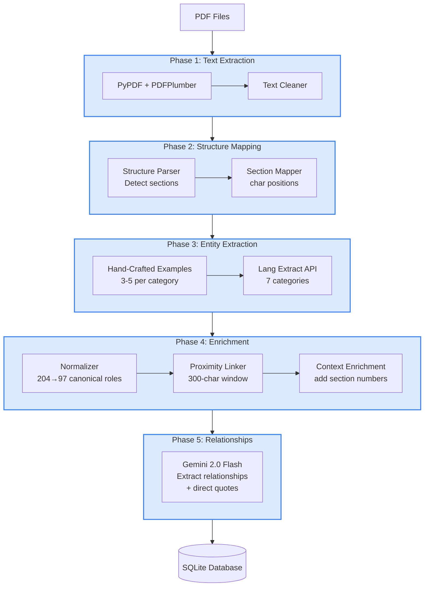

# Extraction Pipeline - 5-Phase Processing

This diagram shows the detailed extraction pipeline that transforms raw PDFs into structured knowledge.

## Pipeline Flow



## Phase Details

### Phase 1: Text Extraction & Cleaning
**Tools**: `pypdf`, `pdfplumber`

**Steps**:
1. Extract text from PDF (pypdf primary, pdfplumber fallback)
2. Remove formatting artifacts (headers, footers, page numbers)
3. Normalize whitespace and line breaks
4. Preserve document structure

**Output**: Clean text file with original character positions preserved

**Location**: `src/utils/pdf_extractor.py`

---

### Phase 2: Structure Mapping
**Tools**: Custom regex patterns, hierarchical parsers

**Steps**:
1. **Structure Parser**: Detect document hierarchy (Parts, Sections, Subsections)
2. **Section Mapper**: Map character positions to section numbers
3. Build hierarchical section tree (1,344 sections for BIA)
4. Store section boundaries (char_start, char_end)

**Output**: Section mapping JSON with hierarchical paths

**Location**:
- `src/utils/bia_structure_parser.py`
- `src/utils/section_mapper.py`

**Example Mapping**:
```json
{
  "section_number": "50.4(1)",
  "hierarchical_path": "Part III / Division I / Section 50.4 / Subsection (1)",
  "char_start": 125430,
  "char_end": 126250
}
```

---

### Phase 3: Entity Extraction (Lang Extract)
**Tools**: Lang Extract API

**Approach**: Ultra-minimal examples (1-2 attributes per category)

**7 Atomic Categories**:
1. **Actors**: `role_canonical`, `extraction_text`
2. **Procedures**: `step_name`, `action`
3. **Deadlines**: `timeframe`, `trigger_event`
4. **Consequences**: `outcome`, `severity`
5. **Documents**: `document_name_canonical`, `form_number`
6. **Concepts**: `definition`
7. **Statutory References**: `reference_text`

**Example Files**: `data/examples/content_examples/*_minimal.py`

**Output**: JSONL files with extracted entities

**Location**: `src/extraction/extractor.py`

**Key Discovery**:
> Cumulative complexity = text_size × attributes_per_entity
>
> For large documents (492K chars), 1-2 attributes = 100% reliability
>
> Lang Extract expands minimal examples automatically

---

### Phase 4: Enrichment & Normalization
**Tools**: Custom normalization scripts, AI-powered canonical mapping

**Steps**:
1. **Actor Normalizer**: Canonicalize actor roles (204 → 97 unique roles)
   - Example: "Licensed Trustee", "Trustee in Bankruptcy" → "Trustee"
   - Preserves legal distinctions: "Debtor" ≠ "Bankrupt"

2. **Proximity Linker**: Link entities within 300-character window
   - Entities near each other likely form relationships
   - Used as hints for relationship extraction

3. **Context Enrichment**: Add section numbers to entities
   - Map char_start/char_end to section_number
   - Enables section-based filtering

**Output**: Enriched entity records with section context

**Location**:
- `src/normalization/canonical_actor_mapper.py`
- `src/utils/proximity_linker.py`

---

### Phase 5: Relationship Extraction (AI)
**Tools**: Gemini 2.0 Flash API

**Process**:
1. For each BIA section, gather all entities within it
2. Send to Gemini with prompt: "Identify duty relationships"
3. AI returns structured relationships:
   - `actor_id` → `procedure_id` → `deadline_id` → `consequence_id`
   - **`relationship_text`**: Direct quote from BIA (critical!)
   - `duty_type`: mandatory/discretionary/prohibited
   - `modal_verb`: shall/may/must/shall not

**Output**: Relationship records with direct BIA quotes

**Location**: `src/extraction/relationship_extractor.py`

**Cost**: $0.15-0.25 per source (Gemini Flash 2.0)

**Example Relationship**:
```json
{
  "actor_id": 42,
  "procedure_id": 156,
  "deadline_id": 89,
  "consequence_id": 23,
  "relationship_text": "The insolvent person shall, within 10 days after filing a notice of intention, file with the official receiver a cash-flow statement",
  "bia_section": "50.4(1)",
  "duty_type": "mandatory",
  "modal_verb": "shall"
}
```

---

## Pipeline Execution

### Command Line
```bash
# Full pipeline for BIA statute
python3 src/extraction/relationship_extractor.py --mode all

# Full pipeline for study materials
python3 src/extraction/study_material_relationship_extractor.py
```

### Processing Time
- BIA Statute: ~20-25 minutes
- Study Materials: ~15-20 minutes
- Cost per source: $0.15-0.25

### Outputs
- Entities loaded to database (bulk insert)
- Relationships loaded to database
- Views automatically updated
- Ready for querying
