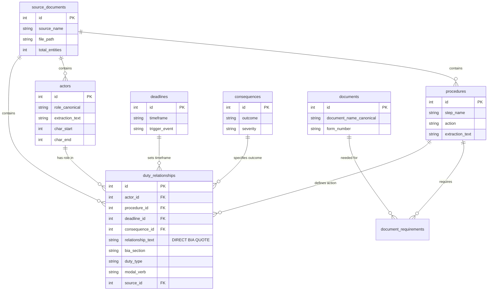

# Database Schema - Entity-Relationship Model

This diagram shows the SQLite database schema with all tables and relationships.

## Schema Diagram



## Table Descriptions

### Entity Tables (7 tables, 13,779 total entities)

#### 1. `actors`
Roles that perform actions in the insolvency process.

**Key Fields**:
- `role_canonical`: Normalized role name (e.g., "Trustee", "Debtor", "Official Receiver")
- `extraction_text`: Original text from BIA
- `char_start`, `char_end`: Position in source document

**Examples**: Trustee, Bankrupt, Secured Creditor, Court, Superintendent

**Total**: ~300 records (97 canonical roles after normalization)

---

#### 2. `procedures`
Actions, steps, or processes defined in insolvency law.

**Key Fields**:
- `step_name`: Brief action name
- `action`: Verb describing the action (e.g., "file", "submit", "notify")
- `extraction_text`: Full procedure description

**Examples**: "File notice of intention", "Submit cash flow statement", "Call meeting of creditors"

**Total**: ~4,200 records

---

#### 3. `deadlines`
Time constraints and timeframes for procedures.

**Key Fields**:
- `timeframe`: Duration or deadline (e.g., "10 days", "within 5 days after filing")
- `trigger_event`: What starts the clock (e.g., "after filing", "from bankruptcy date")

**Examples**: "10 days after filing", "within 5 days", "21 months from bankruptcy"

**Total**: ~800 records

---

#### 4. `consequences`
Outcomes, results, or penalties from actions or inactions.

**Key Fields**:
- `outcome`: What happens (e.g., "deemed assignment", "discharge granted")
- `severity`: Impact level (optional)

**Examples**: "Deemed assignment", "Proposal annulled", "Discharge suspended"

**Total**: ~650 records

---

#### 5. `documents`
Forms, statements, and documents required in the process.

**Key Fields**:
- `document_name_canonical`: Normalized document name
- `form_number`: Official form number (e.g., "Form 31", "Form 79")

**Examples**: "Cash flow statement", "Statement of Affairs (Form 79)", "Proposal (Form 31)"

**Total**: ~1,100 records

---

#### 6. `concepts`
Legal concepts and definitions.

**Key Fields**:
- `definition`: Explanation of the concept

**Examples**: "Secured creditor", "Preferential payment", "Ordinary resolution"

**Total**: ~600 records

---

#### 7. `statutory_references`
Citations to other sections, acts, or regulations.

**Key Fields**:
- `reference_text`: The citation (e.g., "section 68", "subsection (2)")

**Examples**: "section 50.4", "paragraph 66.13(2)(a)", "Income Tax Act"

**Total**: ~6,100 records

---

### Relationship Tables (3 tables, 2,170 total relationships)

#### 1. `duty_relationships` ⭐ PRIMARY TABLE
Links actors, procedures, deadlines, and consequences into complete duties.

**Structure**:
```
Actor → Procedure → Deadline → Consequence
```

**Critical Field**: `relationship_text`
- Stores the **original sentence from BIA**
- Enables zero-hallucination answers
- Direct quote for exam questions

**Example Record**:
```sql
{
  "actor_id": 42,  -- "Insolvent Person"
  "procedure_id": 156,  -- "File cash flow statement"
  "deadline_id": 89,  -- "10 days after filing"
  "consequence_id": NULL,
  "relationship_text": "The insolvent person shall, within 10 days after filing a notice of intention, file with the official receiver a cash-flow statement",
  "bia_section": "50.4(1)",
  "duty_type": "mandatory",
  "modal_verb": "shall"
}
```

**Total**: 2,170 relationships
- 1,047 from BIA Statute (80% coverage)
- 1,123 from Study Materials (100% coverage)

---

#### 2. `document_requirements`
Links procedures to required documents.

**Structure**:
```
Procedure → Document
```

**Key Fields**:
- `is_mandatory`: Required vs optional
- `filing_context`: When/why document is needed

**Example**: Filing a proposal requires Form 31 and cash flow statement

**Total**: ~350 records

---

#### 3. `trigger_relationships`
Links triggering conditions to consequences.

**Structure**:
```
Condition/Event → Consequence
```

**Example**: "Failure to file proposal" triggers "Deemed assignment"

**Total**: ~150 records

---

### Metadata Tables

#### `source_documents`
Tracks all source materials.

**Fields**:
- `id`: Unique source ID
- `source_name`: Human-readable name
- `file_path`: Location of original file
- `total_entities`: Count of extracted entities

**Records**:
1. BIA Statute (source_id = 2)
2. Study Materials - Insolvency Administration (source_id = 3)

---

#### `bia_sections`
Stores full text of all BIA sections with FTS5 search.

**Fields**:
- `section_number`: Section number (e.g., "50.4", "50.4(1)")
- `full_text`: Complete section text
- `char_start`, `char_end`: Position boundaries
- `hierarchical_path`: Full path (e.g., "Part III / Division I / Section 50.4")

**Features**:
- FTS5 virtual table for full-text search
- Sub-5ms query performance
- 385 complete sections

---

#### `osb_directives`
Stores OSB (Office of the Superintendent of Bankruptcy) directives.

**Fields**:
- `directive_number`: Directive ID (e.g., "6R7", "17")
- `title`: Directive title
- `full_text`: Complete directive text
- `url`: Source URL

**Records**: 6 directives locally available, more fetchable via web

---

### Views (Primary Query Interface)

#### `v_complete_duties` ⭐ PRIMARY VIEW
Joins all entities and relationships for easy querying.

**Returns**:
- `actor`: Canonical actor role
- `procedure`: Procedure description
- `deadline`: Timeframe
- `consequence`: Outcome
- `relationship_text`: Direct BIA quote
- `bia_section`: Section reference
- `duty_type`, `modal_verb`: Classification
- `source_name`: Which document

**Performance**: 5-20ms typical query time

**Example Query**:
```sql
SELECT actor, procedure, deadline, relationship_text, bia_section
FROM v_complete_duties
WHERE actor = 'Trustee'
  AND deadline IS NOT NULL
ORDER BY bia_section;
```

---

#### `v_document_requirements`
Simplified view of procedure → document relationships.

---

#### `v_relationship_stats`
Statistics on relationship coverage.

---

## Indexes (15+ indexes)

All foreign keys and frequently queried fields are indexed:
- `idx_duty_actor` on `duty_relationships(actor_id)`
- `idx_duty_section` on `duty_relationships(bia_section)`
- `idx_actors_canonical` on `actors(role_canonical)`
- FTS5 index on `bia_sections.full_text`

**Result**: Sub-20ms queries even with complex joins

---

## Database File

**Location**: `database/insolvency_knowledge.db`

**Size**: ~15-20 MB

**Schema Definition**: `src/database/relationship_schema.sql`

**Loader**: `src/database/loader.py`
