# Consumer Proposal - Complete Reference Map

**All BIA Sections, Directives, and Forms - How They Connect**

---

## Master Relationship Diagram


---

## Detailed Section-by-Section Map

### Pre-Filing & Eligibility


### Filing Documents & Forms


### Administrator's 10-Day Duties


### Voting & Meeting Process


### Statutory Terms & Priority Payments


### Counselling Requirements

```mermaid
graph TD
    Approved["Proposal Approved<br/>Day 60+"] --> Mandatory["§66.13(2)(b)<br/>COUNSELLING MANDATORY"]

    Mandatory --> D1R8["Directive 1R8<br/>Counselling Details"]

    D1R8 --> S1Window["SESSION 1 WINDOW:<br/>Days 10-90 from filing"]
    S1Window --> S1["First Session"]

    S1 --> Topics1["Topics:<br/>- Budgeting<br/>- Financial goals<br/>- Spending habits<br/>- Credit use"]

    Topics1 --> Wait["Wait ≥30 days"]

    Wait --> S2["Second Session<br/>Before certificate"]

    S2 --> Topics2["Topics:<br/>- Progress review<br/>- Budget refinement<br/>- Credit rebuilding<br/>- Future planning"]

    Topics2 --> Special{Non-budgetary<br/>issues?}

    Special -->|YES| Refer["Refer to:<br/>- Gambling counselling<br/>- Substance abuse<br/>- Family services"]
    Special -->|NO| Complete["✅ Counselling<br/>complete"]
    Refer --> Complete

    Complete --> Cert["Eligible for<br/>certificate"]

    Mandatory -.->|if refused| S66_38_2["§66.38(2)<br/>NO CERTIFICATE<br/>if counselling neglected"]

    style S1 fill:#FFE4B5
    style S2 fill:#FFE4B5
    style S66_38_2 fill:#FFB6C1
    style Complete fill:#90EE90
```



### Certificate & Discharge

```mermaid
graph LR
    subgraph Completion["PROPOSAL COMPLETION"]
        AllPaid{All payments<br/>completed?}
        AllCounsel{Both counselling<br/>sessions done?}

        AllPaid -->|NO| KeepPaying[Continue<br/>performing...]
        AllPaid -->|YES| AllCounsel

        AllCounsel -->|NO| NoCert["❌ NO CERTIFICATE<br/>§66.38(2)"]
        AllCounsel -->|YES| IssueCert
    end

    IssueCert["Administrator issues<br/>§66.38"] --> F46["📄 FORM 46<br/>Certificate of<br/>Full Performance"]

    F46 --> Send1["Send to:<br/>✓ Debtor<br/>✓ Official Receiver"]

    Send1 --> Effect["EFFECT:<br/>Debts discharged"]

    Effect --> S173Check["§173 Check:<br/>Some debts survive"]

    S173Check --> Survives["SURVIVE:<br/>- Student loans <7 years<br/>- Fraud debts<br/>- Fines<br/>- Alimony/support<br/>- Misrepresentation"]

    Survives --> Unless["UNLESS:<br/>Proposal explicitly<br/>provided for discharge<br/>AND creditor voted YES"]

    Effect --> Credit["Credit Bureau:<br/>R7 rating<br/>3 years from completion"]

    style IssueCert fill:#FFD700
    style Effect fill:#90EE90
    style NoCert fill:#FFB6C1
```



### Default & Annulment Process


### Administrator Discharge Process


---

## Complete Forms Reference

### By Stage

#### Stage 1: Pre-Filing/Assessment
- **Directive 6R7** - Assessment of Individual Debtor
- **Directive 2R** - Joint Filing (if applicable)

#### Stage 2: Filing
- **Form 47** - Consumer Proposal
- **Form 65** - Statement of Affairs (with budget)
- **Form 79** - Estate Summary Information
- **§50(3)** - Inspectors' approval (if already bankrupt)

#### Stage 3: Notice to Creditors (Within 10 days)
- **Form 51** - Administrator's Report to Creditors
- **Form 31** - Proof of Claim (blank)
- **Form 37.1** - Voting Letter
- **Form 49** - Notice (explains process)

#### Stage 4: Meeting (If held)
- **Directive 22R4** - Quorum and voting procedures
- **§54(3)** - Related creditors (vote against only)

#### Stage 5: Court Review (If requested)
- **§66.23** - Hearing procedures
- **§66.22** - Deemed approval (if not requested)

#### Stage 6: Performance
- **Directive 1R8** - Counselling (2 sessions)
- **§66.12(6)** - 5-year maximum term

#### Stage 7: Completion
- **Form 46** - Certificate of Full Performance
- **§66.38** - Certificate issuance

#### Stage 8: Administrator Discharge
- **Form 14** - Final Statement of Receipts & Disbursements
- **Form 16** - Notice of Deemed Taxation & Discharge
- **§66.39** - Administrator discharge (3 months)

---

## Section Number Quick Finder

### Division II Core Sections (§66.11 - §66.4)

```
ELIGIBILITY & FILING:
├─ §66.11 - Consumer debtor definition
├─ §66.12 - Who can file, debt limits, joint filing
├─ §66.13 - Counselling requirement
└─ §66.14 - Administrator duties (notice)

MEETING & VOTING:
├─ §66.15 - Meeting requirement (≥25%)
├─ §66.16 - (Reserved)
├─ §66.17 - (Reserved)
├─ §66.18 - Deemed acceptance (45 days)
└─ §66.19 - Amendment at meeting

COURT APPROVAL:
├─ §66.21 - (Reserved)
├─ §66.22 - Deemed court approval (15 days)
└─ §66.23 - Court hearing procedures (if requested)

PERFORMANCE & COMPLETION:
├─ §66.28 - Performance obligations
├─ §66.29 - Certificate filing (optional - for land)
└─ §66.38 - Certificate of Full Performance

DEFAULT & ANNULMENT:
├─ §66.3 - Court annulment
├─ §66.31 - Deemed annulment (3 months default)
├─ §66.31(5) - Automatic revival
├─ §66.35 - Cannot refile (6 months)
└─ §66.36 - Cannot amend (6 months)

ADMINISTRATOR DISCHARGE:
└─ §66.39 - Deemed discharge (3 months)
```

### Division I Sections That Apply to Division II

```
THESE SECTIONS APPLY (via §66(1)):
├─ §50(3) - Inspectors' approval (if bankrupt)
├─ §54(3) - Related creditors (vote against only)
├─ §60(1) - Priority payment requirement
├─ §60(1.1) - Crown trust amounts
├─ §60(2) - All payments through administrator
├─ §62(2) - Binding effect when approved
├─ §69.2 - Stay of proceedings
└─ §173 - Debts that survive discharge
```

---

## Directive Quick Reference

### Directive 1R8: Counselling in Insolvency Matters

**Purpose:** Mandatory financial counselling to help debtors avoid future insolvency

**Requirements:**
- **2 sessions** required
- **Session 1:** Days 10-90 from filing
- **Session 2:** ≥30 days after Session 1, before certificate
- **Topics:** Budgeting, financial goals, spending habits, responsible credit use
- **Special needs:** Identify gambling, substance abuse, family issues → refer to specialists
- **Consequence:** No counselling = NO certificate §66.38(2)

---

### Directive 2R: Joint Filing

**Purpose:** Allow couples/partners to file together when debts overlap

**Requirements:**
- Debts must be "substantially the same"
- Must have "financial relationship"
- Administrator must determine it's in best interest of debtors AND creditors

**Benefits:**
- One administration (not two)
- Same admin fee (not doubled)
- Counselling max 2× cost (not 2× full)

**Can separate later** if circumstances change

---

### Directive 6R7: Assessment of Individual Debtor

**Purpose:** Administrator evaluates if proposal is viable before filing

**Assessment includes:**
- Financial situation analysis
- Debt load review ($250k limit check)
- Income/expense evaluation
- Viability of proposed repayment
- Whether joint proposal appropriate
- Recommendation: File or explore alternatives

---

### Directive 22R4: Proofs of Claim, Proxies, Quorums and Voting

**Purpose:** Rules for creditor meetings and voting

**Key Rules:**

**Quorum:**
- ≥1 creditor with proven claim (filed before meeting)
- Voting letters count toward quorum
- Can attend electronically
- **If no quorum in consumer proposal:** Deemed accepted!

**Proxies:**
- Can be letter or electronic
- Filing before meeting NOT required (unlike proofs of claim)
- Blank proxy = trustee can vote
- No corporate seal needed (unless bylaws require)

**Voting:**
- $1 = 1 vote
- Simple majority in consumer proposals
- Only votes cast are counted (abstentions ignored)

---

## Complete Process Map (All Elements Connected)


---

## Form Connections Map


---

## Summary: The "Deeming" Framework

**Consumer proposals use "deemed" provisions extensively to simplify:**

```mermaid
mindmap
    root((Deemed<br/>Provisions))
        Deemed Accepted
            §66.18 After 45 days
            Dir 22R4 No quorum
        Deemed Approved
            §66.22 After 15 days
        Deemed Annulled
            §66.31 3 months default
        Deemed Revived
            §66.31 5 Default cured
        Deemed Discharged
            §66.39 Admin 3 months
```



**Philosophy:** Default = acceptance/approval (favor debtor, reduce admin)

**Compare to Division I:**
- Division I: Must actively vote/approve
- Division II: Automatic unless someone objects

**Why?** "Minimum of administration and cost" (Study 5.3.1)

---

**This map covers ALL sections, directives, and forms in the consumer proposal process!**

Use this as your master reference - every connection is shown.
