# Consumer Proposals (Division II) - Complete Study Guide

**Based on:** BIA Division II (§§66.11-66.4), Study Materials Chapter 5.3, OSB Directives

**Created:** 2025-11-05
**For:** Exam preparation - Visual learner edition

---

## Table of Contents
1. [What is a Consumer Proposal?](#what-is-a-consumer-proposal)
2. [Division I vs Division II Comparison](#division-i-vs-division-ii-comparison)
3. [Complete Process Timeline](#complete-process-timeline)
4. [Key Deadlines](#key-deadlines)
5. [Who Can File?](#who-can-file)
6. [Required Documents](#required-documents)
7. [The Voting Process](#the-voting-process)
8. [Administrator Duties](#administrator-duties)
9. [Counselling Requirements](#counselling-requirements)
10. [Certificate of Full Performance](#certificate-of-full-performance)
11. [Default and Annulment](#default-and-annulment)
12. [Common Exam Traps](#common-exam-traps)

---

## What is a Consumer Proposal?

### Simple Definition

A **consumer proposal** is a legal agreement filed under Division II of the BIA where an insolvent person offers to pay creditors a portion of what's owed (instead of going bankrupt).

**Key characteristics:**
- **Simpler than Division I** - designed for individuals with smaller debts
- **Faster** - often deemed accepted without meetings or court hearings
- **Cheaper** - less administration, no court approval required (usually)
- **Better for credit** - R7 rating vs R9 bankruptcy rating

### Real-World Example

```
Sarah owes:
├─ Credit cards: $45,000
├─ Personal loan: $30,000
├─ Car loan: $25,000
├─ Student loan: $15,000
├─ Mortgage on home: $300,000 (doesn't count!)
└─ Total eligible debt: $115,000

Sarah's offer (consumer proposal):
├─ Pay $500/month for 48 months = $24,000 total
├─ Creditors get 21 cents on the dollar
└─ Remaining $91,000 is forgiven

If accepted:
✅ Sarah pays $24,000 over 4 years
✅ Attends 2 counselling sessions
✅ Gets Certificate of Full Performance
✅ $91,000 debt is discharged
```

---

## Division I vs Division II Comparison

### Visual Comparison

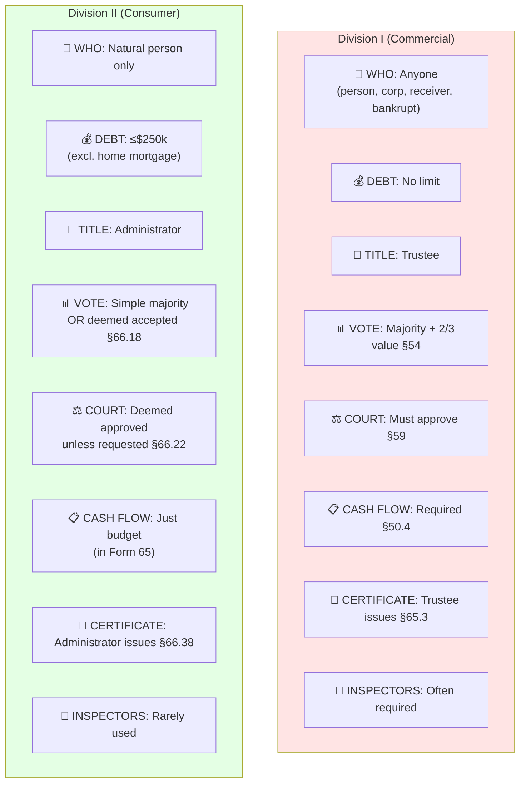

### Side-by-Side Table

| Feature | Division I | Division II | Why Different? |
|---------|-----------|-------------|----------------|
| **Target** | Businesses, high-debt individuals | Consumers | Simpler for regular people |
| **Debt limit** | None | $250k (excl. home) | Keeps simple cases simple |
| **Professional** | Trustee | Administrator | Can be trustee OR licensed admin |
| **Cash flow** | Required + reports | Just budget | Less paperwork |
| **Vote needed** | Maj. + 2/3 value | Simple majority | Easier to pass |
| **Default vote** | Must vote to accept | Deemed accepted | Favors debtor |
| **Court approval** | Must apply | Deemed approved | Faster process |
| **Meeting** | Always held | Only if requested | Saves time/cost |
| **If rejected** | Auto bankruptcy §57 | NOT auto bankruptcy | Second chance |
| **Max term** | No limit | 5 years §66.12(6) | Protect consumers |
| **Counselling** | Not required | 2 sessions mandatory | Help prevent repeat |
| **Credit rating** | Varies | R7 (better than R9) | Less stigma |

---

## Complete Process Timeline

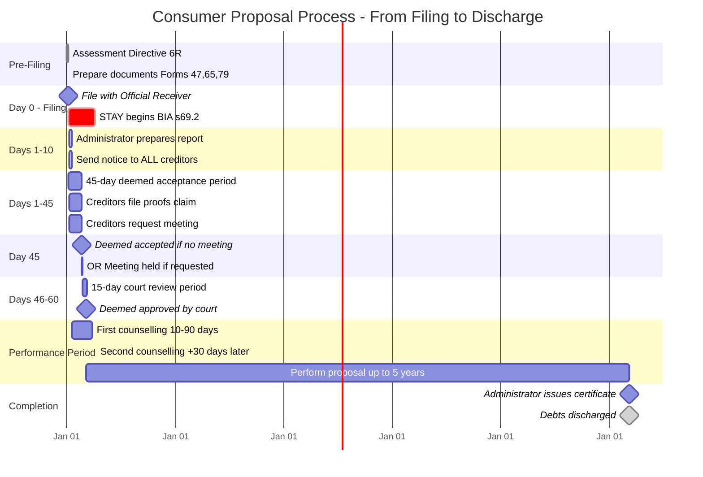

### Process Flow with Decision Points

```mermaid
flowchart TD
    Start([Debtor in financial trouble]) --> Assess{Eligible?<br/>Debt ≤$250k excl home}

    Assess -->|NO| DivI[Must file Division I<br/>or bankruptcy]
    Assess -->|YES| Admin[Meet with Administrator<br/>Directive 6R Assessment]

    Admin --> Docs[Prepare Documents:<br/>Forms 47, 65, 79<br/>+ Estate Summary]

    Docs --> Bankrupt{Already<br/>bankrupt?}
    Bankrupt -->|YES| Inspect[Get inspectors'<br/>approval first]
    Bankrupt -->|NO| File
    Inspect --> File

    File[File with Official Receiver<br/>DAY 0] --> Immediate

    subgraph Immediate["IMMEDIATE EFFECTS (Day 0)"]
        Stay[🛡️ STAY active §69.2<br/>Creditors cannot sue/garnish]
    end

    Immediate --> Admin10[Administrator Actions<br/>Days 1-10]

    subgraph Admin10["ADMINISTRATOR DUTIES (Within 10 days)"]
        Report[Send report Form 51 to:<br/>- Official Receiver<br/>- All creditors]
        Notice[Send notice package to ALL creditors:<br/>- Copy of proposal<br/>- Administrator's report<br/>- Blank proof of claim Form 31<br/>- Voting letter Form 37.1<br/>- Explanatory notice Form 49]
    end

    Admin10 --> Wait[45-DAY WAITING PERIOD<br/>Days 11-45]

    Wait --> Check25{Do creditors<br/>holding ≥25% of claims<br/>request meeting?}

    Check25 -->|NO| Auto1[DEEMED ACCEPTED<br/>by creditors §66.18<br/>Day 45]
    Check25 -->|YES| Meeting[Meeting of creditors held]

    Meeting --> Quorum{Quorum<br/>present?}
    Quorum -->|NO| Auto1[DEEMED ACCEPTED!<br/>Dir 22R4]
    Quorum -->|YES| Vote{Vote result?<br/>Simple majority}

    Vote -->|YES| Auto1
    Vote -->|NO| Refused[Proposal REFUSED]

    Auto1 --> Court15[15-DAY COURT PERIOD<br/>Days 46-60]

    Court15 --> CourtReq{Court review<br/>requested by OR or<br/>interested party?}

    CourtReq -->|NO| Auto2[DEEMED APPROVED<br/>by court §66.22<br/>Day 60]
    CourtReq -->|YES| Hearing[Court hearing<br/>Administrator files report]

    Hearing -->|Approved| Auto2
    Hearing -->|Refused| Refused

    Auto2 --> Perform[PERFORMANCE PERIOD<br/>Max 5 years §66.12]

    Perform --> Counsel{Attended 2<br/>counselling<br/>sessions?}
    Counsel -->|NO| NoCert[❌ NO CERTIFICATE<br/>§66.38 2]
    Counsel -->|YES| Complete{All payments<br/>made?}

    Complete -->|NO| Continue[Continue paying...]
    Complete -->|YES| Cert[✅ Administrator issues<br/>Certificate of Full Performance<br/>§66.38 Form 46]

    Cert --> Discharge[🎉 DEBTS DISCHARGED<br/>except §173 debts]

    Refused --> NotAuto[NOT automatic bankruptcy<br/>unless already bankrupt]

    style Stay fill:#90EE90
    style Auto1 fill:#87CEEB
    style Auto2 fill:#87CEEB
    style Cert fill:#FFD700
    style Discharge fill:#98FB98
    style NoCert fill:#FFB6C1
```

---

## Key Deadlines (Critical for Exams!)

### Timeline Cheat Sheet (Gantt Chart - Chronological)

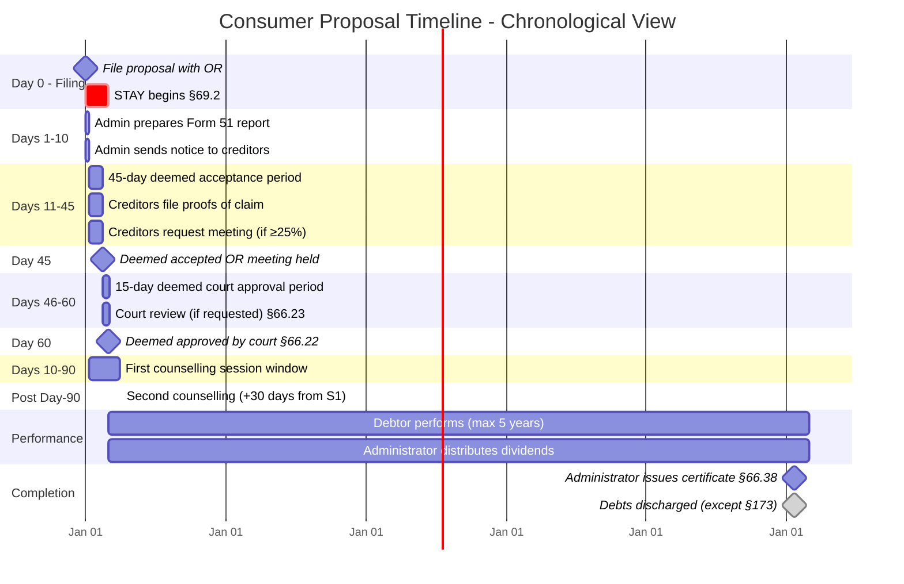

### Detailed Deadline Table

| Deadline | Who | What | BIA Reference | Consequence if Missed |
|----------|-----|------|---------------|----------------------|
| **Within 10 days** | Administrator | Send report (Form 51) to OR & creditors | Study 5.3.7 | Deemed annulment? |
| **Within 10 days** | Administrator | Send notice package to all creditors | §66.14(b), Study 5.3.8 | Deemed annulment? |
| **45 days** | Creditors | Request meeting (if ≥25% want it) | §66.15, Study 5.3.12 | Proposal deemed accepted |
| **45 days** | - | Deemed acceptance by creditors | §66.18, Study 5.3.12 | Moves to court approval |
| **15 days after acceptance** | OR or interested party | Request court review | §66.22, Study 5.3.16 | Proposal deemed approved |
| **15 days after deemed approval** | - | Deemed approval by court | §66.22 | Proposal is binding |
| **10-90 days from filing** | Debtor | Complete 1st counselling session | Dir 1R8, Study 5.3.18 | No certificate |
| **+30 days from 1st** | Debtor | Complete 2nd counselling session | Dir 1R8 | No certificate §66.38(2) |
| **Max 5 years** | Debtor | Complete all proposal payments | §66.12(6), Study 5.3.16 | - |
| **3 months after default** | - | Deemed annulled if not cured | Study 5.3 (from entities) | Auto annulment |

---

## Who Can File? (Eligibility)

### The Test (§66.11-66.12)

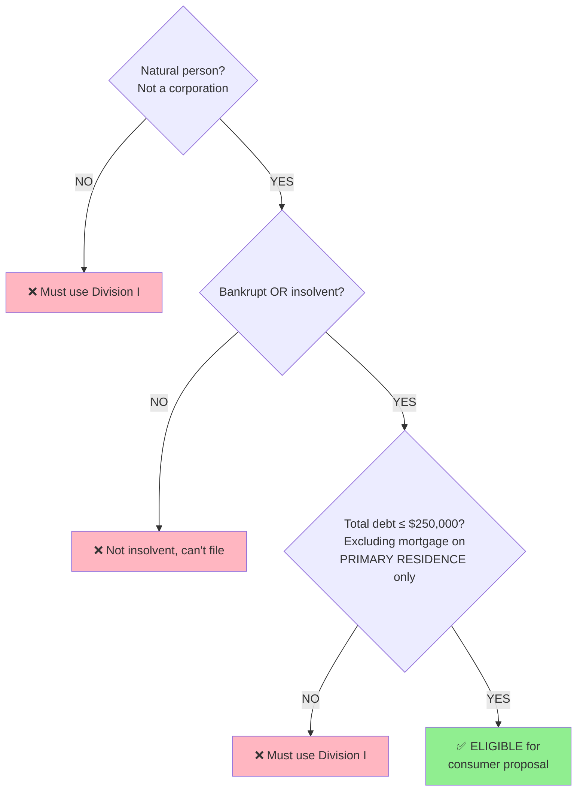

### What Counts Toward $250k Limit? (Study Guide 5.3.4)

```
EXCLUDED (doesn't count):
✅ Mortgage on home you live in (primary residence)

INCLUDED (counts toward limit):
❌ Mortgage on rental property
❌ Car loan/lease
❌ Credit card debt
❌ Personal loans
❌ Student loans
❌ Lines of credit
❌ Tax debt
❌ All other debts
```

### Examples - Am I Eligible?

**Example 1:**
```
Debts:
- Home mortgage (live there): $350,000  ← Doesn't count
- Credit cards: $60,000                 ← Counts
- Car loan: $30,000                     ← Counts
- Personal loan: $20,000                ← Counts
Total eligible debt: $110,000

✅ ELIGIBLE ($110k < $250k)
```

**Example 2:**
```
Debts:
- Home mortgage (live there): $400,000  ← Doesn't count
- Rental property mortgage: $200,000    ← COUNTS!
- Credit cards: $80,000                 ← Counts
Total eligible debt: $280,000

❌ INELIGIBLE ($280k > $250k) - Must file Division I
```

**Example 3:**
```
Corporation owes: $100,000

❌ INELIGIBLE - Not a natural person, must file Division I
```

### Joint Proposals (Directive 2R)

**Two people can file together if:**
1. Debts are "substantially the same"
2. Financial relationship exists (e.g., married couple)
3. Administrator believes it's in best interest of both debtors AND creditors

**Benefits:**
- Only one administration
- Same administrator fee (not double)
- Maximum 2× counselling cost (not 2× full cost)

---

## Required Documents (Study Guide 5.3.5)

### Filing Package

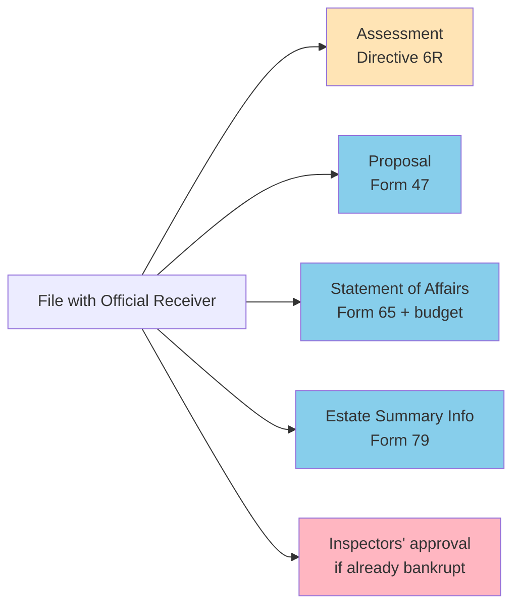

### What's Different from Division I?

**Consumer proposal does NOT need:**
- ❌ Cash Flow Statement (§50.4(2) requirement)
- ❌ Trustee report on reasonableness of cash flow
- ❌ Debtor report on cash flow preparation

**Consumer proposal just needs:**
- ✅ Budget information (attached to Statement of Affairs Form 65)

**Why?** "Quick, efficient, minimum administration and cost" (Study 5.3.1)

---

## The Voting Process (The "Deemed Acceptance" Magic)

### How Consumer Proposals Usually Get Accepted (Without Meetings!)

```mermaid
stateDiagram-v2
    direction LR
    [*] --> Filed: Proposal filed
    Filed --> Day1to10: Administrator sends<br/>notice to all creditors
    Day1to10 --> Day11to45: 45-day waiting period

    Day11to45 --> CheckRequest: Day 45 arrives

    CheckRequest --> Calc: Count creditors who<br/>requested meeting

    Calc --> Under25: < 25% of proven<br/>claims requested
    Calc --> Over25: ≥ 25% of proven<br/>claims requested

    Under25 --> DeemedAccept: DEEMED ACCEPTED<br/>§66.18<br/>No meeting needed!

    Over25 --> Meeting: Meeting must<br/>be held
    Meeting --> QuorumCheck: Check quorum

    QuorumCheck --> NoQuorum: No quorum<br/>present
    QuorumCheck --> HasQuorum: Quorum present

    NoQuorum --> DeemedAccept: DEEMED ACCEPTED<br/>Dir 22R4<br/>Even with no quorum!

    HasQuorum --> Vote: Creditors vote<br/>Simple majority
    Vote --> VoteYes: > 50% vote YES
    Vote --> VoteNo: ≤ 50% vote YES

    VoteYes --> DeemedAccept
    VoteNo --> Refused: REFUSED

    DeemedAccept --> Court15: 15-day period
    Court15 --> DeemedApproved: DEEMED APPROVED<br/>by court §66.22<br/>unless review requested

    DeemedApproved --> [*]: Proposal binding
    Refused --> [*]: NOT auto bankruptcy

    style DeemedAccept fill:#90EE90
    style DeemedApproved fill:#87CEEB
    style Refused fill:#FFB6C1
```

### Meeting of Creditors (If Called)

**When it's called (§66.15, Directive 22R):**
- Creditors holding ≥25% of **proven claims** request it, OR
- Official Receiver requests it

**Quorum (Directive 22R4):**
- At least 1 creditor who filed proof of claim before meeting
- Voting letters count toward quorum!
- **If no quorum → Deemed accepted!** (unique to consumer proposals)

**Voting rules:**
- Simple majority of creditors who vote
- $1 = 1 vote
- Can vote: in person, by proxy, or by voting letter
- Abstentions don't count (only count actual votes)

**Example:**
```
Total proven claims: $100,000

Creditors who requested meeting:
- Creditor A: $15,000
- Creditor B: $12,000
Total: $27,000 = 27% ✅ Meeting must be held

At the meeting:
- Creditors voting YES: $40,000
- Creditors voting NO: $25,000
- Creditors who didn't vote: $35,000 (ignored)

Result: ACCEPTED (40 > 25, simple majority)
```

---

## Administrator Duties (From Study Materials + Database)

### Complete Duty List

**Before filing:**
1. ✅ Assess debtor's financial situation (Dir 6R)
2. ✅ Investigate whether joint proposal is appropriate (Dir 2R)
3. ✅ Verify debt < $250k (excluding primary residence mortgage)
4. ✅ Assist in preparing proposal and statutory documents

**Within 10 days of filing:**
5. ✅ Prepare and send report (Form 51) to OR and creditors
6. ✅ Send notice package to every known creditor

**During 45-day period:**
7. ✅ Receive proofs of claim
8. ✅ Monitor whether ≥25% request meeting

**If meeting held:**
9. ✅ Chair the meeting
10. ✅ Count votes
11. ✅ Report results

**After acceptance:**
12. ✅ Arrange counselling (2 sessions, Directive 1R8)
13. ✅ Receive payments from debtor
14. ✅ Distribute dividends to creditors (every 3-12 months)

**Upon completion:**
15. ✅ Verify debtor attended 2 counselling sessions
16. ✅ Issue Certificate of Full Performance (§66.38, Form 46)
17. ✅ Prepare Final Statement of Receipts & Disbursements
18. ✅ Send to creditors + OSB
19. ✅ Get deemed discharge (3 months after notice if no objections)

---

## Counselling Requirements (Directive 1R8)

### The Two Sessions

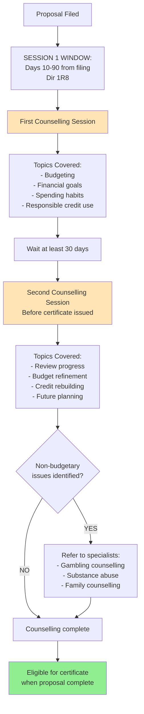

### Critical Rule

**NO counselling = NO certificate!**

§66.38(2): "Subsection (1) [certificate issuance] does not apply in respect of a consumer debtor who has refused or neglected to receive counselling"

**In simple terms:**
- You can pay every cent you owe
- But if you skip counselling → NO certificate
- NO certificate = debts NOT discharged
- Counselling is **mandatory**, not optional

---

## Certificate of Full Performance

### What Is It?

**The finish line!** Once you get this certificate:
- Your debts are discharged (forgiven)
- You're released from the proposal obligations
- You can rebuild credit

### How to Get It (§66.38)

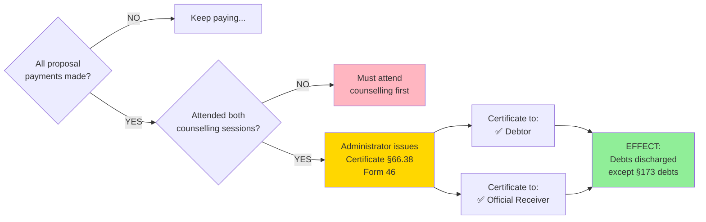

### What Debts Are NOT Discharged? (§173 applies)

Even with certificate, these debts survive:
- ❌ Student loans (if bankruptcy < 7 years after ceasing to be student)
- ❌ Fraud debts
- ❌ Court fines/penalties
- ❌ Alimony/child support
- ❌ Debts arising from fraud, embezzlement, misappropriation

**UNLESS:** The proposal explicitly provides for discharge AND those specific creditors voted YES

---

## Statutory Terms (What MUST Be In Proposal)

### Mandatory Provisions (§66.12(5-6), §136)

```
┌─ CONSUMER PROPOSAL MUST INCLUDE:
│
├─ 1. Payment of PREFERRED CLAIMS in priority:
│     ├─ Administrator fees (first)
│     ├─ Counselling fees
│     ├─ Wage claims §136(d)
│     ├─ Crown trust amounts (source deductions) §60(1.1)
│     └─ Other priority claims per §136
│
├─ 2. Prescribed fees payment:
│     ├─ Administrator fees (tariff-based)
│     └─ Counselling fees
│
├─ 3. Method of dividend distribution
│     Example: "$500/month for 48 months"
│
└─ 4. Term ≤ 5 YEARS maximum §66.12(6)
```

### Priority Payment Order

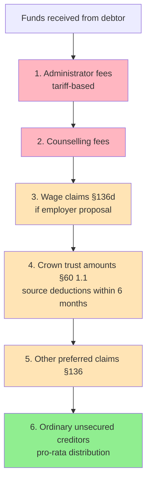

---

## Default and Annulment

### Deemed Annulment (Automatic)

**§66.31: Consumer proposal deemed annulled if:**
- Debtor defaults on payment for 3 months, AND
- Doesn't cure the default

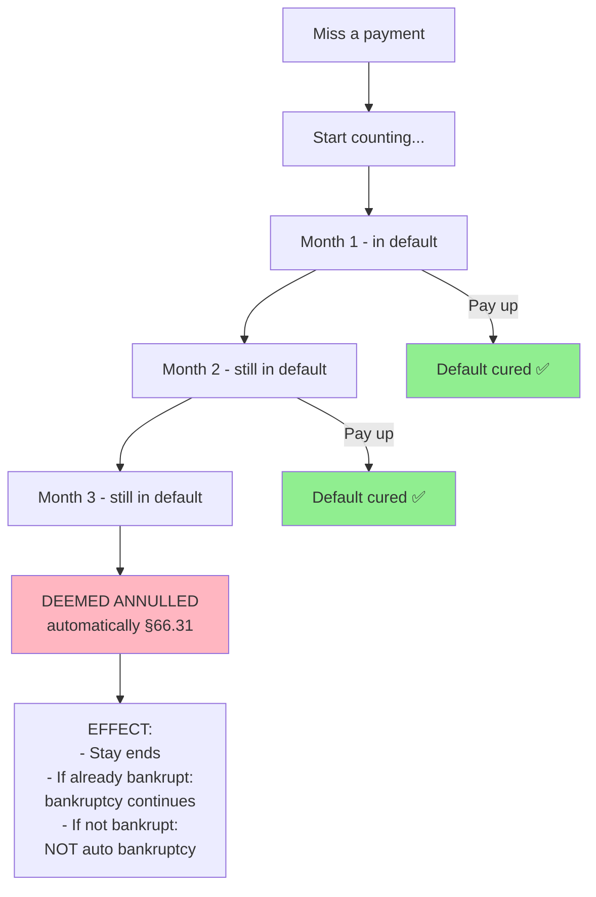

### Court Annulment (§66.3)

**Court can annul if:**
- Debtor wasn't eligible when filed
- Proposal can't continue without injustice/undue delay
- Court approval was obtained by fraud
- Debtor convicted of BIA offense after approval

### Automatic Revival (§66.31(5))

**Key feature:** Consumer proposals can be revived!

If deemed annulled due to 3-month default:
- Debtor can cure the default
- Proposal automatically revives
- Must do so "without delay"

**This is HUGE difference from Division I!**

---

## Common Exam Traps

### Trap 1: The $250k Limit

**Wrong:** "Debt must be under $250k total"
**Right:** "Debt excluding PRIMARY RESIDENCE mortgage must be under $250k"

**Watch out for:**
- Rental property mortgages (COUNT toward limit)
- Car loans (COUNT toward limit)

### Trap 2: Automatic Bankruptcy on Refusal

**Division I:** Refusal = automatic bankruptcy §57
**Division II:** Refusal = NOT automatic bankruptcy

**Unless:** The debtor was already bankrupt when they filed the consumer proposal

### Trap 3: Who Issues the Certificate?

**Division I:** **Trustee** issues certificate §65.3
**Division II:** **Administrator** issues certificate §66.38

**Exam might test:** "Who issues certificate in Division I?" (Trustee, not administrator!)

### Trap 4: Voting Requirements

**Division I:** Majority in number AND 2/3 in value §54(2)(d)
**Division II:** Simple majority (just > 50% of those voting) §66.15

**Exam might say:** "Consumer proposal requires 2/3 vote" ❌ FALSE

### Trap 5: Court Approval

**Division I:** Must apply to court §59
**Division II:** Deemed approved unless someone requests review §66.22

**Exam might ask:** "Does consumer proposal require court approval?"
**Answer:** No formal application required - it's deemed approved (unless review requested)

### Trap 6: The Stay Timing

**Division I:** Stay begins upon filing **Notice of Intention** §69(1)
**Division II:** Stay begins upon filing the **Proposal itself** §69.2

**Watch for:** "When does stay begin in consumer proposal?"
- NOT at acceptance
- NOT at court approval
- AT FILING of proposal

### Trap 7: Inspectors' Approval

**Division I by bankrupt:** Inspectors must approve before filing §50(3)
**Division II by bankrupt:** Inspectors' approval required at filing (Study 5.3.5)
**Division II by non-bankrupt:** Generally no inspectors

**Exam might ask:** "Are inspectors required in consumer proposals?"
**Answer:** Only if debtor is already bankrupt

### Trap 8: Counselling Consequences

**Exam might say:** "Debtor completed all payments but skipped counselling, gets certificate"
**Answer:** ❌ FALSE - §66.38(2) says NO certificate if counselling refused/neglected

---

## Quick Reference: Key Section Numbers

| Topic | BIA Section | What It Says |
|-------|-------------|--------------|
| Who can file | §66.11-66.12 | Natural person, ≤$250k debt |
| Stay begins | §69.2 | On filing proposal |
| Deemed accepted | §66.18 | After 45 days if no meeting |
| Meeting requirement | §66.15 | If ≥25% request it |
| Quorum | Dir 22R4 | 1+ creditor with proven claim |
| No quorum effect | Dir 22R4 | Deemed accepted |
| Voting rule | §66.15 | Simple majority |
| Related creditor | §54(3) applies | Can vote AGAINST, not FOR |
| Deemed court approval | §66.22 | 15 days after acceptance |
| Statutory terms | §66.12(5-6) | Priorities, fees, method, ≤5 years |
| Priority payments | §60(1), §136 | Preferred claims first |
| Counselling | §66.13(2)(b), Dir 1R8 | 2 sessions mandatory |
| Certificate | §66.38 | Administrator issues (not court) |
| Deemed annulment | §66.31 | 3 months default, not cured |
| Court annulment | §66.3 | Ineligible, injustice, fraud |
| Auto revival | §66.31(5) | If default cured without delay |
| Discharge effect | §66.38 + §173 | Like bankruptcy discharge |

---

## Study Tips

### Memory Aids

**"45-15-3-5" Rule:**
- **45** days = deemed acceptance
- **15** days = deemed court approval
- **3** months = deemed annulment (if default not cured)
- **5** years = maximum term

**"2-10-90-30" Counselling:**
- **2** sessions required
- **10** days minimum before first session
- **90** days maximum for first session
- **30** days minimum between sessions

**"25% triggers meeting":**
- If ≥25% of proven claims request → meeting held
- If <25% request → deemed accepted (no meeting)

### Practice Questions to Test Yourself

1. Can a corporation file a consumer proposal? (NO - natural person only §66.11)
2. Does rental property mortgage count toward $250k? (YES - only PRIMARY residence excluded)
3. What happens if consumer proposal is refused? (NOT automatic bankruptcy - unless already bankrupt)
4. Who issues certificate in Division II? (Administrator §66.38, not court)
5. How many counselling sessions? (2 mandatory §66.13, Dir 1R8)
6. What if no quorum at meeting? (Deemed accepted! Dir 22R4)
7. What vote is needed? (Simple majority, not 2/3)
8. Can related creditor vote FOR proposal? (NO - §54(3) can vote AGAINST only)

---

**Generated using knowledge-based MCP deep dive**
**Database searches:** Concepts, Procedures, Deadlines, Consequences, Actors tables
**BIA sections:** §§50, 54, 60, 65.3, 66.11-66.4, 69.2, 136, 173
**OSB Directives:** 1R8, 2R, 6R7, 22R4
**Study Materials:** Chapter 5.3 Consumer Proposals

---

**Study tip:** Print this out, highlight the visual diagrams, and use the "Common Exam Traps" section for final review before the exam!
