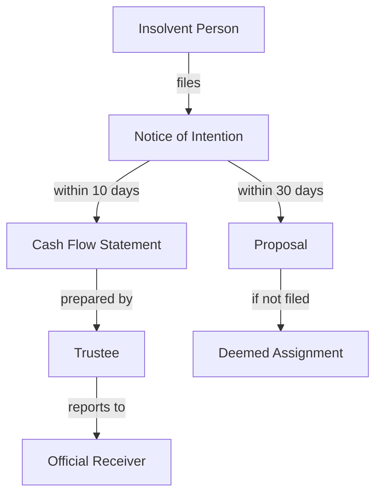
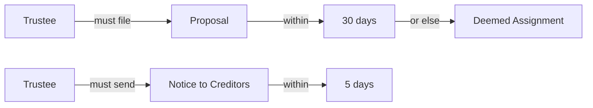
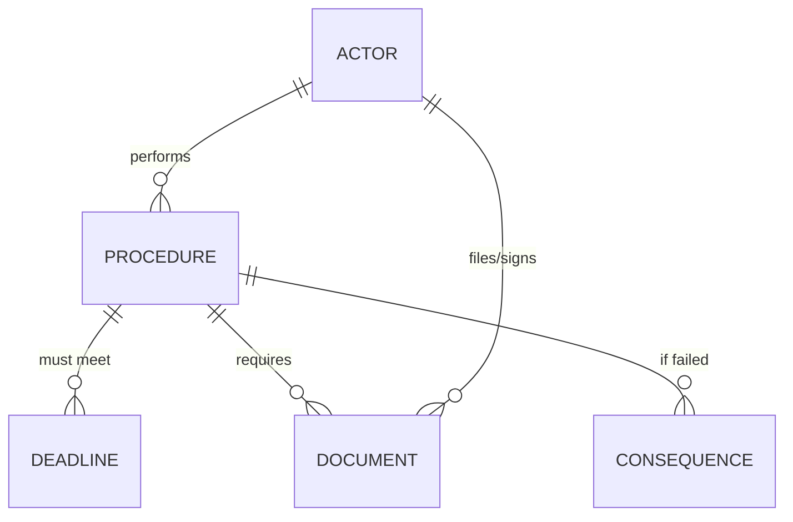

# Relationship Extraction & Knowledge Graph Plan

## Goal
Enhance the knowledge base to capture explicit relationships between entities, enabling:
- Complex questions: "Who must do what by when, and what happens if they don't?"
- Visual knowledge graphs of insolvency processes
- Chain reasoning: Follow duty → deadline → consequence paths

---

## Part 1: Relationship Extraction Schema

### Core Relationship Types

#### **1. Duty Relationships** (Actor → Action → Deadline → Consequence)
```
Trustee MUST file proposal WITHIN 30 days OR deemed assignment
│       │    │            │           │
Actor   Duty Action       Deadline    Consequence
```

**Database Schema:**
```sql
CREATE TABLE duty_relationships (
    id INTEGER PRIMARY KEY,
    actor_id INTEGER,                    -- Links to actors table
    procedure_id INTEGER,                -- Links to procedures table
    deadline_id INTEGER,                 -- Links to deadlines table (optional)
    consequence_id INTEGER,              -- Links to consequences table (optional)
    bia_section TEXT,                    -- Source: "BIA s. 50.4(8)"
    duty_type TEXT,                      -- 'mandatory', 'discretionary', 'prohibited'
    modal_verb TEXT,                     -- 'shall', 'may', 'shall not'
    source_id INTEGER,
    FOREIGN KEY (actor_id) REFERENCES actors(id),
    FOREIGN KEY (procedure_id) REFERENCES procedures(id),
    FOREIGN KEY (deadline_id) REFERENCES deadlines(id),
    FOREIGN KEY (consequence_id) REFERENCES consequences(id)
);
```

#### **2. Document Requirements** (Procedure → Document)
```
Filing proposal REQUIRES Form 31
│              │        │
Procedure      Requires Document
```

**Database Schema:**
```sql
CREATE TABLE document_requirements (
    id INTEGER PRIMARY KEY,
    procedure_id INTEGER,
    document_id INTEGER,
    is_mandatory BOOLEAN,                -- TRUE if required, FALSE if optional
    bia_section TEXT,
    FOREIGN KEY (procedure_id) REFERENCES procedures(id),
    FOREIGN KEY (document_id) REFERENCES documents(id)
);
```

#### **3. Trigger Relationships** (Event → Consequence)
```
Failure to file TRIGGERS deemed assignment
│               │        │
Event           Triggers Consequence
```

**Database Schema:**
```sql
CREATE TABLE trigger_relationships (
    id INTEGER PRIMARY KEY,
    triggering_event_id INTEGER,         -- Could be procedure, deadline, etc.
    triggering_event_type TEXT,          -- 'procedure', 'deadline', 'condition'
    consequence_id INTEGER,
    bia_section TEXT,
    FOREIGN KEY (consequence_id) REFERENCES consequences(id)
);
```

---

## Part 2: Implementation Approach

### Option A: Extract from Existing Data (Faster - 2-3 hours)

**Use AI to infer relationships from existing entities:**

```python
# Pseudo-code
for section in bia_sections:
    # Get all entities from this section
    actors = get_actors_in_section(section)
    procedures = get_procedures_in_section(section)
    deadlines = get_deadlines_in_section(section)
    consequences = get_consequences_in_section(section)

    # Use AI to connect them
    relationships = ai_extract_relationships({
        'actors': actors,
        'procedures': procedures,
        'deadlines': deadlines,
        'consequences': consequences,
        'section_text': section.full_text
    })

    # Store relationships
    store_duty_relationship(relationships)
```

**Advantages:**
- Uses existing validated entity data
- Fast (AI processes structured data, not raw text)
- No new Lang Extract extraction needed

**Disadvantages:**
- May miss relationships not captured in entities
- Depends on entity extraction completeness

### Option B: Direct Relationship Extraction from Text (Thorough - 6-8 hours)

**Create Lang Extract examples for relationship extraction:**

```python
# Example for duty relationships
duty_example = lx.data.ExampleData(
    text="The trustee shall file the proposal within 30 days or the debtor is deemed to have made an assignment",
    extractions=[
        lx.data.Extraction(
            extraction_class="duty",
            extraction_text="trustee shall file proposal within 30 days",
            attributes={
                "actor": "trustee",
                "action": "file proposal",
                "deadline": "within 30 days",
                "consequence_if_failed": "deemed assignment",
                "modal_verb": "shall"
            }
        )
    ]
)
```

**Extract duty relationships directly from BIA sections**

**Advantages:**
- Complete extraction from source
- Captures complex multi-entity relationships
- More comprehensive

**Disadvantages:**
- Slower (new extraction process)
- More complex examples needed
- Higher API costs

---

## Part 3: Knowledge Graph Visualization

### Graph Types to Create

#### **Type 1: Process Flow Graph**
Shows complete process with all connected entities



#### **Type 2: Duty Chain Graph**
Shows actor → duty → deadline → consequence



#### **Type 3: Entity Relationship Diagram**
Shows entity types and their connections



---

## Implementation Plan

### Phase 1: Relationship Extraction (Recommended: Option A)

**Step 1:** Enhance database schema (30 min)
- Add `duty_relationships` table
- Add `document_requirements` table
- Add `trigger_relationships` table

**Step 2:** Build relationship extractor (1-2 hours)
- Use Gemini to analyze existing entities within each BIA section
- Identify connections (actor → procedure → deadline → consequence)
- Store explicit relationships

**Step 3:** Test relationship queries (30 min)
- "What are trustee's duties with deadlines?"
- "What triggers deemed assignment?"
- "What documents are required for proposals?"

### Phase 2: Knowledge Graph Generation (1-2 hours)

**Step 1:** Extend visualization system
- Enhance `src/visualization/timeline_generator.py`
- Add graph type selection (process flow, duty chain, ERD)

**Step 2:** Create graph generators
- `process_flow_generator.py` - End-to-end process visualization
- `duty_chain_generator.py` - Actor duties with consequences
- `entity_relationship_generator.py` - Schema visualization

**Step 3:** Generate sample graphs
- Division I NOI complete process
- Trustee duties chain
- Discharge process flow

---

## Expected Results

### Query Capabilities

**Before (Entity-based):**
```sql
SELECT * FROM deadlines WHERE timeframe LIKE '%10 days%';
-- Returns: List of 10-day deadlines (no context)
```

**After (Relationship-based):**
```sql
SELECT
    a.role_canonical as actor,
    p.action as must_do,
    d.timeframe as deadline,
    c.outcome as consequence
FROM duty_relationships dr
JOIN actors a ON dr.actor_id = a.id
JOIN procedures p ON dr.procedure_id = p.id
JOIN deadlines d ON dr.deadline_id = d.id
JOIN consequences c ON dr.consequence_id = c.id
WHERE d.timeframe LIKE '%10 days%';

-- Returns: Complete context
-- "Trustee must file cash flow within 10 days or deemed assignment"
```

### Visualizations

**Sample Output:**

`Division_I_NOI_Knowledge_Graph.md`:
- Complete process flow with all actors, documents, deadlines
- Visual representation of entire procedure
- Color-coded by entity type

`Trustee_Duties_Chain.md`:
- All trustee obligations connected to deadlines and consequences
- Quick reference for trustee responsibilities

---

## Recommendation

**Start with Option A (AI-based from existing data):**
- Faster implementation
- Lower API cost
- Uses validated entity data you already have
- Can always do Option B later if gaps found

**Total time:** ~4-6 hours
**Expected value:** Significantly enhanced query capability + visual study aids

---

**Ready to proceed?**

Next steps:
1. Create relationship tables
2. Build AI-based relationship extractor
3. Generate first knowledge graph (Division I NOI)
4. Test with exam questions
