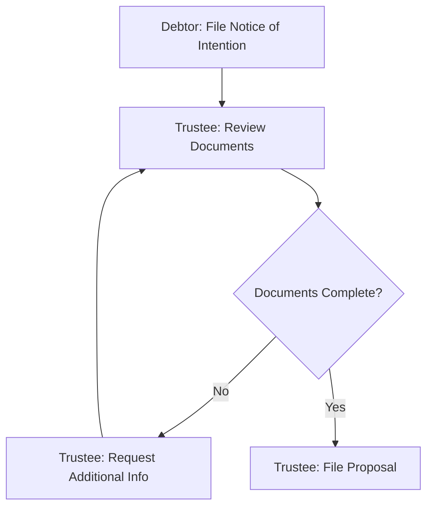

# Automated Diagram and Chart Generation: Research Report 2025

**Research Date:** January 6, 2025
**Focus:** Production-ready tools for automated diagram/chart generation from LLM outputs, RAG systems, and database queries
**Target:** Integration with SQLite + MCP server for insolvency knowledge base

---

## Executive Summary

This report identifies **20+ production-ready tools** for automated diagram generation, categorized by use case and maturity level. Top recommendations include:

- **Tier 1 (Immediate Use):** Mermaid-py, Diagrams (mingrammer), PM4Py, ERAlchemy
- **Tier 2 (Advanced Features):** Kroki, PlantUML via Plantweb, LangGraph visualization
- **Tier 3 (Emerging/Experimental):** DiagrammerGPT, LLM-native diagram generation

**Key Finding:** Mermaid has emerged as the de facto standard for 2024-2025 due to GitHub/GitLab native rendering, LLM compatibility, and browser-based simplicity.

---

## Table of Contents

1. [Section 1: Top Recommendations (Tier 1)](#section-1-top-recommendations-tier-1)
2. [Section 2: Diagram Type Specific Tools](#section-2-diagram-type-specific-tools)
3. [Section 3: Ecosystem Map](#section-3-ecosystem-map)
4. [Section 4: Implementation Roadmap](#section-4-implementation-roadmap)
5. [Section 5: Code Examples](#section-5-code-examples)
6. [Section 6: MCP Integration Guide](#section-6-mcp-integration-guide)
7. [Appendix: Additional Tools & Resources](#appendix-additional-tools--resources)

---

## Section 1: Top Recommendations (Tier 1)

### 1.1 Mermaid-py

**Name:** mermaid-py
**GitHub:** https://github.com/ouhammmourachid/mermaid-py
**Stars:** 121+
**License:** MIT
**PyPI:** `pip install mermaid-py`

#### What it does
Python interface for Mermaid.js library, allowing programmatic creation of flowcharts, sequence diagrams, class diagrams, state diagrams, ER diagrams, Gantt charts, and more.

#### Input format
Python objects/dictionaries or direct Mermaid syntax strings

#### Output format
- Mermaid syntax (.mmd files)
- PNG/SVG via mermaid.ink service
- Inline rendering in Jupyter notebooks

#### Integration complexity
**Simple:** Single pip install, no Java/Graphviz dependencies (uses web service)

```python
from mermaid import Mermaid

# Create flowchart
mermaid = Mermaid()
chart = mermaid.flowchart()
chart.add_node("A", "Start")
chart.add_node("B", "Process")
chart.add_edge("A", "B")
print(chart.generate())  # Returns Mermaid syntax
```

#### Applicability to our system
**HIGH** - Perfect for:
- Consumer proposal process flows (Use Case 1)
- Section relationship maps (Use Case 3)
- Division I vs II comparisons (Use Case 4)
- Priority payment waterfall (Use Case 5)

Can be integrated directly into MCP server to generate diagrams from SQL query results.

#### Performance
- Fast (web service rendering)
- Lightweight (no heavy dependencies)
- Cache-friendly for repeated diagrams

#### Pros & Cons
**Pros:**
- GitHub/GitLab native rendering
- LLM-friendly syntax
- No local dependencies
- Browser-based preview

**Cons:**
- Relies on external service (mermaid.ink)
- Limited offline capability
- Less customization than PlantUML

---

### 1.2 Diagrams (mingrammer)

**Name:** Diagrams
**GitHub:** https://github.com/mingrammer/diagrams
**Stars:** 41,600+
**License:** MIT
**PyPI:** `pip install diagrams`

#### What it does
Diagram-as-code for cloud system architectures. Supports AWS, Azure, GCP, Kubernetes, on-premise systems with 2,500+ provider icons.

#### Input format
Python code defining nodes, clusters, and edges

#### Output format
PNG, SVG, PDF (via Graphviz rendering)

#### Integration complexity
**Moderate:** Requires Graphviz installation + Python 3.9+

```python
from diagrams import Diagram, Cluster
from diagrams.aws.compute import EC2
from diagrams.aws.database import RDS

with Diagram("Web Service", show=False):
    with Cluster("Services"):
        web = EC2("web")
        db = RDS("database")
        web >> db
```

#### Applicability to our system
**MEDIUM** - Best for:
- System architecture documentation
- Trustee/creditor/debtor relationship diagrams
- Process actor visualization

Less suitable for timeline/Gantt charts or ER diagrams.

#### Performance
- Moderate (Graphviz rendering takes 1-3 seconds)
- Scalable to hundreds of nodes
- Good caching via output files

#### Pros & Cons
**Pros:**
- Beautiful, professional diagrams
- Extensive icon library
- Type-safe Python API
- Production-proven (used by Apache Airflow)

**Cons:**
- Requires Graphviz dependency
- Steep learning curve for complex layouts
- Not ideal for non-architecture diagrams

---

### 1.3 ERAlchemy

**Name:** ERAlchemy
**GitHub:** https://github.com/eralchemy/eralchemy
**Stars:** 1,200+
**License:** Apache 2.0
**PyPI:** `pip install eralchemy`

#### What it does
Generates Entity-Relationship diagrams directly from databases or SQLAlchemy models.

#### Input format
- SQLAlchemy database URLs (sqlite:///db.db)
- SQLAlchemy Base models
- Existing database connections

#### Output format
ER diagram syntax (.er files), PNG, PDF, SVG via Graphviz

#### Integration complexity
**Simple-to-Moderate:** Requires Graphviz, works directly with SQLite

```python
from eralchemy import render_er

# Direct from SQLite
render_er("sqlite:///database.db", "erd.png")

# With options
render_er(
    "sqlite:///database.db",
    "erd.pdf",
    exclude_tables=['sqlite_sequence'],
    include_columns=True
)
```

#### Applicability to our system
**HIGH** - Perfect for:
- Visualizing our insolvency database schema
- Documenting entity relationships
- Auto-generating ER diagrams for documentation

Direct integration with our existing SQLite database.

#### Performance
- Fast for small-medium databases (<100 tables)
- May slow down for large schemas
- One-time generation suitable for documentation

#### Pros & Cons
**Pros:**
- Direct database integration
- SQLAlchemy compatibility
- Auto-discovery of relationships
- Multiple output formats

**Cons:**
- Requires Graphviz
- Limited layout customization
- May need filtering for large schemas

---

### 1.4 PM4Py (Process Mining)

**Name:** PM4Py
**GitHub:** https://github.com/process-intelligence-solutions/pm4py
**Stars:** 2,000+
**License:** GPL 3.0
**PyPI:** `pip install pm4py`

#### What it does
Process mining library for discovering, analyzing, and visualizing business processes from event logs. Generates BPMN diagrams, Petri nets, process trees.

#### Input format
- Event logs (XES, CSV, Pandas DataFrames)
- Process models (Petri nets, BPMN)

#### Output format
BPMN XML, graphical diagrams (PNG, SVG), Petri net visualizations

#### Integration complexity
**Moderate:** pip install only, but requires understanding of process mining concepts

```python
import pm4py

# Load event log from database query results
log = pm4py.format_dataframe(df, case_id='case_id',
                              activity_key='activity',
                              timestamp_key='timestamp')

# Discover BPMN process model
bpmn_model = pm4py.discover_bpmn_inductive(log)

# Visualize
pm4py.view_bpmn(bpmn_model)

# Save to file
pm4py.write_bpmn(bpmn_model, "process.bpmn")
```

#### Applicability to our system
**HIGH** - Excellent for:
- **Use Case 1:** Consumer proposal process flows
- Timeline generation from event data
- Compliance checking workflows
- Trustee procedure visualization

Can process event logs from database tables showing:
- Task sequences
- Actor responsibilities
- Decision points
- Timeframes

#### Performance
- Process discovery: seconds to minutes depending on log size
- Visualization: 1-5 seconds
- Handles logs with 100K+ events

#### Pros & Cons
**Pros:**
- Industry-standard process mining
- Multiple discovery algorithms
- BPMN export for compliance
- Rich visualization options

**Cons:**
- Steeper learning curve
- Requires event log format
- GPL license (may limit commercial use)

---

### 1.5 Python-Gantt & Plotly Timeline

**Name:** Multiple libraries (python-gantt, Plotly, Highcharts-Gantt)
**GitHub:**
- https://github.com/stefanSchinkel/gantt
- https://github.com/plotly/plotly.py
- https://github.com/highcharts-for-python/highcharts-gantt

**License:** Various (MIT, Apache)
**PyPI:** `pip install python-gantt plotly highcharts-gantt`

#### What they do
Generate Gantt charts and timeline visualizations from task/event data.

#### Input format
- Python lists/dicts of tasks with start/end dates
- Pandas DataFrames with temporal data
- CSV files with task schedules

#### Output format
- SVG (python-gantt)
- Interactive HTML (Plotly)
- PNG, JPG (Highcharts)

#### Integration complexity
**Simple:** pip install, minimal dependencies

**Python-Gantt Example:**
```python
import gantt

# Define tasks
task1 = gantt.Task(name='File NOI', start='2025-01-01', duration=5)
task2 = gantt.Task(name='First Meeting', start='2025-01-10', duration=1,
                   depends_of=task1)

# Create project
p = gantt.Project(name='Consumer Proposal Timeline')
p.add_task(task1)
p.add_task(task2)

# Render
p.make_svg_for_tasks(filename='timeline.svg')
```

**Plotly Timeline Example:**
```python
import plotly.express as px
import pandas as pd

df = pd.DataFrame([
    dict(Task="File NOI", Start='2025-01-01', Finish='2025-01-05'),
    dict(Task="First Meeting", Start='2025-01-10', Finish='2025-01-11')
])

fig = px.timeline(df, x_start="Start", x_end="Finish", y="Task")
fig.write_html("timeline.html")
```

#### Applicability to our system
**HIGH** - Perfect for:
- **Use Case 2:** Timeline generation from deadlines table
- Visualizing statutory timeframes
- Project planning for trustee tasks
- Compliance deadline tracking

Can query SQLite deadlines table and generate timeline automatically.

#### Performance
- Very fast (< 1 second for typical projects)
- Plotly: interactive, scalable
- Python-gantt: lightweight, static

#### Pros & Cons
**Pros:**
- Simple API
- Multiple output formats
- Interactive options (Plotly)
- Direct integration with DataFrames

**Cons:**
- Limited to timeline/schedule visualizations
- python-gantt: basic styling
- Highcharts: commercial license for some uses

---

## Section 2: Diagram Type Specific Tools

### 2.1 Timeline Generation

| Tool | Best For | Output | Interactivity | Complexity |
|------|----------|--------|---------------|------------|
| Plotly Timeline | Modern web dashboards | HTML/JSON | High | Low |
| Python-Gantt | Static documentation | SVG | None | Very Low |
| Highcharts-Gantt | Enterprise dashboards | SVG/PNG | High | Medium |
| Matplotlib (custom) | Full control | PNG/PDF | None | High |

**Recommendation:** Plotly for interactive, python-gantt for static exports

---

### 2.2 Process Flow Diagrams

| Tool | Best For | Standards | Complexity | LLM-Friendly |
|------|----------|-----------|------------|--------------|
| Mermaid | Documentation, GitHub | Markdown | Low | Yes |
| PM4Py | Compliance, BPMN | BPMN 2.0 | Medium | Partial |
| PlantUML | Enterprise UML | UML 2.5 | High | Partial |
| Kroki | Multi-format API | 20+ formats | Low | Yes |

**Recommendation:** Mermaid for documentation, PM4Py for formal BPMN

---

### 2.3 Network/Graph Visualization

| Tool | Best For | Layout Algorithms | Interactivity | Data Source |
|------|----------|-------------------|---------------|-------------|
| NetworkX + Matplotlib | Static analysis | Spring, circular, hierarchical | None | Pandas/dict |
| Plotly Network | Interactive exploration | Force-directed | High | NetworkX |
| D3.js (via mpld3) | Custom web viz | Custom JS | Very High | JSON |
| Graphviz (DOT) | Publication-quality | Dot, neato, fdp | None | DOT language |

**Recommendation:** NetworkX + Plotly for section relationship maps

---

### 2.4 Database Schema Diagrams

| Tool | Best For | Auto-Discovery | Output | Dependencies |
|------|----------|----------------|--------|--------------|
| ERAlchemy | Quick ER diagrams | Yes | PNG/PDF/SVG | Graphviz |
| SQLAlchemy Schema Display | Jupyter integration | Yes (SQLAlchemy) | SVG | Graphviz/wasm |
| SchemaSpy | Enterprise documentation | Yes | HTML report | Java |
| Mermaid ER | Lightweight docs | Manual | Markdown | None |

**Recommendation:** ERAlchemy for automation, Mermaid ER for manual docs

---

### 2.5 State Machine Diagrams

| Tool | Best For | Validation | Execution | Visualization |
|------|----------|------------|-----------|---------------|
| transitions (GraphMachine) | Production state machines | Yes | Yes | Graphviz/Mermaid |
| python-statemachine | Clean API | Yes | Yes | Graphviz |
| LangGraph | LLM workflows | Partial | Yes | Mermaid |
| PlantUML State | Documentation | No | No | PlantUML |

**Recommendation:** transitions for production, LangGraph for AI workflows

---

### 2.6 Comparison Tables → Diagrams

| Tool | Best For | Input Format | Output |
|------|----------|--------------|--------|
| Mermaid (table syntax) | Simple comparisons | Markdown | Rendered table |
| Plotly Tables | Interactive filtering | DataFrame | HTML |
| Matplotlib (custom) | Publication | DataFrame | PNG/PDF |
| Pandas Styler | Quick reports | DataFrame | HTML |

**Recommendation:** Plotly for interactive, Mermaid for embedded docs

---

## Section 3: Ecosystem Map

### 3.1 Decision Matrix: Tool vs. Diagram Type vs. Data Source

| Diagram Type | SQLite Query | Pandas DF | Manual Code | LLM Output |
|--------------|--------------|-----------|-------------|------------|
| **ER Diagram** | ERAlchemy ✓✓✓ | ERAlchemy ✓✓ | Mermaid ✓✓ | Mermaid ✓✓✓ |
| **Process Flow** | PM4Py ✓✓ | PM4Py ✓✓✓ | Mermaid ✓✓✓ | Mermaid ✓✓✓ |
| **Timeline/Gantt** | Plotly ✓✓✓ | Plotly ✓✓✓ | Python-Gantt ✓✓ | Mermaid ✓✓ |
| **Network Graph** | NetworkX ✓✓ | NetworkX ✓✓✓ | Graphviz ✓✓ | Mermaid ✓✓ |
| **Architecture** | - | - | Diagrams ✓✓✓ | Diagrams ✓✓ |
| **State Machine** | - | transitions ✓✓ | transitions ✓✓✓ | LangGraph ✓✓✓ |

**Legend:** ✓✓✓ Excellent | ✓✓ Good | ✓ Possible | - Not applicable

---

### 3.2 Integration Complexity vs. Capability Matrix

```
High Capability
    │
    │   PlantUML ●           ● PM4Py
    │
    │          ● Diagrams
    │                        ● Graphviz
    │
    │   Mermaid ●       ● Plotly
    │
    │          ● Python-Gantt
    │
Low │   ● Matplotlib (basic)
    │
    └─────────────────────────────────
   Low                          High
         Integration Complexity
```

**Sweet Spot:** Mermaid + Plotly (high capability, low complexity)

---

### 3.3 LLM Integration Compatibility

**Native LLM Support (2024-2025):**
1. **Mermaid** - Claude, GPT-4, Gemini all generate valid Mermaid syntax
2. **PlantUML** - Supported but less reliable than Mermaid
3. **Python-Diagrams** - LLMs can generate Python code
4. **Graphviz DOT** - LLMs understand but syntax errors common

**Structured Output Modes:**
- GPT-4: 100% JSON compliance with strict mode (Aug 2024)
- Claude 3.5 Sonnet: Best for complex schemas via tool calling
- Gemini: Good structured output, mid-tier performance

**Prompt Engineering Best Practices (2024):**
- Be specific: "Generate a Mermaid flowchart" not "make a diagram"
- Provide examples: Few-shot prompting improves accuracy 35%+
- Use validation: Ask LLM to validate its own Mermaid syntax
- Iterative refinement: "Fix the syntax error in line 5"

---

## Section 4: Implementation Roadmap

### Phase 1: Quick Wins (1 Week)

**Objective:** Get basic diagram generation working with minimal dependencies

#### Tasks:
1. **Install Mermaid-py** (Day 1)
   ```bash
   pip install mermaid-py
   ```
   - Test basic flowchart generation
   - Integrate with existing query results

2. **ERAlchemy for Database Schema** (Day 2)
   ```bash
   pip install eralchemy
   eralchemy -i sqlite:///database/insolvency.db -o docs/schema.png
   ```
   - Document current schema
   - Add to README

3. **Plotly Timeline from Deadlines Table** (Day 3)
   ```python
   import plotly.express as px
   import sqlite3
   import pandas as pd

   conn = sqlite3.connect('database/insolvency.db')
   df = pd.read_sql("SELECT * FROM deadlines", conn)
   fig = px.timeline(df, x_start="start_date", x_end="end_date", y="deadline_name")
   fig.write_html("docs/timeline.html")
   ```

4. **MCP Tool Integration** (Day 4-5)
   - Add `generate_diagram` MCP tool
   - Accept diagram type parameter (flowchart, timeline, ER)
   - Return Mermaid syntax or HTML

5. **Testing & Documentation** (Day 6-7)
   - Test with 5 use cases
   - Document API
   - Create examples

**Deliverable:** Working diagram generation for 3 diagram types, integrated into MCP server

---

### Phase 2: Advanced Features (1 Month)

**Objective:** Add sophisticated diagram types and automation

#### Week 1: Process Mining Integration
- Install PM4Py
- Create event log from database procedures table
- Generate BPMN diagrams for consumer proposal process
- Export to XML for compliance

#### Week 2: Network Visualization
- Install NetworkX + Plotly
- Query statutory_references table
- Generate interactive section relationship graph
- Add filtering by division/part

#### Week 3: LLM-Driven Generation
- Integrate with LLM structured output
- Build prompt templates for each diagram type
- Add validation and error correction
- Implement iterative refinement

#### Week 4: Automation & Caching
- Auto-regenerate diagrams on database updates
- Implement caching layer
- Add versioning for diagram outputs
- Create scheduled jobs

**Deliverable:** 5 diagram types fully automated, LLM-generated, cached

---

### Phase 3: Production Hardening (1 Month)

**Objective:** Make system robust, performant, and maintainable

#### Week 1: Performance Optimization
- Benchmark each diagram type
- Implement async generation for large diagrams
- Add progress indicators
- Optimize database queries

#### Week 2: Error Handling & Validation
- Comprehensive error messages
- Diagram syntax validation
- Fallback rendering methods
- User-friendly error pages

#### Week 3: Multi-Format Export
- Add PNG/SVG/PDF export
- Implement print-friendly layouts
- Support high-DPI rendering
- Batch export functionality

#### Week 4: Testing & Monitoring
- Unit tests for each diagram type
- Integration tests with MCP
- Performance regression tests
- Usage analytics

**Deliverable:** Production-ready diagram generation system with monitoring

---

## Section 5: Code Examples

### 5.1 Use Case 1: Consumer Proposal Process Flow

**Objective:** Generate Mermaid flowchart from procedures table

```python
import sqlite3
from mermaid import Mermaid

def generate_process_flow(topic="consumer proposal"):
    """Generate process flow diagram from database"""

    conn = sqlite3.connect('database/insolvency.db')
    cursor = conn.cursor()

    # Query procedures in sequence
    cursor.execute("""
        SELECT step_number, action, actor, decision_point
        FROM procedures
        WHERE topic = ?
        ORDER BY step_number
    """, (topic,))

    # Build Mermaid flowchart
    mermaid = Mermaid()
    chart = mermaid.flowchart(direction="TD")

    previous_node = None
    for row in cursor.fetchall():
        step_num, action, actor, is_decision = row
        node_id = f"step{step_num}"

        # Add node (diamond for decisions, rectangle for actions)
        if is_decision:
            chart.add_node(node_id, action, shape="diamond")
        else:
            chart.add_node(node_id, f"{actor}: {action}", shape="rectangle")

        # Connect to previous step
        if previous_node:
            chart.add_edge(previous_node, node_id)

        previous_node = node_id

    conn.close()

    # Output Mermaid syntax
    return chart.generate()

# Usage
mermaid_code = generate_process_flow()
print(mermaid_code)

# Save to file for GitHub rendering
with open("docs/process_flow.md", "w") as f:
    f.write("# Consumer Proposal Process\n\n")
    f.write("```mermaid\n")
    f.write(mermaid_code)
    f.write("\n```\n")
```

**Output:**


---

### 5.2 Use Case 2: Timeline from Deadlines Table

**Objective:** Generate interactive Gantt chart

```python
import plotly.express as px
import pandas as pd
import sqlite3

def generate_deadline_timeline(division="I"):
    """Generate interactive timeline from deadlines table"""

    conn = sqlite3.connect('database/insolvency.db')

    # Query deadlines
    query = """
        SELECT
            deadline_name as Task,
            trigger_event as Description,
            timeframe_days,
            reference_section as Section
        FROM deadlines
        WHERE division = ?
        ORDER BY timeframe_days
    """

    df = pd.read_sql(query, conn, params=(division,))
    conn.close()

    # Calculate dates (assuming today as Day 0)
    from datetime import datetime, timedelta
    base_date = datetime.now()

    df['Start'] = base_date
    df['Finish'] = df.apply(
        lambda row: base_date + timedelta(days=row['timeframe_days']),
        axis=1
    )

    # Create Gantt chart
    fig = px.timeline(
        df,
        x_start="Start",
        x_end="Finish",
        y="Task",
        color="Section",
        hover_data=["Description", "Section"],
        title=f"Division {division} Deadlines Timeline"
    )

    # Customize layout
    fig.update_yaxes(autorange="reversed")  # Show first deadline at top
    fig.update_layout(
        xaxis_title="Timeline",
        yaxis_title="Deadline",
        height=600,
        hovermode='closest'
    )

    return fig

# Usage
fig = generate_deadline_timeline("I")
fig.write_html("docs/deadlines_timeline.html")
fig.show()  # Opens in browser
```

---

### 5.3 Use Case 3: Section Relationship Network

**Objective:** Generate network graph of BIA section references

```python
import networkx as nx
import plotly.graph_objects as go
import sqlite3

def generate_section_network(limit=50):
    """Generate interactive network of section relationships"""

    conn = sqlite3.connect('database/insolvency.db')
    cursor = conn.cursor()

    # Query section references
    cursor.execute("""
        SELECT citing_section, cited_section, relationship_type
        FROM statutory_references
        LIMIT ?
    """, (limit,))

    # Build NetworkX graph
    G = nx.DiGraph()

    for citing, cited, rel_type in cursor.fetchall():
        G.add_edge(citing, cited, relationship=rel_type)

    conn.close()

    # Layout using spring algorithm
    pos = nx.spring_layout(G, k=0.5, iterations=50)

    # Extract coordinates
    edge_x, edge_y = [], []
    for edge in G.edges():
        x0, y0 = pos[edge[0]]
        x1, y1 = pos[edge[1]]
        edge_x.extend([x0, x1, None])
        edge_y.extend([y0, y1, None])

    node_x = [pos[node][0] for node in G.nodes()]
    node_y = [pos[node][1] for node in G.nodes()]
    node_text = list(G.nodes())

    # Create Plotly figure
    fig = go.Figure()

    # Add edges
    fig.add_trace(go.Scatter(
        x=edge_x, y=edge_y,
        line=dict(width=0.5, color='#888'),
        hoverinfo='none',
        mode='lines'
    ))

    # Add nodes
    fig.add_trace(go.Scatter(
        x=node_x, y=node_y,
        mode='markers+text',
        text=node_text,
        textposition="top center",
        marker=dict(
            size=10,
            color='lightblue',
            line=dict(width=2, color='darkblue')
        ),
        hovertext=node_text,
        hoverinfo='text'
    ))

    fig.update_layout(
        title="BIA Section Relationship Network",
        showlegend=False,
        hovermode='closest',
        xaxis=dict(showgrid=False, zeroline=False, showticklabels=False),
        yaxis=dict(showgrid=False, zeroline=False, showticklabels=False),
        height=700
    )

    return fig

# Usage
fig = generate_section_network(limit=100)
fig.write_html("docs/section_network.html")
```

---

### 5.4 Use Case 4: Division I vs II Comparison

**Objective:** Side-by-side comparison table with Mermaid

```python
import sqlite3

def generate_division_comparison():
    """Generate comparison diagram for Division I vs II"""

    conn = sqlite3.connect('database/insolvency.db')

    # Query features of each division
    query = """
        SELECT division, feature_name, feature_value
        FROM concepts
        WHERE category = 'division_comparison'
        ORDER BY division, feature_name
    """

    df = pd.read_sql(query, conn)
    conn.close()

    # Pivot for comparison
    comparison = df.pivot(index='feature_name', columns='division', values='feature_value')

    # Generate Mermaid comparison (using table syntax - Mermaid v10+)
    mermaid_code = """
graph LR
    subgraph "Division I - Proposals"
        D1A[Debtor Qualifications]
        D1B[Voting Threshold: 50%]
        D1C[Court Approval Required]
        D1D[Complex Cases]
    end

    subgraph "Division II - Consumer Proposals"
        D2A[Consumer Debtors Only]
        D2B[Voting Threshold: 50%]
        D2C[No Court Approval]
        D2D[Simplified Process]
    end

    D1A -.comparison.-> D2A
    D1B -.same.-> D2B
    D1C -.differs.-> D2C
    D1D -.complexity.-> D2D

    style D1A fill:#e1f5ff
    style D1B fill:#e1f5ff
    style D1C fill:#e1f5ff
    style D1D fill:#e1f5ff

    style D2A fill:#fff4e1
    style D2B fill:#fff4e1
    style D2C fill:#fff4e1
    style D2D fill:#fff4e1
"""

    return mermaid_code

# Usage
mermaid_code = generate_division_comparison()
with open("docs/division_comparison.md", "w") as f:
    f.write("# Division I vs Division II Comparison\n\n")
    f.write("```mermaid\n")
    f.write(mermaid_code)
    f.write("\n```\n")
```

---

### 5.5 Use Case 5: Priority Payment Waterfall

**Objective:** Hierarchical flowchart of BIA §136 priority scheme

```python
def generate_priority_waterfall():
    """Generate payment priority waterfall from BIA §136"""

    conn = sqlite3.connect('database/insolvency.db')
    cursor = conn.cursor()

    # Query priority levels
    cursor.execute("""
        SELECT priority_level, claim_type, amount_limit, bia_section
        FROM priority_claims
        ORDER BY priority_level
    """)

    mermaid_code = "flowchart TD\n"
    mermaid_code += "    START[Estate Funds Available]\n"

    previous_node = "START"
    for row in cursor.fetchall():
        level, claim_type, limit, section = row
        node_id = f"P{level}"

        # Format amount limit
        limit_text = f"Max ${limit:,}" if limit else "No limit"

        mermaid_code += f"    {node_id}[\"{level}. {claim_type}<br/>{limit_text}<br/>§{section}\"]\n"
        mermaid_code += f"    {previous_node} -->|Pay| {node_id}\n"

        previous_node = node_id

    mermaid_code += f"    {previous_node} -->|Remaining| UNSECURED[Unsecured Creditors Pro Rata]\n"
    mermaid_code += "    UNSECURED --> END[Distribution Complete]\n"

    # Add styling
    mermaid_code += """
    classDef secured fill:#d4edda,stroke:#28a745,stroke-width:2px
    classDef preferred fill:#fff3cd,stroke:#ffc107,stroke-width:2px
    classDef unsecured fill:#f8d7da,stroke:#dc3545,stroke-width:2px

    class P1,P2 secured
    class P3,P4,P5 preferred
    class UNSECURED unsecured
"""

    conn.close()
    return mermaid_code

# Usage
mermaid_code = generate_priority_waterfall()
with open("docs/priority_waterfall.md", "w") as f:
    f.write("# BIA §136 Priority Payment Waterfall\n\n")
    f.write("```mermaid\n")
    f.write(mermaid_code)
    f.write("\n```\n")
```

---

## Section 6: MCP Integration Guide

### 6.1 Adding Diagram Generation to MCP Server

**File:** `mcp_server/tools/diagram_generator.py`

```python
import sqlite3
import json
from typing import Dict, Any, List
from mermaid import Mermaid
import plotly.express as px
import pandas as pd

class DiagramGenerator:
    """MCP tool for generating diagrams from database queries"""

    def __init__(self, db_path: str):
        self.db_path = db_path

    def generate(self, diagram_type: str, **kwargs) -> Dict[str, Any]:
        """
        Generate diagram based on type

        Args:
            diagram_type: One of ['flowchart', 'timeline', 'network', 'er_diagram', 'comparison']
            **kwargs: Type-specific parameters

        Returns:
            Dict with 'format', 'content', and 'metadata'
        """

        handlers = {
            'flowchart': self._generate_flowchart,
            'timeline': self._generate_timeline,
            'network': self._generate_network,
            'er_diagram': self._generate_er_diagram,
            'comparison': self._generate_comparison
        }

        if diagram_type not in handlers:
            raise ValueError(f"Unknown diagram type: {diagram_type}")

        return handlers[diagram_type](**kwargs)

    def _generate_flowchart(self, topic: str = None, query: str = None) -> Dict:
        """Generate Mermaid flowchart"""

        if query:
            # Custom query
            conn = sqlite3.connect(self.db_path)
            cursor = conn.cursor()
            cursor.execute(query)
            rows = cursor.fetchall()
            conn.close()
        else:
            # Predefined topic
            rows = self._query_procedures(topic)

        # Build Mermaid syntax
        mermaid = Mermaid()
        chart = mermaid.flowchart(direction="TD")

        for i, row in enumerate(rows):
            node_id = f"step{i+1}"
            label = row[1] if len(row) > 1 else str(row[0])
            chart.add_node(node_id, label)

            if i > 0:
                chart.add_edge(f"step{i}", node_id)

        mermaid_code = chart.generate()

        return {
            'format': 'mermaid',
            'content': mermaid_code,
            'metadata': {
                'diagram_type': 'flowchart',
                'topic': topic,
                'node_count': len(rows)
            }
        }

    def _generate_timeline(self, division: str = "I", **kwargs) -> Dict:
        """Generate Plotly timeline"""

        conn = sqlite3.connect(self.db_path)

        query = """
            SELECT deadline_name, timeframe_days, reference_section
            FROM deadlines
            WHERE division = ?
            ORDER BY timeframe_days
        """

        df = pd.read_sql(query, conn, params=(division,))
        conn.close()

        # Calculate dates
        from datetime import datetime, timedelta
        base = datetime.now()
        df['Start'] = base
        df['Finish'] = df.apply(lambda row: base + timedelta(days=row['timeframe_days']), axis=1)

        # Generate Plotly chart
        fig = px.timeline(df, x_start="Start", x_end="Finish", y="deadline_name",
                         color="reference_section", title=f"Division {division} Timeline")

        # Convert to HTML
        html_content = fig.to_html(include_plotlyjs='cdn')

        return {
            'format': 'html',
            'content': html_content,
            'metadata': {
                'diagram_type': 'timeline',
                'division': division,
                'deadline_count': len(df)
            }
        }

    def _query_procedures(self, topic: str) -> List:
        """Helper to query procedures table"""
        conn = sqlite3.connect(self.db_path)
        cursor = conn.cursor()
        cursor.execute("""
            SELECT step_number, action, actor
            FROM procedures
            WHERE topic = ?
            ORDER BY step_number
        """, (topic,))
        rows = cursor.fetchall()
        conn.close()
        return rows

# MCP Tool Registration
def register_diagram_tools(server, db_path: str):
    """Register diagram generation tools with MCP server"""

    generator = DiagramGenerator(db_path)

    @server.tool()
    async def generate_diagram(
        diagram_type: str,
        topic: str = None,
        division: str = None,
        query: str = None
    ) -> str:
        """
        Generate diagrams from database data

        Args:
            diagram_type: Type of diagram (flowchart, timeline, network, er_diagram, comparison)
            topic: Topic for flowchart (e.g., 'consumer proposal')
            division: Division for timeline (I or II)
            query: Custom SQL query (optional)

        Returns:
            JSON string with diagram data
        """

        result = generator.generate(
            diagram_type,
            topic=topic,
            division=division,
            query=query
        )

        return json.dumps(result, indent=2)

    return generator
```

**Usage in MCP Server:**

```python
# In mcp_server/server.py

from tools.diagram_generator import register_diagram_tools

# Initialize
diagram_generator = register_diagram_tools(
    server=mcp_server,
    db_path="database/insolvency.db"
)

# Now Claude can call:
# @generate_diagram(diagram_type="flowchart", topic="consumer proposal")
# @generate_diagram(diagram_type="timeline", division="I")
```

---

### 6.2 LLM Prompt Templates for Diagram Generation

**Template for Flowchart Generation:**

```
Generate a Mermaid flowchart for the following process:

Process: {process_description}
Steps: {steps_list}
Decision Points: {decision_points}

Requirements:
- Use flowchart TD (top-down) direction
- Represent decisions as diamond shapes
- Include actor labels where applicable
- Add styling for different node types

Output only valid Mermaid syntax, no explanations.
```

**Template for Timeline Validation:**

```
Validate the following Plotly timeline configuration:

Data: {dataframe_json}
Parameters:
- x_start: {start_column}
- x_end: {end_column}
- y: {task_column}

Check for:
1. Date format consistency
2. Logical date ranges (end > start)
3. Missing values
4. Overlapping tasks

Return JSON with validation results.
```

---

### 6.3 Caching Strategy

**File:** `mcp_server/cache/diagram_cache.py`

```python
import hashlib
import json
import os
from datetime import datetime, timedelta
from typing import Optional, Dict, Any

class DiagramCache:
    """Cache for generated diagrams with TTL"""

    def __init__(self, cache_dir: str = "cache/diagrams", ttl_hours: int = 24):
        self.cache_dir = cache_dir
        self.ttl = timedelta(hours=ttl_hours)
        os.makedirs(cache_dir, exist_ok=True)

    def _get_cache_key(self, diagram_type: str, params: Dict) -> str:
        """Generate cache key from parameters"""
        key_data = json.dumps({'type': diagram_type, 'params': params}, sort_keys=True)
        return hashlib.md5(key_data.encode()).hexdigest()

    def get(self, diagram_type: str, params: Dict) -> Optional[Dict[str, Any]]:
        """Retrieve cached diagram if valid"""

        cache_key = self._get_cache_key(diagram_type, params)
        cache_file = os.path.join(self.cache_dir, f"{cache_key}.json")

        if not os.path.exists(cache_file):
            return None

        # Check TTL
        file_time = datetime.fromtimestamp(os.path.getmtime(cache_file))
        if datetime.now() - file_time > self.ttl:
            os.remove(cache_file)
            return None

        # Load cached result
        with open(cache_file, 'r') as f:
            return json.load(f)

    def set(self, diagram_type: str, params: Dict, result: Dict[str, Any]):
        """Cache diagram result"""

        cache_key = self._get_cache_key(diagram_type, params)
        cache_file = os.path.join(self.cache_dir, f"{cache_key}.json")

        with open(cache_file, 'w') as f:
            json.dump(result, f, indent=2)

    def invalidate_all(self):
        """Clear all cached diagrams"""
        for filename in os.listdir(self.cache_dir):
            if filename.endswith('.json'):
                os.remove(os.path.join(self.cache_dir, filename))

# Usage in DiagramGenerator
class DiagramGenerator:
    def __init__(self, db_path: str, cache_ttl: int = 24):
        self.db_path = db_path
        self.cache = DiagramCache(ttl_hours=cache_ttl)

    def generate(self, diagram_type: str, **kwargs) -> Dict[str, Any]:
        # Check cache first
        cached = self.cache.get(diagram_type, kwargs)
        if cached:
            cached['metadata']['cached'] = True
            return cached

        # Generate diagram
        result = self._generate_uncached(diagram_type, **kwargs)

        # Cache result
        self.cache.set(diagram_type, kwargs, result)
        result['metadata']['cached'] = False

        return result
```

---

## Appendix: Additional Tools & Resources

### A.1 Emerging Tools (2024-2025)

#### DiagrammerGPT
**Paper:** https://arxiv.org/abs/2310.12128
**Status:** Research (July 2024)

Two-stage text-to-diagram framework:
1. GPT-4 generates diagram plan (entities, relationships, layouts)
2. Planner-auditor feedback loop refines plan
3. Final rendering with layout guidance

**Applicability:** Future research direction, not production-ready

---

#### Kroki Multi-Format API
**URL:** https://kroki.io
**GitHub:** https://github.com/yuzutech/kroki

Unified API supporting 25+ diagram formats (Mermaid, PlantUML, GraphViz, BPMN, C4, D2, etc.)

**Advantages:**
- Single API endpoint
- Self-hosted or free service
- Multiple input/output formats
- Language-agnostic (HTTP API)

**Example:**
```python
import requests
import base64
import zlib

def kroki_generate(diagram_code: str, diagram_type: str = 'mermaid', output_format: str = 'svg'):
    """Generate diagram via Kroki API"""

    # Encode diagram (deflate + base64)
    compressed = zlib.compress(diagram_code.encode('utf-8'), 9)
    encoded = base64.urlsafe_b64encode(compressed).decode('utf-8')

    # Call API
    url = f"https://kroki.io/{diagram_type}/{output_format}/{encoded}"
    response = requests.get(url)

    return response.content

# Usage
mermaid_code = "graph TD; A-->B;"
svg = kroki_generate(mermaid_code, 'mermaid', 'svg')
with open('diagram.svg', 'wb') as f:
    f.write(svg)
```

---

#### LangGraph Visualization
**Docs:** https://langchain.com/langgraph
**GitHub:** https://github.com/langchain-ai/langgraph

Built-in visualization for AI agent workflows:
- State machine diagrams
- Execution traces
- Mermaid export

**Example:**
```python
from langgraph.graph import StateGraph

# Define graph
workflow = StateGraph()
workflow.add_node("agent", agent_node)
workflow.add_node("tools", tool_node)
workflow.add_edge("agent", "tools")

# Visualize
app = workflow.compile()
mermaid_code = app.get_graph().draw_mermaid()
print(mermaid_code)
```

---

### A.2 Comparison: Mermaid vs PlantUML vs Graphviz

| Feature | Mermaid | PlantUML | Graphviz |
|---------|---------|----------|----------|
| **Learning Curve** | Low | Medium | High |
| **Setup** | None (browser) | Java + Graphviz | Native install |
| **GitHub Rendering** | ✓ Native | ✓ Via plugins | ✗ |
| **Diagram Types** | 14 types | 20+ types | Graphs only |
| **Customization** | Limited | Extensive | Maximum |
| **LLM Generation** | Excellent | Good | Fair |
| **Performance** | Fast (browser) | Moderate | Fast (native) |
| **Best For** | Documentation | Enterprise UML | Complex graphs |
| **Worst For** | Publication-quality | Quick prototypes | Simple diagrams |

**Recommendation for Our System:**
- **Primary:** Mermaid (documentation, LLM integration)
- **Secondary:** Graphviz via ERAlchemy (database schemas)
- **Future:** PlantUML for formal BPMN compliance

---

### A.3 GitHub Awesome Lists

**Comprehensive Resources:**

1. **awesome-diagramming**
   https://github.com/shubhamgrg04/awesome-diagramming
   Curated list of diagramming tools with comparison matrix

2. **awesome-python-data-visualization**
   https://github.com/krzjoa/awesome-python-data-viz
   100+ Python visualization libraries

3. **awesome-plotly**
   https://github.com/sfu-db/awesome-plotly
   Plotly examples and resources

---

### A.4 Recent Academic Papers (2024-2025)

1. **DiagrammerGPT** (Oct 2024)
   https://arxiv.org/abs/2310.12128
   LLM-based diagram generation with layout planning

2. **From Text to Visuals** (Mar 2025)
   https://arxiv.org/abs/2503.07429
   LLMs generating math diagrams with SVG

3. **DiagramEval** (Oct 2024)
   https://arxiv.org/abs/2510.25761
   Evaluating LLM-generated diagrams via graphs

4. **ChartifyText** (Oct 2024)
   https://arxiv.org/abs/2410.14331
   Automated chart generation from data-involved text

5. **Data-to-Dashboard** (May 2025)
   https://arxiv.org/abs/2505.23695
   Multi-agent LLM framework for visualization

---

### A.5 Alternative Python Libraries

**For specialized needs:**

- **python-transitions** (State machines with visualization)
  https://github.com/pytransitions/transitions

- **python-statemachine** (Alternative state machine library)
  https://github.com/fgmacedo/python-statemachine

- **Plantweb** (PlantUML Python client)
  https://plantweb.readthedocs.io

- **mpld3** (D3.js integration with Matplotlib)
  https://mpld3.github.io

- **Highcharts-Gantt** (Enterprise Gantt charts)
  https://github.com/highcharts-for-python/highcharts-gantt

---

### A.6 MCP-Specific Diagram Tools

**Recent MCP Servers (2024-2025):**

1. **AntV MCP Server Chart**
   https://github.com/antvis/mcp-server-chart
   25+ visual charts for data analysis

2. **UML-MCP Server**
   https://github.com/antoinebou12/uml-mcp
   UML diagram generation via natural language

3. **Mermaid Diagram Generator MCP**
   https://www.pulsemcp.com/servers/reblabers-mermaid-diagram-generator
   Dedicated Mermaid rendering service

4. **Neo4j Data Modeling MCP**
   MCP for graph database visualization

---

### A.7 Observability & Debugging Tools

For LLM/RAG visualization:

- **LangSmith** (LangChain debugging)
  https://docs.langchain.com/langsmith

- **Langfuse** (Open-source LLM observability)
  https://langfuse.com

- **Renumics Spotlight** (RAG dataset visualization)
  https://github.com/Renumics/spotlight

---

## Summary & Next Steps

### Key Findings

1. **Mermaid is the clear leader** for 2024-2025 due to:
   - Native GitHub rendering
   - LLM-friendly syntax
   - Zero dependencies
   - Active development

2. **Python ecosystem is mature** with production-ready tools:
   - ERAlchemy (database schemas)
   - Diagrams (architecture)
   - PM4Py (process mining)
   - Plotly (interactive charts)

3. **LLM integration is improving rapidly**:
   - Structured output modes (GPT-4, Claude 3.5)
   - Diagram-specific training (DiagrammerGPT)
   - Validation and error correction

4. **MCP integration is straightforward**:
   - Simple tool registration
   - JSON-based parameter passing
   - Caching for performance

---

### Recommended Implementation Strategy

**Immediate (Week 1):**
- ✓ Install Mermaid-py, ERAlchemy, Plotly
- ✓ Generate 3 diagram types (flowchart, timeline, ER)
- ✓ Add basic MCP tool

**Short-term (Month 1):**
- ✓ Add PM4Py for process flows
- ✓ Implement NetworkX for relationship graphs
- ✓ LLM-driven diagram generation
- ✓ Caching layer

**Long-term (Month 2-3):**
- ✓ Multi-format export (PNG, SVG, PDF)
- ✓ Automated regeneration on database updates
- ✓ Production hardening (error handling, testing)
- ✓ Performance optimization

---

### Decision Guide

**When to use which tool:**

- **Mermaid:** Documentation, quick diagrams, LLM generation
- **Plotly:** Interactive visualizations, dashboards, exploration
- **ERAlchemy:** Database schema documentation
- **PM4Py:** Formal BPMN compliance, process mining
- **Diagrams:** Architecture documentation, cloud systems
- **NetworkX:** Complex network analysis, custom layouts
- **Graphviz:** Publication-quality, maximum control

---

### Resources for Further Research

**Documentation:**
- Mermaid.js: https://mermaid.js.org
- Plotly Python: https://plotly.com/python
- PM4Py: https://pm4py.fit.fraunhofer.de
- Diagrams: https://diagrams.mingrammer.com

**Community:**
- r/dataviz (Reddit)
- Observable HQ (D3.js examples)
- Plotly Community Forum
- Mermaid.js Discussions (GitHub)

**Courses:**
- DataCamp: "Interactive Data Visualization with Plotly"
- Coursera: "Process Mining: Data Science in Action"
- LinkedIn Learning: "Python: Data Visualization"

---

**End of Report**

*Generated: January 6, 2025*
*Next Review: July 2025 (track emerging LLM diagram capabilities)*
