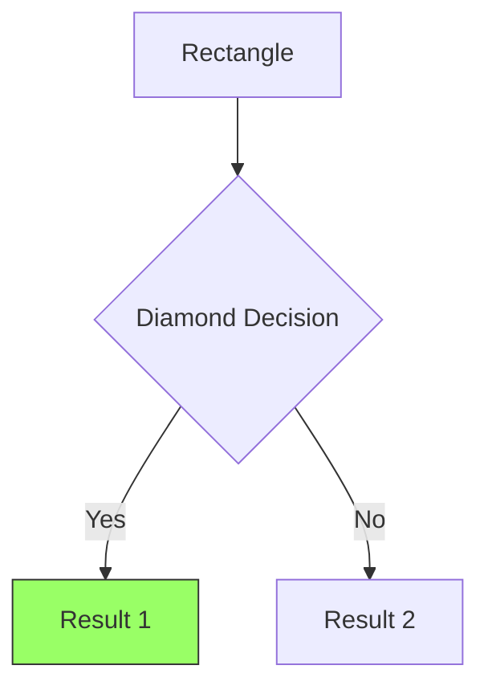

# Diagram Generation Quick Reference Card

**Last Updated:** January 6, 2025
**For:** Insolvency Knowledge Base

---

## Installation (5 Minutes)

```bash
# Core stack (recommended)
pip install mermaid-py plotly pandas

# Optional (for specific use cases)
pip install eralchemy networkx pm4py

# GraphViz (required for ERAlchemy, one-time)
brew install graphviz  # macOS
sudo apt-get install graphviz  # Linux
```

---

## When to Use Which Tool

| Need | Tool | Command |
|------|------|---------|
| Process flowchart | Mermaid | `from mermaid import Mermaid` |
| Timeline/Gantt | Plotly | `import plotly.express as px` |
| Database schema | ERAlchemy | `eralchemy -i sqlite:///db.db -o schema.png` |
| Network graph | NetworkX + Plotly | `import networkx as nx` |
| Architecture diagram | Diagrams | `from diagrams import Diagram` |
| BPMN compliance | PM4Py | `import pm4py` |

---

## 1-Minute Examples

### Generate Flowchart (Mermaid)

```python
from mermaid import Mermaid

chart = Mermaid().flowchart(direction="TD")
chart.add_node("A", "Start")
chart.add_node("B", "Process")
chart.add_edge("A", "B")

print(chart.generate())  # Returns: flowchart TD\n    A[Start]...
```

### Generate Timeline (Plotly)

```python
import plotly.express as px
import pandas as pd

df = pd.DataFrame([
    {"Task": "File NOI", "Start": "2025-01-01", "Finish": "2025-01-05"},
    {"Task": "Meeting", "Start": "2025-01-10", "Finish": "2025-01-11"}
])

fig = px.timeline(df, x_start="Start", x_end="Finish", y="Task")
fig.write_html("timeline.html")
```

### Generate Schema (ERAlchemy)

```bash
eralchemy -i sqlite:///database.db -o schema.png
```

---

## From Database to Diagram

### Pattern 1: SQL → Mermaid

```python
import sqlite3
from mermaid import Mermaid

conn = sqlite3.connect('db.db')
cursor = conn.cursor()
cursor.execute("SELECT step, action FROM procedures ORDER BY step")

chart = Mermaid().flowchart()
for step, action in cursor.fetchall():
    chart.add_node(f"S{step}", action)

mermaid_code = chart.generate()
```

### Pattern 2: SQL → Plotly

```python
import sqlite3
import pandas as pd
import plotly.express as px

conn = sqlite3.connect('db.db')
df = pd.read_sql("SELECT task, start_date, end_date FROM deadlines", conn)

fig = px.timeline(df, x_start="start_date", x_end="end_date", y="task")
fig.show()
```

### Pattern 3: Database → ER Diagram

```bash
eralchemy -i "sqlite:///db.db" -o schema.pdf
```

---

## Output Formats

| Tool | Markdown | HTML | PNG | PDF | SVG |
|------|----------|------|-----|-----|-----|
| Mermaid | ✓ | ✓ (via mermaid.ink) | ✓ | - | ✓ |
| Plotly | - | ✓ | ✓ (export) | - | - |
| ERAlchemy | - | - | ✓ | ✓ | ✓ |
| NetworkX | - | - | ✓ (via Matplotlib) | ✓ | - |

---

## MCP Integration (Copy-Paste)

**Add to** `mcp_server/tools/diagrams.py`:

```python
@server.tool()
async def generate_diagram(diagram_type: str, **params) -> str:
    """
    Generate diagrams from database

    Args:
        diagram_type: 'flowchart', 'timeline', 'network', 'schema'
        **params: Type-specific parameters

    Returns:
        JSON with format, content, metadata
    """

    if diagram_type == 'flowchart':
        # Your flowchart logic
        return json.dumps({"format": "mermaid", "content": "..."})

    elif diagram_type == 'timeline':
        # Your timeline logic
        return json.dumps({"format": "html", "content": "..."})

    # ... other types
```

**Usage from Claude:**
```
@generate_diagram(diagram_type="flowchart", topic="consumer proposal")
```

---

## Common Tasks

### Save Mermaid to GitHub Markdown

```python
mermaid_code = chart.generate()

with open("diagram.md", "w") as f:
    f.write("# My Diagram\n\n```mermaid\n")
    f.write(mermaid_code)
    f.write("\n```\n")
```

### Make Plotly Interactive

```python
fig = px.timeline(df, ...)
fig.update_layout(
    hovermode='closest',
    height=600,
    title="Interactive Timeline"
)
fig.write_html("timeline.html")  # Open in browser
```

### Customize ERAlchemy Output

```bash
eralchemy -i "sqlite:///db.db" -o schema.png \
  --exclude-tables sqlite_sequence \
  --include-columns
```

---

## Debugging

### Mermaid Syntax Errors

1. **Test online:** https://mermaid.live
2. **Check special characters:** Escape or quote labels
3. **Validate node IDs:** Must be alphanumeric

### Plotly Not Showing

1. **Include CDN:** `fig.write_html("file.html", include_plotlyjs='cdn')`
2. **Check data types:** Dates must be datetime objects
3. **Column names:** Match x_start/x_end parameters

### ERAlchemy GraphViz Error

```bash
# Install GraphViz first
brew install graphviz  # macOS
sudo apt-get install graphviz  # Linux

# Then test
eralchemy --version
```

---

## Performance Tips

| Scenario | Optimization |
|----------|--------------|
| Large flowcharts (>100 nodes) | Use subgraphs, collapse sections |
| Timeline (>1000 tasks) | Filter by date range, paginate |
| Schema (>50 tables) | Exclude system tables, focus on subset |
| Network (>200 nodes) | Increase layout iterations, use clustering |

**Caching:**
```python
from functools import lru_cache

@lru_cache(maxsize=128)
def generate_diagram(diagram_type, params_tuple):
    # Your generation logic
    return result
```

---

## File Paths Reference

### Input
- Database: `database/insolvency.db`
- Source code: `src/diagram_generators/`

### Output
- Diagrams: `docs/diagrams/`
- Cache: `cache/diagrams/`
- Temp: `/tmp/diagrams/`

### Structure
```
project/
├── src/
│   └── diagram_generators/
│       ├── process_flow.py
│       ├── timeline.py
│       └── schema.py
├── docs/
│   └── diagrams/
│       ├── *.md (Mermaid)
│       ├── *.html (Plotly)
│       └── *.png (ERAlchemy)
└── mcp_server/
    └── tools/
        └── diagrams.py
```

---

## Cheat Sheet: Mermaid Syntax



**Node Shapes:**
- `A[Text]` - Rectangle
- `A(Text)` - Rounded
- `A{Text}` - Diamond
- `A((Text))` - Circle
- `A>Text]` - Asymmetric

**Arrows:**
- `-->` - Solid
- `-.->` - Dotted
- `==>` - Thick
- `-->|Label|` - With text

---

## Cheat Sheet: Plotly Timeline

```python
df = pd.DataFrame([
    dict(Task="A", Start="2025-01-01", Finish="2025-01-05", Resource="Team 1"),
    dict(Task="B", Start="2025-01-03", Finish="2025-01-08", Resource="Team 2"),
])

fig = px.timeline(df, x_start="Start", x_end="Finish", y="Task", color="Resource")
fig.update_yaxes(autorange="reversed")  # First task at top
fig.show()
```

---

## Links

### Documentation
- Mermaid: https://mermaid.js.org
- Plotly: https://plotly.com/python/
- ERAlchemy: https://github.com/eralchemy/eralchemy

### Testing
- Mermaid Live: https://mermaid.live
- Plotly Chart Studio: https://chart-studio.plotly.com

### Full Research
- Executive Summary: `Diagram-Generation-Executive-Summary.md`
- Full Report: `Diagram-Generation-Research-2025.md`
- Implementation: `Diagram-Implementation-Guide.md`

---

## Next Steps

1. ✓ Install dependencies
2. ✓ Test with 1-minute examples
3. ✓ Implement your first use case
4. ✓ Integrate with MCP server
5. ✓ Add caching and error handling

**Time to first diagram:** 5 minutes
**Time to production:** 1 week

---

*Quick Reference v1.0 - January 6, 2025*
