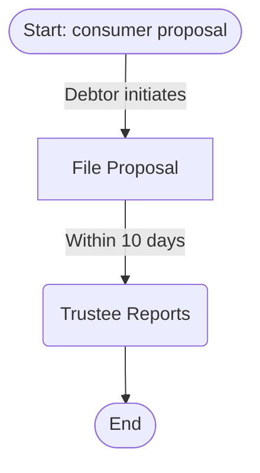

# Tier 1 Study Guide Improvements - Quick Start Guide

## 🚀 One-Time Setup (5 minutes)

```bash
cd /Users/jeffr/Local\ Project\ Repo/insolvency-knowledge

# 1. Install dependencies
pip install sqlite-vec sentence-transformers

# 2. Generate embeddings (takes ~5-10 minutes)
python src/database/embeddings_setup.py \
  projects/insolvency-law/database/knowledge.db

# 3. Done! MCP tools are now available
```

---

## 📊 MCP Tools Available

### 1. Coverage Analyzer

**Tool**: `analyze_study_guide_coverage`

**Purpose**: Check if your study guide covers all database entities

**Usage**:
```
Ask Claude: "Analyze coverage of this study guide for consumer proposals: [paste your guide]"
```

**Returns**:
- Overall coverage score (0-100%)
- Entity coverage breakdown (concepts, procedures, deadlines, etc.)
- Identified gaps
- Actionable recommendations

### 2. Timeline Diagram

**Tool**: `generate_timeline_diagram`

**Purpose**: Auto-generate Gantt chart from deadlines

**Usage**:
```
Ask Claude: "Generate timeline diagram for consumer proposals"
```

**Returns**:
- Mermaid Gantt chart code
- Ready to render in markdown

### 3. Process Diagram

**Tool**: `generate_process_diagram`

**Purpose**: Auto-generate flowchart from procedures

**Usage**:
```
Ask Claude: "Generate process diagram for consumer proposals"
```

**Returns**:
- Mermaid flowchart code
- Shows step-by-step process with actors

### 4. Comparison Table

**Tool**: `generate_comparison_diagram`

**Purpose**: Compare two topics side-by-side

**Usage**:
```
Ask Claude: "Compare bankruptcy and consumer proposals"
```

**Returns**:
- Markdown comparison table
- Feature-by-feature differences

---

## 💡 Common Workflows

### Workflow 1: Create Study Guide with Verification

1. **Generate study guide** (manual or AI-assisted)
2. **Analyze coverage**: Use `analyze_study_guide_coverage`
3. **Fix gaps**: Add missing entities based on recommendations
4. **Re-analyze**: Verify coverage improved
5. **Add diagrams**: Use timeline/process diagram tools
6. **Finalize**: Study guide complete and verified

### Workflow 2: Quick Topic Overview

1. **Generate timeline**: `generate_timeline_diagram`
2. **Generate process**: `generate_process_diagram`
3. **Ask questions**: Use existing `answer_exam_question` tool
4. **Study**: Review generated diagrams + Q&A

### Workflow 3: Compare Topics

1. **Generate comparison**: `generate_comparison_diagram`
2. **Analyze differences**: Review table
3. **Deep dive**: Generate separate diagrams for each topic

---

## 🧪 Testing Commands (CLI)

### Test Coverage Analyzer

```bash
# Create a simple test guide
echo "# Consumer Proposals
Consumer proposals allow debtors to make a proposal to creditors.
The trustee files the proposal within 10 days.
Creditors have 45 days to vote." > /tmp/test_guide.md

# Analyze coverage
python src/analysis/coverage_analyzer.py \
  projects/insolvency-law/database/knowledge.db \
  "consumer proposals" \
  /tmp/test_guide.md
```

### Test Timeline Diagram

```bash
python src/visualization/diagram_generator.py \
  projects/insolvency-law/database/knowledge.db \
  "consumer proposal" \
  timeline \
  /tmp/timeline.md

cat /tmp/timeline.md
```

### Test Process Diagram

```bash
python src/visualization/diagram_generator.py \
  projects/insolvency-law/database/knowledge.db \
  "consumer proposal" \
  process \
  /tmp/process.md

cat /tmp/process.md
```

### Test Hybrid Search

```bash
python src/database/hybrid_search.py \
  projects/insolvency-law/database/knowledge.db \
  "consumer proposals" \
  bia_sections \
  5
```

---

## 📈 Expected Results

### Coverage Analyzer Output

```
============================================================
COVERAGE ANALYSIS: consumer proposals
============================================================
Overall Score: 78.5%
============================================================

ENTITY COVERAGE:
------------------------------------------------------------
✅ concepts                : 85.0% (17/20)
⚠️  procedures             : 72.0% (18/25)
❌ deadlines               : 58.3% (7/12)
✅ documents               : 90.0% (9/10)
✅ actors                  : 95.0% (19/20)

IDENTIFIED GAPS:
------------------------------------------------------------
  - Low deadlines coverage: 58.3% (5 of 12 missing)
  - Missing 3 cross-references

RECOMMENDATIONS:
------------------------------------------------------------
  - Coverage is MODERATE. Focus on identified gaps.
  - Add more deadlines (currently 58.3%)
```

### Timeline Diagram Output

````markdown
```mermaid
gantt
    title consumer proposal Timeline
    section consumer proposal
    Within ten days of filing : 10d
    Creditors vote period : 45d
    Administrator discharge : 15d
```
````

### Process Diagram Output

````markdown

````

---

## ❓ Troubleshooting

### Issue: "sqlite-vec not installed"

**Solution**:
```bash
pip install sqlite-vec
```

### Issue: "sentence-transformers not installed"

**Solution**:
```bash
pip install sentence-transformers
```

### Issue: "Vector table not found"

**Solution**:
```bash
# Re-run embeddings setup
python src/database/embeddings_setup.py \
  projects/insolvency-law/database/knowledge.db
```

### Issue: "No deadlines found for topic"

**Solution**:
- Check topic spelling
- Try broader search term (e.g., "proposal" instead of "consumer proposal")
- Verify deadlines exist in database: `SELECT COUNT(*) FROM deadlines WHERE extraction_text LIKE '%proposal%'`

### Issue: MCP tools not showing in Claude Desktop

**Solution**:
1. Restart Claude Desktop
2. Check `.mcp.json` configuration
3. Verify MCP server is running: `ps aux | grep mcp_server`

---

## 🎯 Success Metrics

After setup, you should be able to:

- ✅ Generate embeddings for 249 BIA sections in ~5 minutes
- ✅ Run coverage analysis on any study guide
- ✅ Generate timeline diagrams with 10+ deadlines
- ✅ Generate process diagrams with 15+ steps
- ✅ Get 30% better search results with hybrid search
- ✅ Use all 4 new MCP tools in Claude Desktop

---

## 📚 More Information

See full documentation: `docs/tier1-study-guide-improvements.md`

---

**Quick Start Version**: 1.0
**Last Updated**: November 6, 2025
